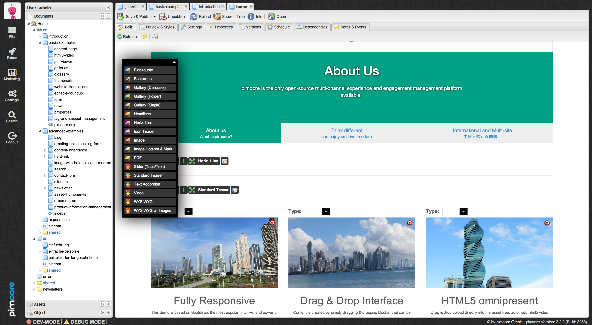
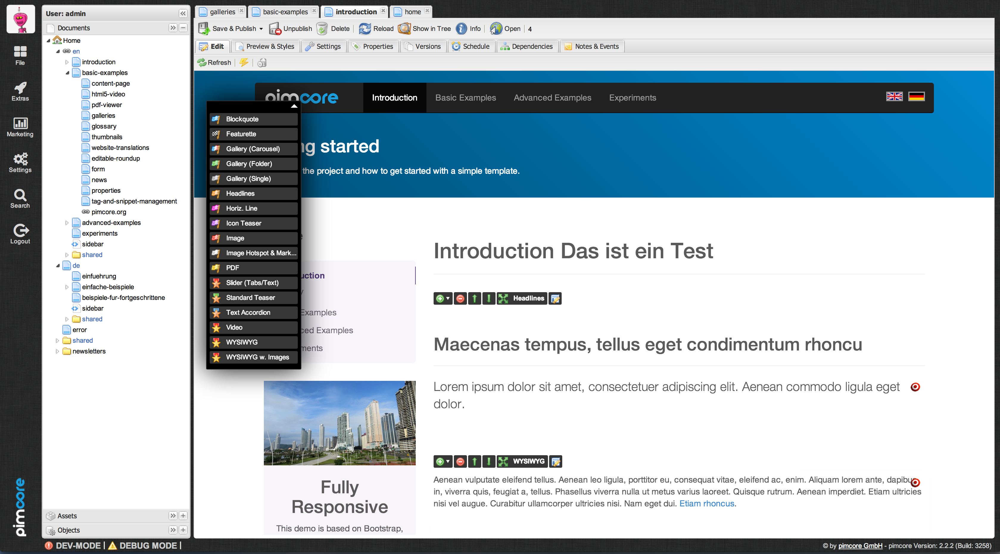
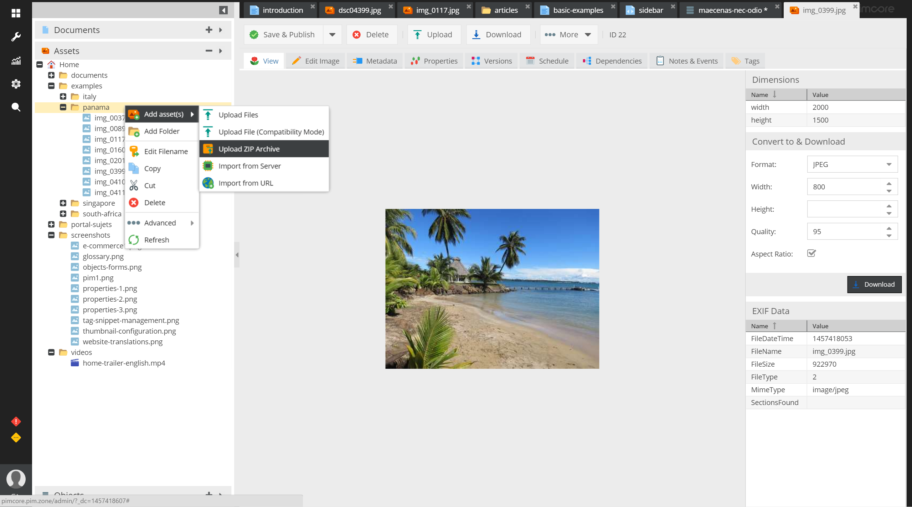

# Pimcore 4

THE OPEN-SOURCE ENTERPRISE CMS/CMF, PIM, DAM, ECOMMERCE-SUITE

[](LICENSE.md)
[](https://packagist.org/packages/pimcore/pimcore)
[](https://travis-ci.org/pimcore/pimcore)
[](https://gitter.im/pimcore/pimcore?utm_source=badge&utm_medium=badge&utm_campaign=pr-badge)




* [Documentation](https://www.pimcore.org/docs/latest)
* Homepage: [http://www.pimcore.org/](http://www.pimcore.org/) - Learn more about Pimcore
* Like us on [Facebook](https://www.facebook.com/pimcore)
* Twitter: [@pimcore](https://twitter.com/pimcore) - Get the latest news
* Issue Tracker: - [Issues](https://github.com/pimcore/pimcore/issues) - Report bugs here
* Help [translating](https://poeditor.com/join/project/VWmZyvFVMH) Pimcore
* [Google Group](https://groups.google.com/forum/#!forum/pimcore) - Discussions 
* [StackOverflow](http://stackoverflow.com/questions/tagged/pimcore) - Questions / Support 


## Getting started

Download the [latest release](http://www.pimcore.org/download) and extract the archive in document root.
Create a database for Pimcore (charset: utf8). If you have a website_example (empty installation) or a website_demo (boilerplate) folder please rename one of them to website (only if cloning from git).
Run the Pimcore installation by accessing the URL where you uploaded the Pimcore files in a browser.

```
cd /your/document/root
wget https://www.pimcore.org/download/pimcore-latest.zip
unzip pimcore-latest.zip

mysql -u root -p -e "CREATE DATABASE pimcore charset=utf8;"

# now launch http://yourhostname.tld/install
```

[A detailed installation guide can be found here.](https://www.pimcore.org/wiki/pages/viewpage.action?pageId=16854184)


## Contribute

Please have a look at our [contributing guide](CONTRIBUTING.md).

#### Short summary:  
**Bug fixes:** please create a pull request including a step by step description to reproduce the problem  
**Contribute features:** contact the core-team before you start developing (contribute@pimcore.org)  
**Security vulnerabilities:** please contact us (security@pimcore.org)  

## Copyright and license 
Copyright: [Pimcore](http://www.pimcore.org) GmbH  
For licensing details please visit [LICENSE.md](LICENSE.md) 
  
  
## Screenshots


