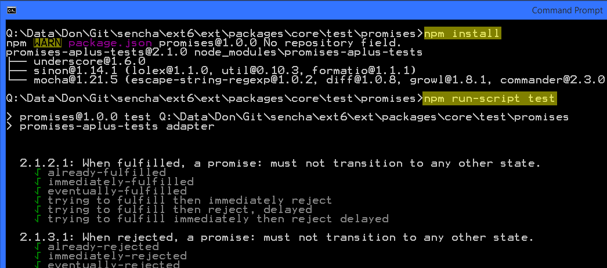
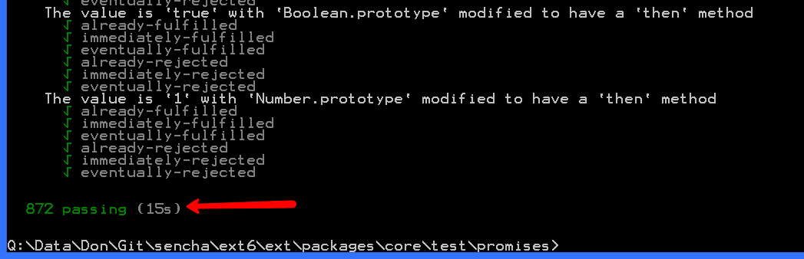
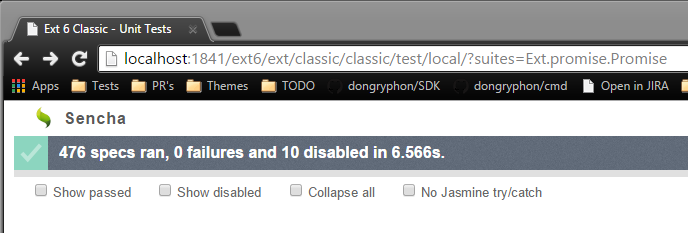

# Promises/A+ Test Runner

These scripts will run the Promises/A+ specification using the `Ext.Promise`
polyfill as well as the enhanced `Ext.Deferred` class.

Steps:

 - Run `npm instal`
 - Run `npm run-script test-extra`
 - Run `npm run-script test-polyfill`

# Jasmine Suite

The extended capabilities of `Ext.Deferred` are tested in Jasmine using the
normal runner.

