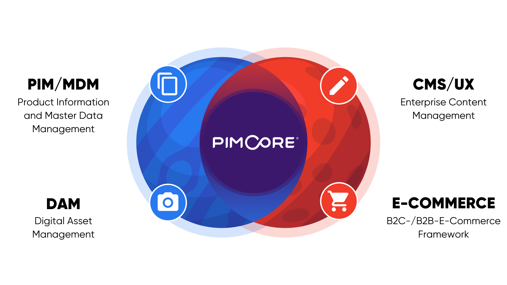

# Pimcore Overview
Pimcore is the leading Open Source platform for managing digital data and customer experience. It provides a fully integrated software stack for PIM, MDM, CDP, DAM, DXP/CMS & Digital Commerce.

As a platform, Pimcore provides a solid foundation with generic functionality for all kinds of web applications and therefore 
allows rapid application development and building customer solutions really fast. 

Its API driven approach makes it easy to develop with Pimcore, allows integration into every IT infrastructure and makes it 
easily extendable. Also headless execution of Pimcore is possible. 

Pimcore is built for developers and should empower them to build great digital experiences easily. As a consequence, Pimcore 
is NOT an ‘out-of-the-box’ software product like Wordpress, Magento, Akeneo, WooCommerce, Shopify and others. You need a developer to get started. 

# Pimcore in a Nutshell
Our mission is to provide ONE platform for ANY data, ANY channel, ANY process and ANY one. 

## ANY Data 
In Pimcore any digital content can be managed and put in relation with other content.
There are three main element data types in Pimcore:

### [Data Objects](../05_Objects/README.md)
Manage any structured data based on a predefined data model, either manually or automatically via the APIs. Define the structure and attributes of your objects by using the class editor. Manage any data – products (PIM/MDM), categories, customers (CDP), orders (digital commerce), blog articles (DXP/CMS). Data Objects provide the possibility to manage structured data for multiple output channels from a single source. By centralizing data in one place, Pimcore's data objects enable you to achieve better data completeness and data quality, allowing you to create and maintain a consistent, up-to-date customer experience across multiple touchpoints in less time.

### [Digital Assets](../04_Assets/README.md)
Assets are the DAM part of Pimcore. Store, manage and organize digital files such as images, videos, PDFs, Word/Excel documents in a folder structure. Preview 200+ file types directly in Pimcore, edit pictures, and enrich files with additional meta-data. Facial recognition for focal points in images is available. Editors only need to maintain one high-resolution version of a file in the system. Pimcore can automatically generate all required output formats for various channels such as commerce, apps, and websites. Of course, including comprehensive user management and version control.

### [Documents](../03_Documents/README.md)
The DXP/CMS part of Pimcore for managing unstructured content such as the pages of a website and its navigation. Based on Twig templates, documents render physical HTML/CSS pages and provide the capabilities to manage the presentation of data, exactly how customers will experience it. They can be composed by administrators by arranging predefined layout elements. Pimcore documents provide multi-lingual and multi-site capabilities for websites, including emails and newsletters. Total frontend flexibility enables a perfect blend of content and commerce. You can also use them to create content for offline channels, such as printed catalogs (web-to-print).

Most important, all elements (assets, documents or objects) can be linked and set into relation with each other.

## ANY Channel / ANY Process
As Pimcore is a platform that stores data independently from the channel, it can provide the managed data to any channel – simple 
websites (B2B, B2C), commerce-systems ([integrated](https://pimcore.com/docs/platform/Ecommerce_Framework/) and/or third party), mobile apps, 
print, digital signage, ... there are basically no limits.

In terms of output to the frontend or custom APIs, Pimcore follows the MVC pattern and is based on the Symfony Framework. 
 If you don't know the MVC pattern yet, please read [this article](http://en.wikipedia.org/wiki/Model%E2%80%93view%E2%80%93controller) 
 first.
If you are new to Symfony, you should read the [getting started guide](https://symfony.com/doc/current/) of Symfony first. With this 
knowledge, learning Pimcore will be much easier.

In addition to that, Pimcore can also be executed in a headless way and therefore integrated into any environment. 

## ANY One 
Pimcore provides lots of functionality on top of its basic data elements that already cover lots of use cases. 
But being a platform, Pimcore can be used for pretty much any use case and can be easily extended if necessary. 

## Pimcore Ecosystem

The following list of resources should show you where to get information about Pimcore and what's going on in the whole ecosystem. 

* [Pimcore Documentation](../README.md)
* [Pimcore at Github](https://github.com/pimcore/pimcore)
* [Pimcore Community Forums](https://github.com/pimcore/pimcore/discussions)
* [Pimcore at Gitter](https://gitter.im/pimcore/pimcore)
* [Pimcore at Stackoverflow](http://stackoverflow.com/questions/tagged/pimcore)
* [Pimcore at Packagist](https://packagist.org/search/?q=pimcore)
* [Pimcore Blog](https://pimcore.com/en/resources/blog)
* [Pimcore Support / Professional Services](https://pimcore.com/en/services/support)

## Contributions
As Pimcore is an open-source project, any contributions are highly appreciated. For details, see our [Contributing guide](https://github.com/pimcore/pimcore/blob/11.x/CONTRIBUTING.md).

-----
Wanna see more - [Let's get started](../01_Getting_Started/README.md)
