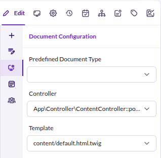

# MVC in Pimcore

Pimcore builds on [Symfony's MVC architecture](https://symfony.com/doc/current/controller.html)
and adds a content management layer through Documents.
Instead of mapping every URL to a controller via route configuration,
Pimcore resolves requests to documents in the document tree.
Each document then determines which controller and template handle the rendering.

## Document Rendering Flow

1. A request comes in and [routing](./05_Routing_and_URLs/README.md) resolves it to a document.
2. The document's settings determine the controller and template (see type configuration below).
3. The controller executes, receiving the document as context.
4. If the controller returns a `Response`, that response is sent to the client.
5. If the controller does not return a `Response`, the configured template is rendered automatically,
   with the document and its [editables](./02_Templates/03_Editables/README.md) available in the template.

## Document Type Configuration

Documents can be configured in three ways, controlling how controller and template are resolved:



| Type | Controller | Template | Description                                                                                                   |
|------|------------|----------|---------------------------------------------------------------------------------------------------------------|
| 1    | X          |          | The specified controller is executed. If it returns a `Response`, that response is used.                      |
| 2    | X          | X        | Same as Type 1, but the specified template is rendered instead of the auto-discovered one (if no `Response`). |
| 3    |            | X        | Renders the template with the default controller. Useful for pages with only template logic.                  |

Pimcore ships a default controller that is used when only a template is assigned to a document.
You can configure a custom default controller:

```yaml
pimcore:
    documents:
        default_controller: App\Controller\DefaultController::defaultAction
```

## File Structure

The most common paths for MVC components in a Pimcore project:

| Path               | Description                                                                                                               |
|---------------------|--------------------------------------------------------------------------------------------------------------------------|
| `/src/Controller`   | Controller classes, e.g. `ContentController.php`                                                                         |
| `/templates/`       | Twig templates, following Symfony naming: `/templates/[controller]/[action].html.twig`                                   |

Pimcore controllers typically extend `Pimcore\Controller\FrontendController`,
which provides access to the current document, edit mode detection, and other Pimcore-specific features.

## Further Reading

- [Controllers](./03_Controller.md) - writing Pimcore controllers
- [Templates](./02_Templates/README.md) - Twig templates and editables
- [Routing](./05_Routing_and_URLs/README.md) - how requests reach documents
