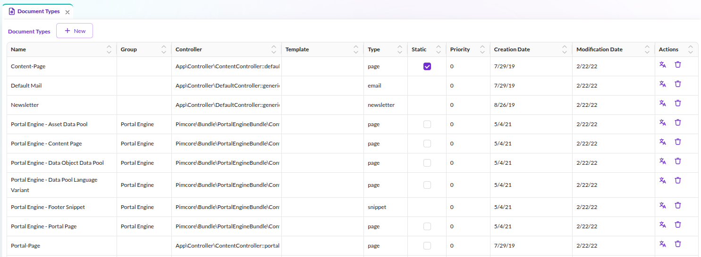
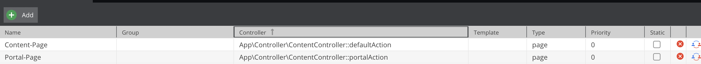
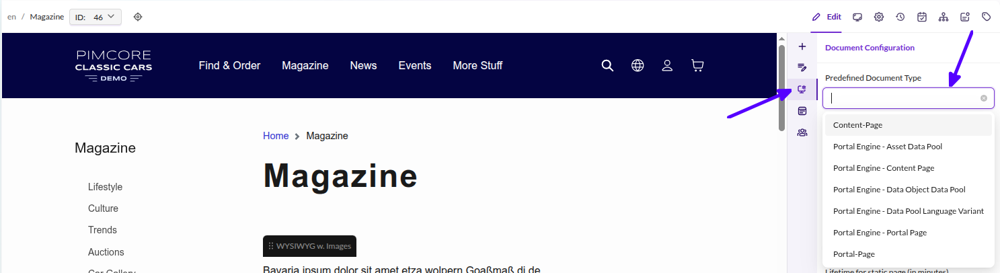
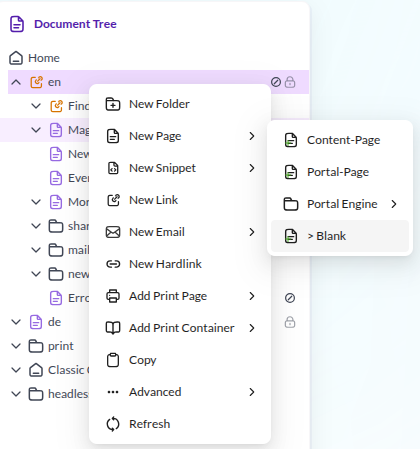

# Predefined Document-Types

## General

Predefined document types let you save controller/template combinations under a friendly name.
Editors can then select a type when creating a document instead of manually configuring
the controller and template in the document settings.

## Example

To define document-type go to *Settings* > *Document-Types*.

Let's suppose that you've created controller, action and template for a books listing.

Reference to the action: `App\Controller\BookController::listAction`  
Reference to the template: `templates/book/list.html.twig`

To add a new document-type which renders the book listing template, you have to click on the *Add* button first and then
fill out the newly created configuration row accordingly. 

Available types:

- `page`, `snippet`, `email` - always available
- `printcontainer`, `printpage` - requires PimcoreWebToPrintBundle
- `newsletter` - requires PimcoreNewsletterBundle

After you have defined a type you can access it in the context menu or in the document settings:

##### Document Settings Preview

##### Context Menu Preview

