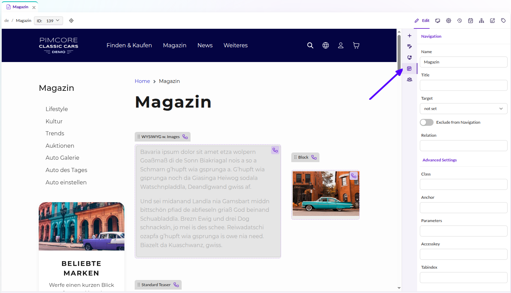

# Navigation

Pimcore provides a navigation system that builds a navigation container from the document tree.
The process has two steps:

1. **Build** the navigation container from the document tree
2. **Render** it using one of several built-in renderers (menu, breadcrumbs, sidebar)

Only published documents with a navigation name are included. Folders are always excluded,
regardless of their navigation properties.

## Building the Navigation

Use `pimcore_build_nav()` to create a navigation container. It requires two parameters:
- `active` - the current document (used to determine active state)
- `root` - the root document to start building the tree from

The following boilerplate resolves the root node, with support for multi-site setups:

```twig
{# Resolve the current document (fallback for custom routes) #}

    


{# Resolve navigation root: document property > site root > home #}


    
        
        
    
        
    



```

> The build step does not need to happen in the template. The Twig helper forwards the `build()` call
> to the `Pimcore\Navigation\Builder` service, so you can build the navigation in a controller
> or service and pass the container to the view.

All rendering examples below assume `mainNavigation` was built using this pattern.

## Rendering the Navigation

`pimcore_render_nav(container, rendererType, renderMethod, ...arguments)` is the main rendering helper.
The most common call pattern is `pimcore_render_nav(nav, 'menu', 'renderMenu', {maxDepth: 1})`.
You can also access a renderer directly via `pimcore_nav_renderer('menu')` for more control
(e.g. calling `renderPartial()` or `setPartial()`).

### Menu (Single Level)

```twig
{{ pimcore_render_nav(mainNavigation, 'menu', 'renderMenu', {
    maxDepth: 1,
    ulClass: 'nav navbar-nav'
}) }}
```

### Menu (Multi-Level)

```twig
{# Per-depth CSS classes #}
{{ pimcore_render_nav(mainNavigation, 'menu', 'renderMenu', {
    maxDepth: 2,
    ulClass: {
        0: 'nav navbar-nav',
        1: 'nav navbar-nav-second',
        2: 'nav navbar-nav-third'
    }
}) }}

{# Or use 'default' to apply the same class on all levels #}
{{ pimcore_render_nav(mainNavigation, 'menu', 'renderMenu', {
    maxDepth: 2,
    ulClass: {
        default: 'nav navbar-nav'
    }
}) }}
```

### Breadcrumbs

```twig
<div class="my-breadcrumbs">
    <a href="/">{{ 'Home'|trans }}</a> >
    {{ pimcore_render_nav(mainNavigation, 'breadcrumbs') }}
</div>
```

### Sidebar

```twig
<div class="my-sidebar-menu">
    {{ pimcore_nav_renderer('menu').renderMenu(mainNavigation) }}
</div>
```

The `renderMenu()` method renders the full tree. Branches outside the active path and levels
below the active page should be hidden with CSS (toggle `display` on nested `ul` elements
using the `.active` class that Pimcore applies automatically).

You can customize the HTML ID prefix used on navigation elements with the `htmlMenuPrefix`
parameter during the build step:

```twig


{{ pimcore_render_nav(sideNav, 'menu', 'renderMenu', {
    ulClass: 'nav my-sidenav',
    expandSiblingNodesOfActiveBranch: true
}) }}
```

## Document Navigation Properties



Pages and links have **Navigation Settings** in their system properties. These include:

| Property | Description |
|---|---|
| **Name** | Label shown in the navigation. |
| **Title** | HTML `title` attribute on the link. |
| **Target** | Link target (`_blank`, `_self`, `_top`, `_parent`). |
| **Exclude from Navigation** | Removes this document from the navigation tree. Accessible in templates via `document.getProperty('navigation_exclude')`. |
| **Class** | HTML class on the navigation element. |
| **Anchor** | Fragment appended to the document URL. |
| **Parameters** | Query parameters appended to the document URL. |
| **Relation** | HTML `rel` attribute (available in custom navigation scripts only). |
| **Accesskey** | HTML `accesskey` attribute (available in custom navigation scripts only). |
| **Tab-Index** | HTML `tabindex` attribute (available in custom navigation scripts only). |

## Custom Navigation Templates

If the default HTML output does not fit your project, you can provide a partial template
for full control over the markup:

```twig


{# Use renderPartial for a one-off partial #}
{{ menuRenderer.renderPartial(mainNavigation, 'includes/navigation.html.twig') | raw }}

{# Or set the partial on the renderer for all subsequent render calls #}

{{ menuRenderer.render(mainNavigation) | raw }}
```

`templates/includes/navigation.html.twig`:

```twig

    <div class="my-menu-element">
        {{ pimcore_nav_renderer('menu').htmlify(page) | raw }}
    </div>

```

## Bootstrap 5 Dropdown Navigation

For even more control, you can bypass the renderer and iterate the navigation container manually.
This example renders a responsive navbar with dropdown menus using Bootstrap 5:

```twig


<nav class="navbar navbar-expand-lg navbar-light bg-light">
    <a class="navbar-brand" href="#">Navbar</a>
    <button class="navbar-toggler" type="button"
            data-bs-toggle="collapse" data-bs-target="#navbarNavDropdown"
            aria-controls="navbarNavDropdown" aria-expanded="false" aria-label="Toggle navigation">
        <span class="navbar-toggler-icon"></span>
    </button>
    <div class="collapse navbar-collapse" id="navbarNavDropdown">
        <ul class="navbar-nav">
            
                {# Manually check visibility and ACL conditions #}
                
                    
                    
                        <li class="nav-item">
                            <a class="nav-link" href="{{ page.getHref() }}">{{ page.getLabel() }}</a>
                        </li>
                    
                        <li class="nav-item dropdown">
                            <a class="nav-link dropdown-toggle" href="{{ page.getHref() }}"
                               role="button" data-bs-toggle="dropdown"
                               aria-expanded="false">{{ page.getLabel() }}</a>
                            <div class="dropdown-menu">
                                
                                    
                                        <a class="dropdown-item"
                                           href="{{ child.getHref() }}">{{ child.getLabel() }}</a>
                                    
                                
                            </div>
                        </li>
                    
                
            
        </ul>
    </div>
</nav>
```

## Adding Custom Items to the Navigation

You can inject custom entries (e.g. data objects) into the navigation using callbacks:

- **`pageCallback`** - called for each document page, allowing you to add child pages
- **`rootCallback`** - called once on the root container, allowing you to add top-level entries

The following Twig extension demonstrates both callbacks, adding news articles as children
of a specific page and category links at the root level:

```php
<?php

namespace App\Twig\Extension;

use App\Website\LinkGenerator\NewsLinkGenerator;
use App\Website\LinkGenerator\CategoryLinkGenerator;
use Pimcore\Model\Document;
use Pimcore\Navigation\Container;
use Pimcore\Twig\Extension\Templating\Navigation;
use Twig\Extension\AbstractExtension;
use Twig\TwigFunction;

class NavigationExtension extends AbstractExtension
{
    protected Navigation $navigationHelper;
    protected NewsLinkGenerator $newsLinkGenerator;
    protected CategoryLinkGenerator $categoryLinkGenerator;

    public function __construct(
        Navigation $navigationHelper,
        NewsLinkGenerator $newsLinkGenerator,
        CategoryLinkGenerator $categoryLinkGenerator
    ) {
        $this->navigationHelper = $navigationHelper;
        $this->newsLinkGenerator = $newsLinkGenerator;
        $this->categoryLinkGenerator = $categoryLinkGenerator;
    }

    public function getFunctions(): array
    {
        return [
            new TwigFunction('app_navigation_links', [$this, 'getNavigationLinks'])
        ];
    }

    public function getNavigationLinks(Document $document, Document $startNode): Container
    {
        $navigation = $this->navigationHelper->build([
            'active' => $document,
            'root' => $startNode,
            'pageCallback' => function($page, $document) {
                if ($document->getProperty("templateType") == "news") {
                    $list = new \Pimcore\Model\DataObject\News\Listing;
                    $list->load();
                    foreach ($list as $news) {
                        $detailLink = $this->newsLinkGenerator->generate(
                            $news, ['document' => $document]
                        );
                        $page->addPage(new \Pimcore\Navigation\Page\Document([
                            "label" => $news->getTitle(),
                            "id" => "object-" . $news->getId(),
                            "uri" => $detailLink,
                        ]));
                    }
                }
            },
            'rootCallback' => function(Container $navigation) {
                $list = new \Pimcore\Model\DataObject\Category\Listing;
                $list->load();
                foreach ($list as $category) {
                    $detailLink = $this->categoryLinkGenerator->generate($category);
                    $navigation->addPage(new \Pimcore\Navigation\Page\Document([
                        "label" => $category->getName(),
                        "id" => "object-" . $category->getId(),
                        "uri" => $detailLink,
                    ]));
                }
            }
        ]);

        return $navigation;
    }
}
```

Use the extension in your template:

```twig


<div class="my-navigation">
    {{ pimcore_render_nav(navigation, 'menu', 'renderMenu', {
        expandSiblingNodesOfActiveBranch: true,
        ulClass: {
            default: 'nav my-sidenav'
        }
    }) }}
</div>
```

## Caching and High-Performance Navigation

The navigation container (`\Pimcore\Navigation\Container`) is automatically cached by Pimcore,
which significantly improves performance. To benefit from caching, avoid using
`Pimcore\Model\Document` objects directly in navigation templates or partials, as this
bypasses the cache by loading all documents again.

When you need document properties or editable data in your navigation markup, use the
`pageCallback` parameter to map that data onto the navigation page item during the build step:

```php
<?php

namespace App\Twig\Extension;

use Pimcore\Model\Document;
use Pimcore\Navigation\Container;
use Pimcore\Twig\Extension\Templating\Navigation;
use Twig\Extension\AbstractExtension;
use Twig\TwigFunction;

class NavigationExtension extends AbstractExtension
{
    protected Navigation $navigationHelper;

    public function __construct(Navigation $navigationHelper)
    {
        $this->navigationHelper = $navigationHelper;
    }

    public function getFunctions(): array
    {
        return [
            new TwigFunction('app_navigation_custom', [$this, 'getCustomNavigation'])
        ];
    }

    public function getCustomNavigation(Document $document, Document $startNode): Container
    {
        $navigation = $this->navigationHelper->build([
            'active' => $document,
            'root' => $startNode,
            'pageCallback' => function ($page, $document) {
                $page->setCustomSetting("myCustomProperty", $document->getProperty("myCustomProperty"));
                $page->setCustomSetting("subListClass", $document->getProperty("subListClass"));
                $page->setCustomSetting("title", $document->getTitle());
                $page->setCustomSetting("headline", $document->getEditable("headline")->getData());
            }
        ]);

        return $navigation;
    }
}
```

```twig



{{ menuRenderer.render(mainNavigation) | raw }}
```

In the partial template, access the mapped data directly on the page item:

```twig

    
        
        <li class="{{ activeClass }}">
            <a href="{{ page.getUri() }}" target="{{ page.getTarget() }}">{{ page.getLabel() }}</a>
            <ul class="{{ page.getCustomSetting("subListClass") }}" role="menu">
                
            </ul>
        </li>
    

```

This approach dramatically improves performance by keeping all document data in the cached container.

### Dynamic Cache Key

Set a custom cache key when you need separate cached versions of the same navigation
(e.g. per language or user role):

```twig

```

### Disabling the Cache

Disable caching by setting `cache` to `false` (useful during development):

```twig

```

## FAQ

**A document does not show up in the navigation. Why?**

Make sure the document and all its parent documents are published, have a navigation name set,
and do not have **Exclude from Navigation** enabled
(`Document properties > System properties`).

**Why is the navigation not appearing?**

If no documents have a navigation name set, the render function returns nothing.
See the answer above.

**Why is the homepage not appearing in the navigation?**

The homepage is excluded by default. Add it manually:

```twig

```

To make the homepage label editable from Pimcore Studio, retrieve the home document's
navigation properties:

```twig



```
