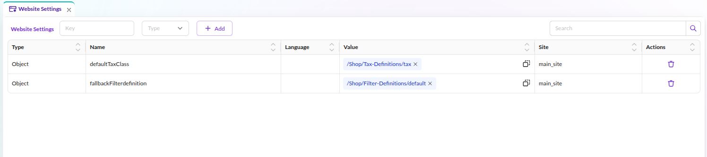

# Website Settings

The `Website Settings` give you the possibility to configure website-specific settings, which you can 
access in every controller and view.

Examples:

* ReCAPTCHA public & private key
* Locale settings
* Google Maps API key
* Default values and fallbacks

### Access the Settings

In controllers and views, you can use view helpers or argument resolvers to access the config.
The returned configuration is an array containing your settings.


### Example Configuration


Usage in a template:

```twig
{# access the whole configuration #}
{{ pimcore_website_config() }}

{# or only a single value #}
{{ pimcore_website_config('googleMapsKey') }}

{# you can pass a default value in case the value is not configured #}
{{ pimcore_website_config('googleMapsKey', 'NOT SET') }}
```

Usage in a controller:

```php
<?php

use Symfony\Component\HttpFoundation\Response;

class TestController
{
    public function testAction(array $websiteConfig): Response
    {
        $recaptchaKeyPublic = $websiteConfig['recaptchaPublic'];
        
        // ...
    }    
}
```

### Manipulate the values in a Controller

If you want to change the value of a website setting from your PHP script, for example from a controller, you can use this code.

```php
<?php

use Symfony\Component\HttpFoundation\Response;

class TestController
{
    public function testAction(): Response
    {
        // get the "somenumber" setting for "de"
        // if the property does not exist you will get the setting with no language provided
        $somesetting = \Pimcore\Model\WebsiteSetting::getByName('somenumber', null, 'de');
        $currentnumber = $somesetting->getData();
        //Now do something with the data or set new data
        //Count up in this case
        $newnumber = $currentnumber + 1;
        $somesetting->setData($newnumber);
        $somesetting->save();
        
        // ...
    }
}
```

### Events

Pimcore dispatches events when website settings are created, updated, or deleted.
Use standard Symfony event subscribers to listen for these events:

| Event                                    | Constant                                          |
|------------------------------------------|---------------------------------------------------|
| `pimcore.websiteSetting.preAdd`          | `WebsiteSettingEvents::PRE_ADD`                   |
| `pimcore.websiteSetting.postAdd`         | `WebsiteSettingEvents::POST_ADD`                  |
| `pimcore.websiteSetting.preUpdate`       | `WebsiteSettingEvents::PRE_UPDATE`                |
| `pimcore.websiteSetting.postUpdate`      | `WebsiteSettingEvents::POST_UPDATE`               |
| `pimcore.websiteSetting.preDelete`       | `WebsiteSettingEvents::PRE_DELETE`                |
| `pimcore.websiteSetting.postDelete`      | `WebsiteSettingEvents::POST_DELETE`               |

All events dispatch a `Pimcore\Event\Model\WebsiteSettingEvent` instance.
See `Pimcore\Event\WebsiteSettingEvents` for the full class reference.

