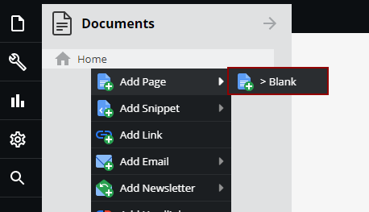
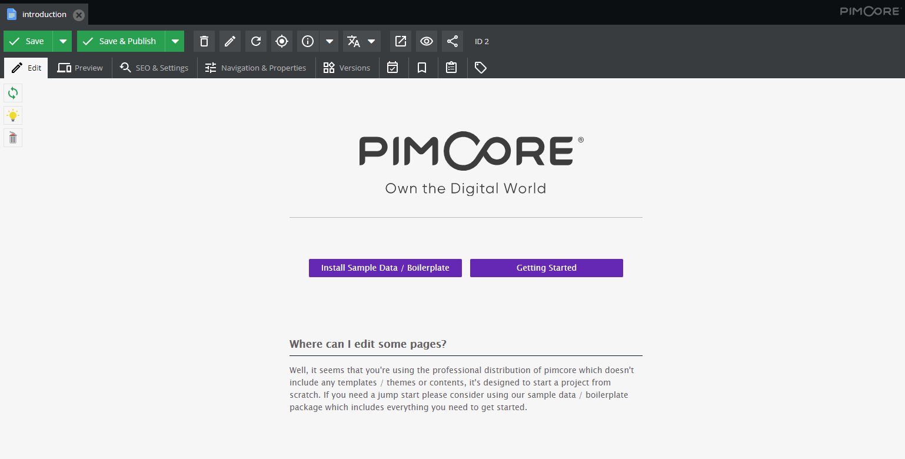
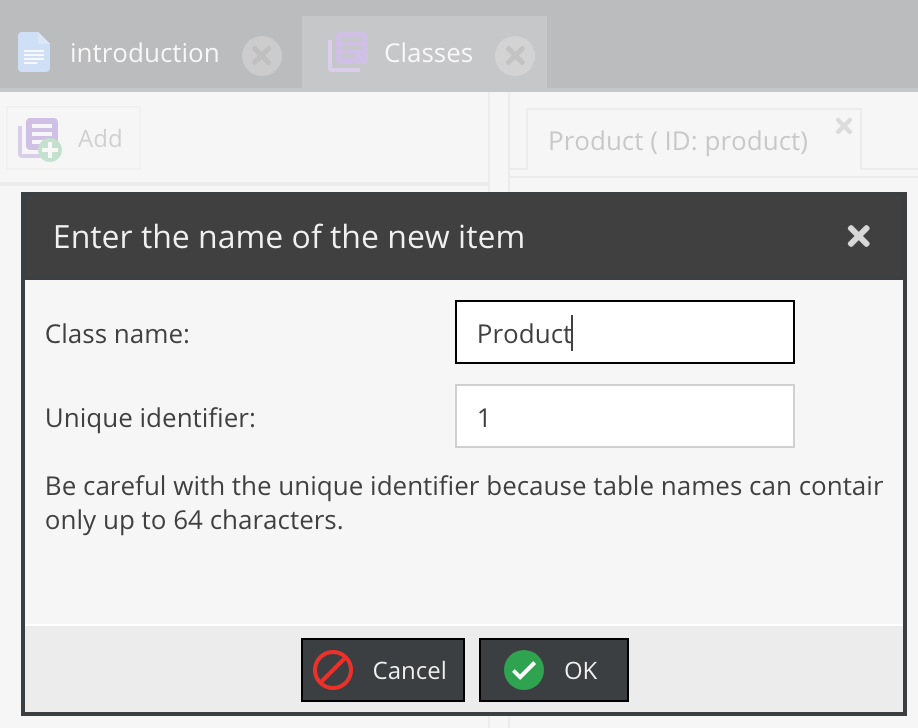
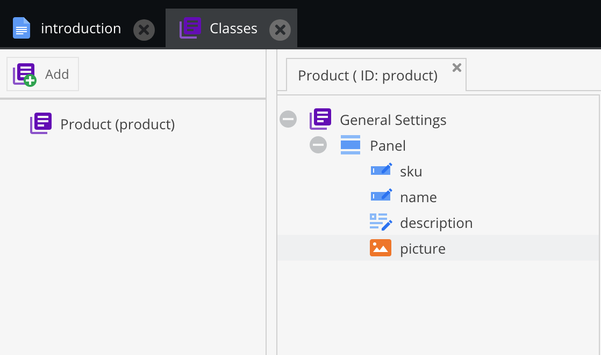
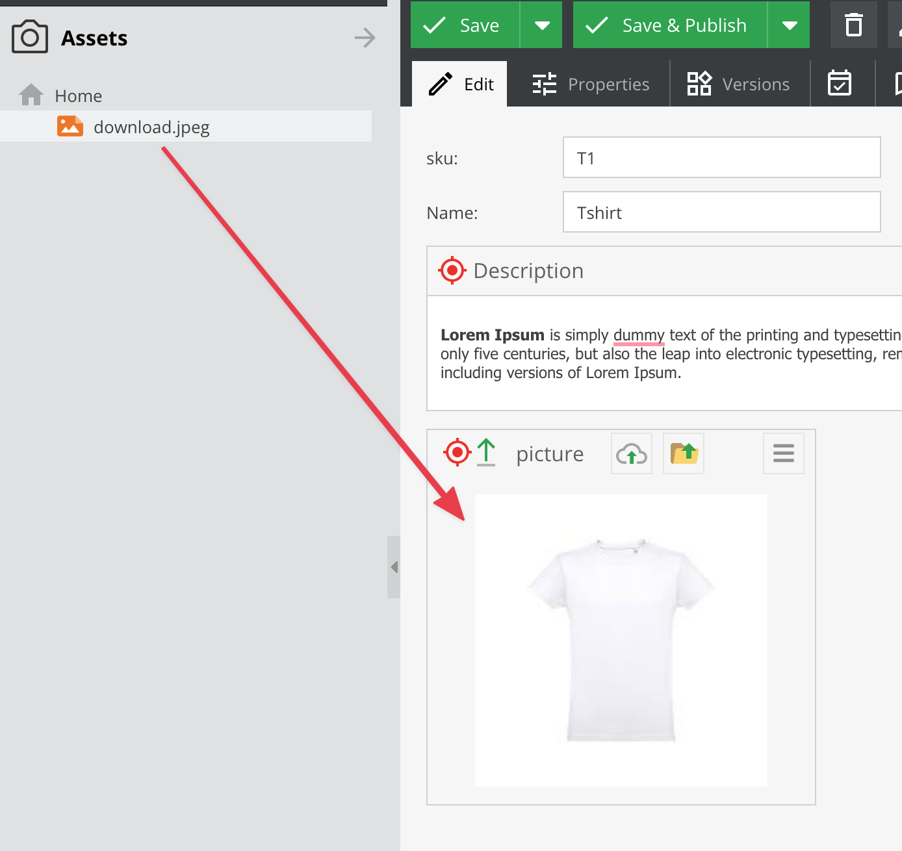
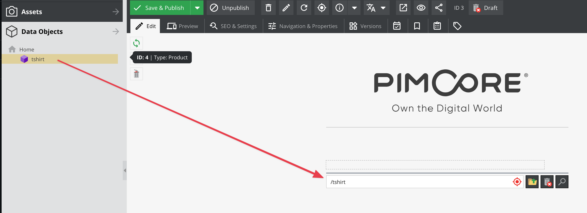
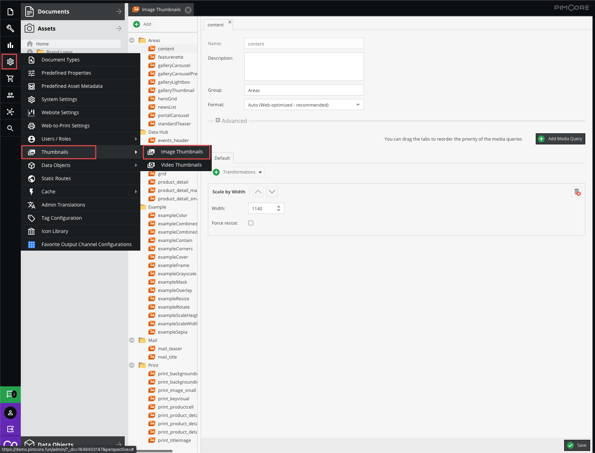
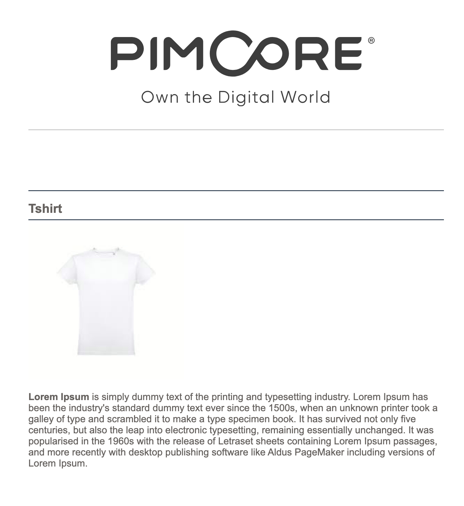

# Create a First Project

In this section, you will learn the basics of Pimcore, required to start developing. 


# Creating CMS Pages with Documents

In the first part you'll learn the basics for creating CMS pages with Pimcore Documents. 

## Create Template, Layout and Controller

### New Controller
First of all, we need a controller. 
Let's call it `ContentController.php`. 
You have to put the file into the `/src/Controller` directory.

```php
<?php

namespace App\Controller;

use Pimcore\Controller\FrontendController;
use Symfony\Bridge\Twig\Attribute\Template;
use Symfony\Component\HttpFoundation\Request;

class ContentController extends FrontendController
{
    #[Template('content/default.html.twig')]
    public function defaultAction(Request $request): array
    {
        return [];
    }
}
```

For the moment we only have one single action called `defaultAction()`.
In the defaultAction, we can put some custom code or assign values to the template. For this example we
don't need any custom code in our controller, so the action stays empty for the moment. 

### Create a Template
Now we create a template for our page:
* Create a new folder in `/templates` and name it like the controller (using the snake_case typo) (in the `content` case). 
* Put a new Twig template into this folder and name it like our action (using the snake_case typo) (`default.html.twig`).

Then we can put some template code into it, for example:
```twig



    <h1>{{ pimcore_input("headline", {"width": 540}) }}</h1>

    
        <h2>{{ pimcore_input('subline') }}</h2>
        {{ pimcore_wysiwyg('content') }}
    

```

Pimcore uses by default Symfony Twig engine, so you have the full power of Symfony templates with all Symfony functionalities available. In addition to that, there are some Pimcore specific additions like the so called *editables*, which add editable parts (placeholders) to the layout and some custom templating helpers. 

For details concerning editables (like `pimcore_input`, `pimcore_block`, ...) see [Editables](../03_Documents/01_Editables/README.md). 

### Add a Layout
We can use Symfony's [template inheritance and layout](https://symfony.com/doc/current/templates.html#template-inheritance-and-layouts) functionality 
to wrap our content page with another template which contains the main navigation, a sidebar, … using the following code:

```twig

```
We tell the engine that we want to use the layout `layout.html.twig`. 
  
Now create a new Twig template in the folder `/templates` and name it `layout.html.twig`.
Then we can also put some HTML and template code into it:

```twig
<!DOCTYPE html>
<html lang="en">
<head>
    <meta charset="UTF-8">
    <title>Example</title>
    <style>
        body {
            padding: 0;
            margin: 0;
            font-family: "Lucida Sans Unicode", Arial;
            font-size: 14px;
        }
    
        #site {
            margin: 0 auto;
            width: 600px;
            padding: 30px 0 0 0;
            color: #65615E;
        }
    
        h1, h2, h3 {
            font-size: 18px;
            padding: 0 0 5px 0;
            border-bottom: 1px solid #001428;
            margin-bottom: 5px;
        }
    
        h3 {
            font-size: 14px;
            padding: 15px 0 5px 0;
            margin-bottom: 5px;
            border-color: #cccccc;
        }
    
        img {
            border: 0;
        }
    
        p {
            padding: 0 0 5px 0;
        }
    
        a {
            color: #000;
        }
    
        #logo {
            text-align: center;
            padding: 50px 0;
        }
    
        #logo hr {
            display: block;
            height: 1px;
            overflow: hidden;
            background: #BBB;
            border: 0;
            padding: 0;
            margin: 30px 0 20px 0;
        }
    
        .claim {
            text-transform: uppercase;
            color: #BBB;
        }
    
        #site ul {
            padding: 10px 0 10px 20px;
            list-style: circle;
        }
    
        .buttons {
            margin-bottom: 100px;
            text-align: center;
        }
    
        .buttons a {
            display: inline-block;
            background: #6428b4;
            color: #fff;
            padding: 5px 10px;
            margin-right: 10px;
            width: 40%;
            border-radius: 2px;
            text-decoration: none;
        }
    
        .buttons a:hover {
            background: #1C8BC1;
        }
    
        .buttons a:last-child {
            margin: 0;
        }
    
    </style>
</head>
<body>
    <div id="site">
        <div id="logo">
            <a href="http://www.pimcore.com/"></a>
            <hr/>
        </div>
        {{ block('content') }}
    </div>
</body>
</html>
```

The code `{{ block('content') }}` is the placeholder where the content of the page will be inserted.

### Putting It All Together With Pimcore Documents
Now we need to connect the action to a page in the Pimcore backend, so that the page knows which action 
(and therefore also which template) needs to be executed/processed.
First, click right on *Home* in the *Documents* panel and Select *Add Page* > *Blank* to add a new page. 



Now select the tab *Settings* in the newly opened tab.
Select the Controller::Action and template (if different from controller action naming).


You can test the new controller and action, after saving the document (press *Save & Publish*).
Select the tab *Edit*, to see your page with all the editable placeholders.




# Introduction to Assets

In assets, all binary files like images, videos, office files and PDFs, ... can be uploaded, stored and managed. 
You can organize them in a directory structure and assign them additional meta data. 
Once uploaded, an asset can be used and linked in multiple places - e.g. documents or objects. 

In terms of images or videos, always upload only one high quality version (best quality available). 
[Thumbnails](../04_Assets/03_Working_with_Thumbnails/01_Image_Thumbnails.md) for different output 
channels are created directly 
[within Pimcore](../04_Assets/03_Working_with_Thumbnails/01_Image_Thumbnails.md) using custom configurations.

For this tutorial, at least add one file which you will use in an object later. 

There are many ways to upload files:
1. Drag & drop files from your file explorer into the browser on the desired asset folder
2. Right click on *Home* and choose the most suitable method for you


# Introduction to Objects
We've already made a controller, action and a view so we're able to add text from within the admin panel to our pages.
In this chapter we will create a simple product database and use them in our CMS pages. 
Objects are used to store any structured data independently from the output-channel and can be used anywhere in your project. 

## Create the Class Model/Definition

Go to: *Settings -> Object -> Classes* and click the button *Add Class*.



Now, there is a new product class/model which is a representation of your entity including the underlying database 
scheme as well as a generated PHP class you can use to create, update, list and delete your entities. 

More specific backgrounds and insights can be found in the [Objects section](../05_Objects/README.md)

The product should have the following attributes: **SKU**, **picture**, **name** and **description**. 
Follow these steps to add them: 

* Go to the edit page of the class product 
* Click right on *Base* and select *Add Layout Component -> Panel* - This is the main panel/container for the following product attributes
* To add attributes:
    * Click right on *Panel*, then *Add data component -> Text -> Input*, then change the name of the input component to **sku** (in the edit panel on the right side)
    * Just the same way you add the new data field for **name**
    * Now we're going to add a WYSIWYG attribute for the **description**. Again, click right, select *Add data component -> Text -> WYSIWYG*. We name it *description*.
    * The last attribute is for the picture. We can use on of the specialized image components in *Other -> Image*. Name the attribute **picture**.

If everything goes well, the new class looks like in the picture:



**Important:** Every generated class in the Pimcore admin panel has an associated PHP class 
with getters and setters. You can find the PHP class representation of our newly created class definition above in 
`var/classes/DataObject/Product.php` 

## Add a new Object

We've just prepared a simple class for new products. 
Now we can use it to create objects in Pimcore.

* Open the objects section on the left and click on the right button after *Home* (Note that you can also create directory structures for objects).
* Choose *Add object -> product* and fill the input with a name, for example: *tshirt*
* Add values for sku, name and description attributes.
* Click *Save & Publish*

Probably, your view looks like below:


The last step to finish the product object is adding a photo.

One way to upload a photo is using this button:  or just drag a file that you uploaded from the Assets section.

Click *Save & Publish* button. 

That's it. 




# Putting the Pieces Together
Let's put the pieces together and connect the products to the CMS. 

## Update Controller and Template
Therefore create another action in the controller (ContentController) called `productAction`.
 
```php
<?php

namespace App\Controller;

use Pimcore\Controller\FrontendController;
use Symfony\Bridge\Twig\Attribute\Template;
use Symfony\Component\HttpFoundation\Request;
use Symfony\Component\HttpFoundation\Response;

class ContentController extends FrontendController
{
    #[Template('content/default.html.twig')]
    public function defaultAction (Request $request): array
    {
        return [];
    }
    
    public function productAction(Request $request): Response
    {
        return $this->render('content/product.html.twig');
    }
}
```

Then we also need a new template for our product action: `templates/content/product.html.twig` 

```twig



    <h1>{{ pimcore_input("headline", {"width": 540}) }}</h1>

    <div class="product-info">
        
            {{ pimcore_relation("product") }}
        
            <!-- Product information-->
        
    </div>

```

`{{ editmode }}` is a standard variable (it's always set), that checks if the view is called from the Pimcore admin backend and gives you the 
 possibility to do different stuff in editmode and in the frontend. 

`{{ pimcore_relation("product") }}` is one of the possible editable placeholders. It can be used to make 1 to 1 relations. A cool 
alternative for that would be the [Renderlet](../03_Documents/01_Editables/28_Renderlet.md) editable.  
Click [here](../03_Documents/01_Editables/README.md) for a full list of available editables in Pimcore.


## Add the Product Object to a Document

The last thing is to show the product in the body of the document you created. 

Let's go back to the documents section. Right click on *Home* then *Add Page* > *Empty Page*.
In the settings label, choose the `product` action and the `Content` controller, click save and go back to the edit tab.

Now you can see the new editable element (`relation`) which we added in the product template above.
Drag the product object to that editable and press *Save & Publish*.



Let's see what happened on the frontend... 

Go to the product page. In my case, let's say `http://pimcore.local/tshirt` where *tshirt* is the identifier of the product (the name visible the documents tree).

We haven't implemented frontend features yet, therefore the page doesn't contain any product information.

Add a few lines in the template file (`templates/content/product.html.twig`):

```twig


    <h1>{{ pimcore_input("headline", {"width": 540}) }}</h1>

    <div class="product-info">
        
            {{ pimcore_relation("product") }}
        
             
             
                <h2>{{ product.name }}</h2>
                <div class="content">
                    {{ product.description|raw }}
                </div>
            
        
    </div>

```

You are now able to access the linked object above by using the method `getElement()`.
Now you have access to the entire data from the linked object (name, description, ...).

## Add a Thumbnail Configuration
To show the product image in the view, we need to add a thumbnail configuration first. Using [thumbnail configurations](../04_Assets/03_Working_with_Thumbnails/01_Image_Thumbnails.md),
Pimcore automatically renders optimized images for certain output channels (including high-res @2x versions). 

Adding a thumbnail configuration can be achieved by adding a configuration as depicted below. For now, simply add a configuration named `content`. 



## Showing the Image in the View
Last but not least, we would like to show the product picture: 

```twig
<div class="content">
    
        {{ product.picture.thumbnail("content").html|raw }}
    

    {{ product.description|raw }}
</div>
```
As you can see, Image is an additional class with useful attributes and functions.
To print out the image in the right size just use the method `thumbnail.html` which returns the `` or `<picture>` (when using media queries in your config) tag with the 
correct image path and also sets alt attributes to values based on the asset meta data. 

Now the product page should look like this:


