# Image Thumbnails

Pimcore offers an advanced thumbnail service (also called "image pipeline") that transforms images
in unlimited steps to produce the desired result. You can configure transformation pipelines in Pimcore Studio via the mega menu under
_Asset Management_ > _Image Thumbnails_.

Every image stored as an asset can be transformed through this service.
Pimcore does not support modifying images that are not stored as assets.

> **Tip:** For most web applications, use the **auto format** setting on your thumbnail
> configurations. It automatically selects the best image format (JPEG, PNG) based on image
> characteristics and generates optimized variants (WebP, AVIF) using progressive enhancement.
> See [Customize Auto Format](./04_Advanced_Image_Thumbnails.md#customize-auto-web-optimized-format)
> for configuration details.

> **IMPORTANT**
> Use the Imagick PECL extension for best results. GDlib is a fallback with limited functionality
> (only PNG, JPG, GIF) and lower quality. If Imagick is available, it is used by default,
> otherwise Pimcore falls back to GD.
> Using ImageMagick, Pimcore supports hundreds of formats including AI, EPS, TIFF, PNG, JPG, GIF, PSD, and more.
> Not all formats are allowed out of the box. To extend the list, see [Allowed Formats](./README.md#allowed-formats).

## Creating Transformation Pipelines

To create a new pipeline, open _Asset Management_ > _Image Thumbnails_ in the Pimcore Studio
mega menu and click _Add Thumbnail_.
Configure the name, description, format, and quality, then add transformations.
Click _+_ to add a new transformation. For example:

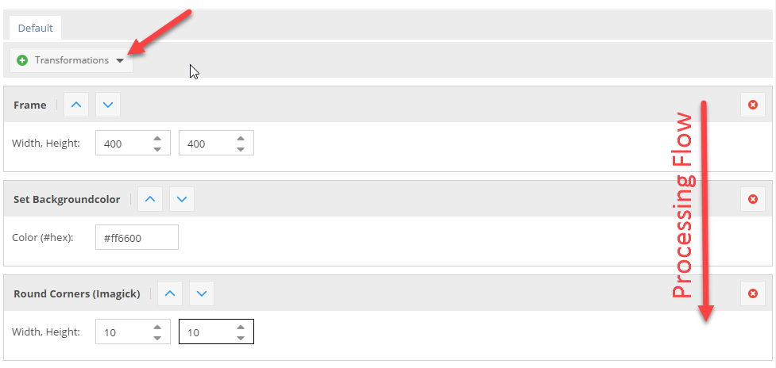

**Important:** Transformations run in order from top to bottom. In the configuration above,
if you round the corners first, this applies to the original image, and then the image gets resized,
so the rounded corners are also resized, which is not intended.

## Retrieving Thumbnails

Call `$asset->getThumbnail("thumbnail-name")` on an asset object to get
a `\Pimcore\Model\Asset\Image\Thumbnail` object. The thumbnail object's `__toString()` method
returns the path to the thumbnail file, for example:
`/Car%20Images/ac%20cars/68/image-thumb__68__content/automotive-car-classic-149813.jpg`

**Important:** `getThumbnail()` does not generate the thumbnail itself. It returns the path
where the thumbnail file will be stored. To generate the thumbnail immediately,
see [Deferred Rendering of Thumbnails](#deferred-rendering-of-thumbnails).

Use the path directly in `` or `<picture>` tags:

```php
$image = Asset::getById(1234);

// get path to thumbnail, e.g. /foo/bar/362/image-thumb__362__content/foo.webp
$pathToThumbnail = $image->getThumbnail("myThumbnailName");

// preferred alternative - let Pimcore create the whole image tag
// including high-res alternatives (srcset) or media queries, if configured
$htmlCode = $image->getThumbnail("myThumbnail")->getHtml();
```

Same in Twig:

```twig


{# get path to thumbnail, e.g. /foo/bar/362/image-thumb__362__content/foo.webp #}


{# preferred alternative - let Pimcore create the whole image tag #}
{# including high-res alternatives (srcset) or media queries, if configured #}
{{ image.thumbnail('myThumbnailName').html|raw }}
```

## Explanation of the Transformations

| Transformation   | Description                                                                                                                                                                                                                                                                                                               | Configuration                                                    | Result                                                           |
| ---------------- | ------------------------------------------------------------------------------------------------------------------------------------------------------------------------------------------------------------------------------------------------------------------------------------------------------------------------- | ---------------------------------------------------------------- | ---------------------------------------------------------------- |
| ORIGINAL IMAGE   | This is the image which is used in the following transformations                                                                                                                                                                                                                                                          | NONE ;-)                                                         |      |
| RESIZE           | The image is exactly resized to the given dimensions without respecting the ratio.                                                                                                                                                                                                                                        | 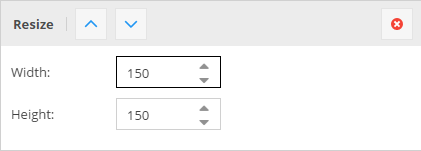         |          |
| SCALE BY HEIGHT  | The image is scaled respecting the ratio to the given height, the width is variable depending on the original ratio of the image (portrait, landscape).                                                                                                                                                                   | 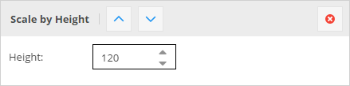         |          |
| SCALE BY WIDTH   | The image is scaled respecting the ratio to the given width, the height is variable depending on the original ratio of the image (portrait, landscape).                                                                                                                                                                   | 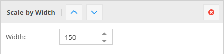           |            |
| CONTAIN          | The image is scaled to either the given height or the width, depending on the ratio of the original image. That means that the image is scaled to fit into a "virtual" box with the dimensions given in the configuration.                                                                                                | 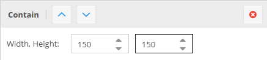       |        |
| CROP             | Cuts out a box of the image starting at the given X,Y coordinates and using the width and height.                                                                                                                                                                                                                         | 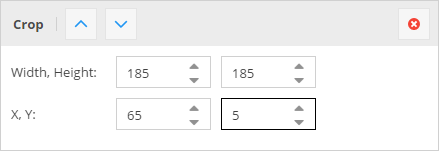             |              |
| COVER            | The image is resized so that it completely covers the given dimensions. Then the overlapping pieces are cropped depending on the given positioning or based on the focal point set on the source image. This is useful if you need a fixed size for a thumbnail but the source images have different ratios.              | 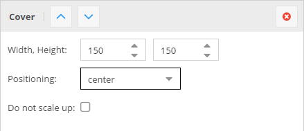           |            |
| FRAME            | The transformation is the same as CONTAIN the difference is, that the image gets exactly the entered dimensions by adding transparent borders left / right or top / bottom.                                                                                                                                               | 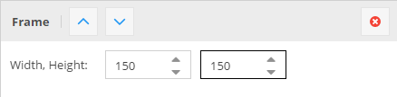           |            |
| ROTATE           | Rotates the image with the given angle. The background is transparent by default.                                                                                                                                                                                                                                         | 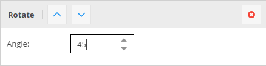         |          |
| BACKGROUND COLOR | Background color is especially useful if you have transparent PNG as source data or if you're using the FRAME or the ROTATE transformations where you get transparencies. It allows you to give transparencies a color, and gives you the possibility to use them for example with JPEGs which do not support transparency. | 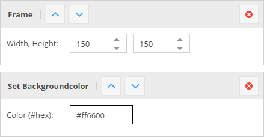 |  |
| ROUNDED CORNERS  | Rounds the corners to the given width/height.                                                                                                                                                                                                                                                                             | 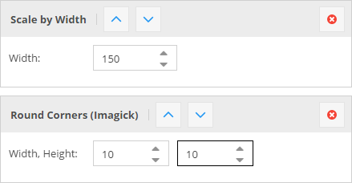         |          |

For thumbnails in action, have a look at the [Live Demo](https://demo.pimcore.fun/en/More-Stuff/Developers-Corner/Thumbnails).

## Generating HTML for Thumbnails

Pimcore offers the method `getHtml(array $options)` to get a ready-to-use `<picture>` tag
for your thumbnail. When a `<picture>` element is not needed or desired, use
`getImageTag(array $options, array $removeAttributes)` to get an `` element instead.

Configure the generated markup with these options:

| Name                           | Type     | Description                                                                                                                        |
|--------------------------------| -------- |------------------------------------------------------------------------------------------------------------------------------------|
| `disableWidthHeightAttributes` | bool     | Width & height attributes are set automatically by Pimcore, to avoid this set this option (e.g. to true => isset check)            |
| `disableAutoTitle`             | bool     | Set to true to disable the automatically generated title attribute (containing title and copyright from the origin image)          |
| `disableAutoAlt`               | bool     | Set to true to disable the automatically generated alt attribute                                                                   |
| `disableAutoCopyright`         | bool     | Set to true to disable the automatically appended copyright info (alt & title attribute)                                           |
| `pictureAttributes`            | array    | A key-value array of custom attributes to apply to the generated `<picture>` tag                                                   |
| `imgAttributes`                | array    | A key-value array of custom attributes to apply to the generated `` tag                                                       |
| `lowQualityPlaceholder`        | bool     | Puts a small SVG/JPEG placeholder image into the `src` (data-uri), the real image path is placed in `data-src` and `data-srcset`.  |
| `pictureCallback`              | callable | A callable to modify the attributes for the generated `<picture>` tag. One argument passed: the array of attributes.               |
| `sourceCallback`               | callable | A callable to modify the attributes for any of the generated `<source>` tags. One argument passed: the array of attributes.        |
| `imgCallback`                  | callable | A callable to modify the attributes for the generated `` tag. One argument passed: the array of attributes.                   |
| `disableImgTag`                | bool     | Set to `true` to not include the `` fallback tag in the generated `<picture>` tag.                                            |
| `useDataSrc`                   | bool     | Set to `true` to use `data-src(set)` attributes instead of `src(set)`.                                                             |
| `useFrontendPath`              | bool     | Set to `true` to use the full URL (including the frontend_prefix).                                                                 |

### Auto Alt

The Auto Alt functionality automatically falls back to any available `alt` value by checking
the metadata entries (with name `alt` or `defaultalt`).
If none is found, it uses the image `title` as the `alt` value.
You can define an alternative metadata field for `alt`, `copyright`, and `title` values
(e.g. by defining `pimcore.assets.metadata.alt` in the configuration) that is used when
inline options are not passed.

## Usage Examples

```twig
{# Use directly on the asset object #}
{{ pimcore_asset_by_path('/path/to/image.jpg').thumbnail('myThumbnail').html|raw }}

{# ... with some additional options #}
{{ pimcore_asset_by_path('/path/to/image.jpg').thumbnail('myThumbnail').html({
    pictureAttributes: {
        data-test: "my value"
    },
    disableImgTag: true
})|raw }}

{# Use with the image tag in documents #}
<div>
    <p>
        {{ pimcore_image('myImage', {'thumbnail': 'myThumbnail'}) }}
    </p>
</div>

{# Use without pre-configured thumbnail #}
{{ pimcore_image('myImage', {
    'thumbnail': {
        'width': 500,
        'aspectratio': true,
        'interlace': true,
        'quality': 85,
        'format': 'png'
    }
}) }}

{# Use from an object-field #}
{# where "myThumbnail" is the name of the thumbnail configuration in settings -> thumbnails #}

   {{ myObject.myImage.thumbnail('myThumbnail').html|raw }}


{# Use from an object-field with dynamic configuration #}


{# Use directly on the asset object using dynamic configuration #}
{{ pimcore_asset_by_path('/path/to/image.jpg').thumbnail({'width': 500, 'format': 'png'}).html|raw}}
```

## Advanced Examples

Pimcore returns a `\Pimcore\Model\Asset\Image\Thumbnail` object when calling
`$asset->getThumbnail("thumb-name")`, which gives you additional flexibility
when working with thumbnails.

```php
$thumbnail = $asset->getThumbnail("myThumbnail");

// get the final dimensions of the thumbnail (especially useful when working with dynamic configurations)
$width = $thumbnail->getWidth();
$height = $thumbnail->getHeight();

// get the html "<picture>" tag for the thumbnail incl. custom class on the containing `` tag:
echo $thumbnail->getHtml(['imgAttributes' => ["class" => "custom-class"]]);

// get the path to the thumbnail
$path = $thumbnail->getPath();

// get path and disable deferred thumbnails
$path = $thumbnail->getPath(["deferredAllowed" => false]);
// possible options: ["deferredAllowed" => true, "cacheBuster" => false, "frontend" => false]

// getting the full url to a thumbnail (including the frontend_prefix) - also works in console commands
$path = $thumbnail->getFrontendPath();
//or
$path = $thumbnail->getPath(['deferredAllowed' => false, 'frontend' => true]);

// Asset\Image\Thumbnail implements __toString(), so you can still print the path by
echo $thumbnail; // prints something like /Car%20Images/....png

// examples for callbacks, etc. for the generated <picture> tag
$thumbnail->getHtml([
    'useDataSrc' => true,
    'pictureAttributes' => [
        'data-bar' => uniqid(),
    ],
    'imgAttributes' => [
        'data-foo' => uniqid(),
    ],
    'imgCallback' => function ($attributes) {
        // modify  tag attributes
        $attributes['data-foo'] = 'new value';
        return $attributes;
    },
    'sourceCallback' => function ($attributes) {
        // modify <source> tag attributes
        $attributes['data-custom-source-attr'] = uniqid();
        return $attributes;
    },
    'pictureCallback' => function ($attributes) {
        // modify <picture> tag attributes
        $attributes['data-custom-picture-attr'] = uniqid();
        return $attributes;
    },
    'disableImgTag' => true,
    'lowQualityPlaceholder' => true,
]);
// get thumbnail instance in a specific file format
$webpThumbnail = $thumbnail->getAsFormat('webp');
$webpThumbnail->getHtml();
```

## More Examples

```twig
{# adding custom html attributes to the generated  or <picture> tag, using a dynamic thumbnail #}
{{ image.thumbnail({
    'width': 180,
    'height': 180,
    'cover': true,
}).html({
    'imgAttributes': {
        'class': 'thumbnail-class',
    },
    'data-my-name': 'my value',
    'attributes': {
        'non-standard': 'HTML attributes',
        'another': 'one'
    }
})|raw }}

{# same with a thumbnail definition #}
{{ image.thumbnail('exampleScaleWidth').html({
    'pictureAttributes': {
        'class': 'thumbnail-class',
    },
    'data-my-name': 'my value',
})|raw }}

{# disable the automatically added width & height attributes #}
{{ image.thumbnail('exampleScaleWidth').html({}, ['width', 'height'])|raw }}

{# add alt text #}
{{ image.thumbnail('exampleScaleWidth').html({'alt': 'top priority alt text'})|raw }}
{# OR #}
{{ image.thumbnail('exampleScaleWidth').html({'defaultalt': 'default alt, if not set in image'})|raw }}

{# Output only  element without <picture> and <source> around it #}
{{ image.thumbnail('exampleScaleWidth').imageTag({'alt': 'top priority alt text'}) }}
```

Additionally, there are some special parameters to [customize generated image HTML code](../../01_Documents/02_Templates/03_Editables/14_Image.md#configuration).

## Lazy Loading

Images use lazy loading by default. To change this, set the loading attribute to "eager":

```twig
{{ image.thumbnail('example').html({
    'imgAttributes': {
        'loading': 'eager',
    }
})|raw }}
```

## Dynamic Generation on Request

Pimcore auto-generates a thumbnail if it is requested but does not exist on the file system
and is called directly via its file path (not using any of the `getThumbnail()` methods).

For example, call `https://example.com/examples/panama/6644/image-thumb__6644__contentimages/img_0037.jpeg`
directly in your browser (`/examples/panama/` is the path to the source asset, `6644` is the ID
of the source asset, `contentimages` is the name of the thumbnail configuration, `img_0037.jpeg`
the filename of the source asset). Pimcore checks if the asset with ID 6644 and the thumbnail
with the key "contentimages" exist. If yes, the thumbnail is generated on-the-fly and delivered
to the client. When requesting the image again, the web server (Apache, Nginx) serves the file
directly because it already exists (the same way it works with the `getThumbnail()` methods).

The path structure is identical to the one generated by `getThumbnail()`, so it does not matter
whether the thumbnail is generated by `getThumbnail()` (inside a PHP process) or on-the-fly
(in a separate process).

This works only with predefined (named) thumbnail configurations, not with dynamic configurations.

> **WARNING**
> This feature is delivered through PublicServicesController and may not work if the controller
> is unreachable (e.g. during maintenance mode).
> When requesting an image without providing a hash, the content cannot be browser-cached like
> regular Nginx-served files, as the file without hash does not exist physically.

## Deferred Rendering of Thumbnails

For performance reasons, Pimcore does not generate the thumbnail image directly when calling
`getThumbnail()` on an asset. Instead, it generates thumbnails when they are actually needed
(on request).

Sometimes it is necessary to have the actual image already generated. In this case, pass a
second parameter to `getThumbnail()` to force processing:

```php
$asset = Asset\Image::getById(123);
$asset->getThumbnail("myConfig", false); // set the 2nd parameter to false
```

Processing is also forced when calling `getPathReference()` or `getPath(["deferredAllowed" => false])`
on the returned thumbnail object:

```php
$asset->getThumbnail("myConfig")->getPathReference();
// or
$asset->getThumbnail("myConfig")->getPath(['deferredAllowed' => false]);
```

## Downloading Asset Thumbnails

Besides embedding thumbnails into CMS pages and distributing them via other channels,
users can download a thumbnail of an asset in Pimcore Studio.
To make a thumbnail downloadable, mark "List as option in download section on image detail view"
in the Image Thumbnail Advanced settings. All thumbnails with this option enabled are listed
in the "Download Thumbnail" dropdown on the detail view of an asset.
To download the thumbnail, choose it from the list and hit the "Download" button.

## Further Reading

For advanced features like high-resolution support, media queries, focal points, clipping support,
ICC color profiles, auto (web-optimized) format configuration, and custom image processing adapters,
see [Advanced Image Thumbnail Features](./04_Advanced_Image_Thumbnails.md).
