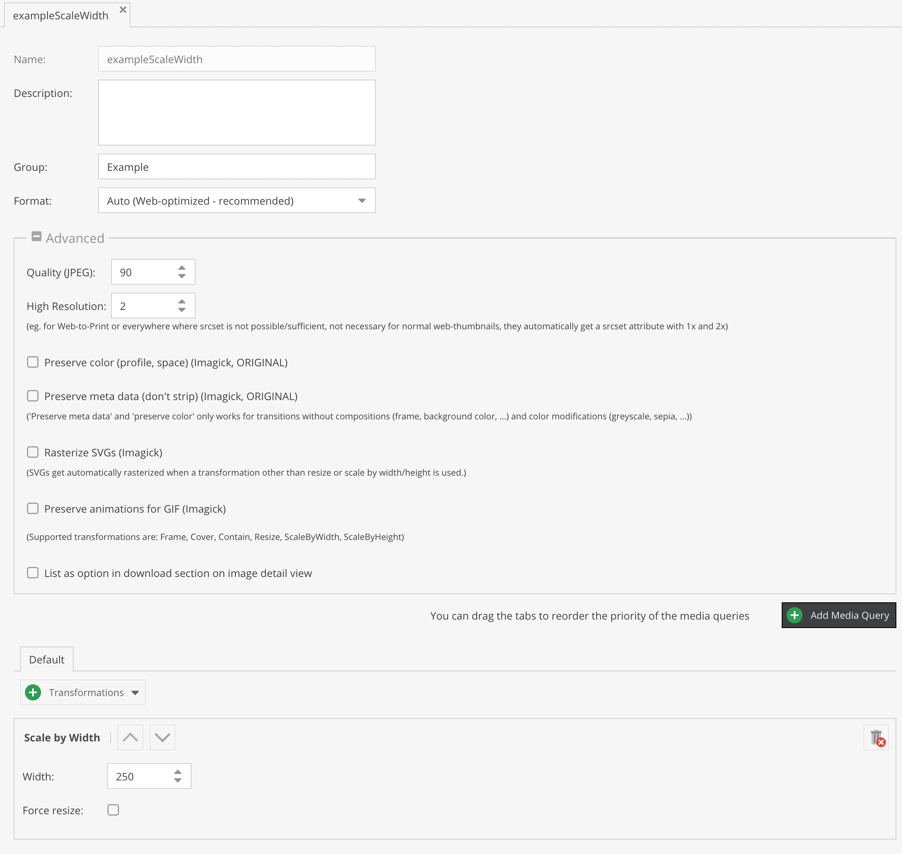
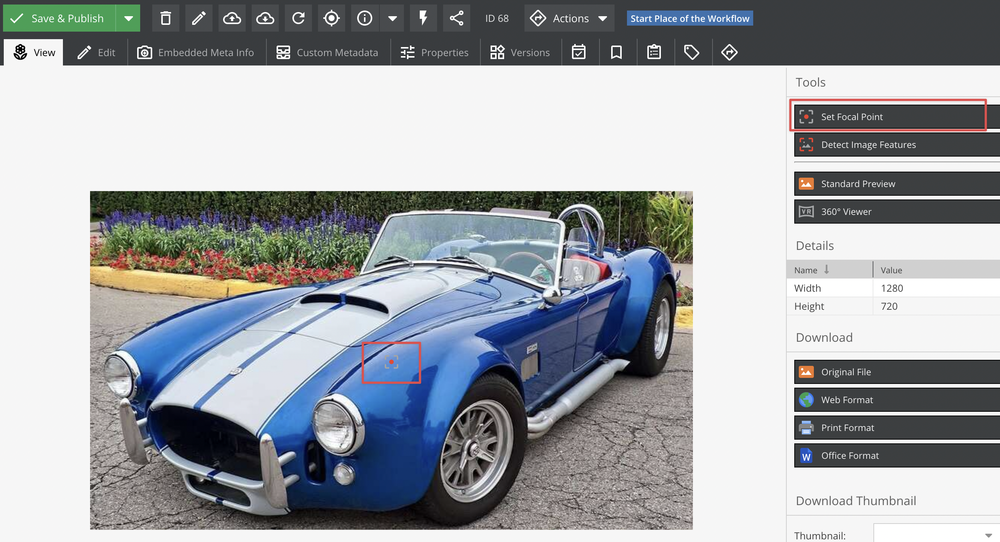
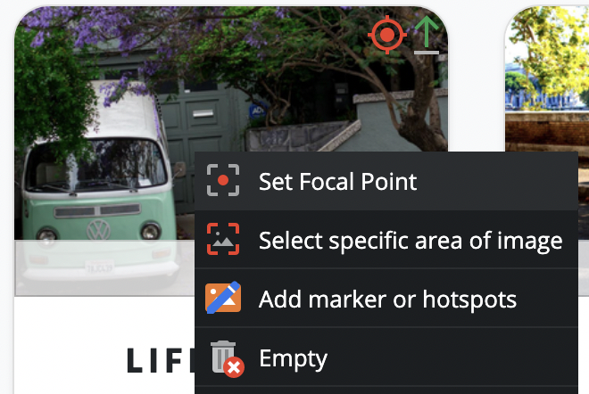
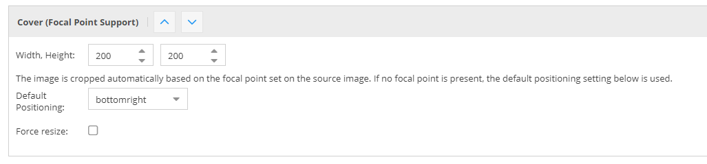

# Advanced Image Thumbnails

This page covers advanced image thumbnail features. For the basics of creating thumbnail
configurations and generating HTML, see [Image Thumbnails](./01_Image_Thumbnails.md).

## High-Resolution Support

Pimcore supports embedding high-resolution (ppi/dpi) images. For typical web-based cases,
Pimcore automatically adds the `srcset` attribute to `` and `<picture>` tags,
so no manual work is necessary. The following is only needed in special use-cases like
Web-to-Print.

The high-resolution scaling factor is limited to `5.0` (e.g. `@5x`). Float values are supported.
To increase the limit, use the `max_scaling_factor` configuration option:

```yaml
pimcore:
    assets:
        thumbnails:
            max_scaling_factor: 6.0
```

You can define the maximum automatic DPI scaling factor used for image thumbnail srcset values
via the `pimcore.assets.image.thumbnails.max_srcset_dpi_factor` configuration option.
By default, this value is set to 2, and the `getSrcset()` method generates values
in increments of 1.

### Use in the Thumbnail Configuration



The above configuration generates a thumbnail with 500px width.

When using this configuration with the [image editable](../../01_Documents/02_Templates/03_Editables/14_Image.md):

```twig
{{ pimcore_image('myImage', {'thumbnail': 'contentimages'}) }}
```

this creates the following output:

```html

```

You can also add high-res dynamically:

```twig
{{ pimcore_image('myImage', {thumbnail: {
    width: 250,
    contain: true,
    highResolution: 2
}}) }}
```

This creates an image `width = 500px`.

### Combining Dynamic Generation on Request with High-Resolution Images

This is especially useful when you want to serve thumbnails depending on the ppi of the device
screen or in combination with Web-to-Print documents (browser preview with normal size, tripled
in size for PDF output). Pimcore also uses this functionality internally to provide the
automatically added high-res support on `` and `<picture>` tags.
This feature is only useful in some edge cases.

#### Example

```twig
{{ image.thumbnail('testThumbnailDefinitionName').path }}
```

This generates the following output:

```sh
/Car%20Images/ac%20cars/68/image-thumb__68__testThumbnailDefinitionName/automotive-car-classic-149813.jpg
```

To get a high-res version of the thumbnail, add `@2x` before the file extension:

```sh
/Car%20Images/ac%20cars/68/image-thumb__68__content/automotive-car-classic-149813@2x.png
/Car%20Images/ac%20cars/68/image-thumb__68__content/automotive-car-classic-149813@5x.png
```

Using float is possible too:

```sh
/Car%20Images/ac%20cars/68/image-thumb__68__content/automotive-car-classic-149813@3.2x.png
```

Pimcore then dynamically generates the thumbnails accordingly.

## Media Queries in Thumbnail Configuration

When you use media queries in your thumbnail configuration, Pimcore automatically generates
a `<picture>` tag when calling `$asset->getThumbnail("example")->getHtml()`.
In some cases it is necessary to get single thumbnails for certain media queries out of the
thumbnail object:

```php
$a = Asset::getById(71);

// list all available medias in "galleryCarousel" thumbnail configuration
p_r(array_keys(Asset\Image\Thumbnail\Config::getByName("galleryCarousel")->getMedias()));

// get the <picture> element for "galleryCarousel" => default behavior
$a->getThumbnail("galleryCarousel")->getHtml();

// get path of thumbnail for media query min-width: 940px
$a->getThumbnail("galleryCarousel")->getMedia("(min-width: 940px)");

// get  tag for media query min-width: 320px including @srcset 2x
$a->getThumbnail("galleryCarousel")->getMedia("(min-width: 320px)")->getHtml();

// get 2x thumbnail path for media query min-width: 320px
$a->getThumbnail("galleryCarousel")->getMedia("(min-width: 320px)", 2);
```

## Focal Point

Pimcore supports focal points on images, which are considered when images are automatically
cropped. Currently this applies to the `COVER` transformation. If a focal point is set on
the source image, it is automatically considered and the thumbnail is cropped accordingly
to keep the focus on the focal point.







## Clipping Support

Images with an embedded clipping path (8BIM / Adobe profile metadata) are automatically
clipped when generating thumbnails.

To disable automatic clipping, add the following configuration:

```yaml
pimcore:
    assets:
        image:
            thumbnails:
                clip_auto_support: false
```

## Using ICC Color Profiles for CMYK to RGB

Pimcore supports ICC color profiles to get better results when converting CMYK images
(without embedded color profile) to RGB.

Due to licensing, Pimcore does not include color profiles (*.icc files) in the download package.
You can download them for free here:
[Adobe ICC Profiles](https://www.adobe.com/support/downloads/iccprofiles/iccprofiles_win.html)
or here: [ICC (color.org)](https://www.color.org/profiles.xalter).

After downloading the profiles, put them into your project folder or anywhere else on your server
(e.g. `/usr/share/color/icc`). Then configure the path:

```yaml
pimcore:
    assets:
        # Absolute path to default ICC RGB profile (if no embedded profile is given)
        icc_rgb_profile: null

        # Absolute path to default ICC CMYK profile (if no embedded profile is given)
        icc_cmyk_profile: null
```

## Customize Auto (Web-Optimized) Format

For most web-based applications, use the auto configuration, which does the following:

- Automatically selects the target image format (`jpeg`, `png`) based on image characteristics
  (such as alpha channel)
- Generates multiple additional optimized image formats (`webp`, `avif`) using progressive
  enhancement (in `<picture>` tag)
- Runs image optimizers (such as `jpegoptim` and `pngout`) on generated images using an async queue

Even with the auto setting, you still need to set a quality in the thumbnail configuration.
This quality is used by `jpeg` and `png` and, if not configured otherwise, also for `webp`.
If `avif` is supported by Imagick, it uses a fixed value instead of the thumbnail configuration quality.

You can customize the alternative image formats and their qualities:

```yaml
pimcore:
    assets:
        image:
            thumbnails:
                auto_formats:
                    # the quality is used by Imagick, set to null if quality value from config should be used
                    # the following config is used as the default by Pimcore
                    # the order of the formats is used for the priority of the <source> in the <picture> tag
                    avif:
                        quality: 15
                    webp:
                        quality: null
                        enabled: true
```

### Disabling All Auto-Formats

```yaml
pimcore:
    assets:
        image:
            thumbnails:
                auto_formats: null
```

## Manually Specifying the Image Processing Adapter

You can manually specify the image processing adapter (Imagick or GD).
The default is auto-detected based on the availability of the `imagick` PECL extension.
You can also implement your own adapter by implementing `Pimcore\Image\AdapterInterface`.

To specify the adapter, use the following service configuration:

```yaml
services:
    Pimcore\Image\AdapterInterface:
        alias: Pimcore\Image\Adapter\GD
        public: true
```

The adapter service needs to be public.

## Note on Using WebP with Imagick Delegates

Ensure that your delegate definition for WebP encoding includes the `-q` flag, otherwise
the quality setting on thumbnails will not be considered and the default value of `75`
is used by `cwebp`.

Working example of a WebP encode delegate (defined in `/etc/ImageMagick-6/delegates.xml`):

```xml
<delegate decode="png" encode="webp" command="&quot;cwebp&quot; -quiet -q %Q &quot;%i&quot; -o &quot;%o&quot;"/>
```
