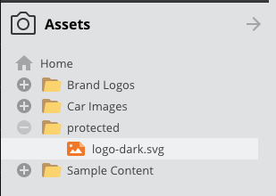

# Restricting Public Asset Access

By default, all data stored as Pimcore assets is publicly accessible via its URL
(e.g. `https://mydomain.com/my-assetfolder/my-asset.jpg`) without login or other access restriction.
Confidential data **must not** be stored as Pimcore assets without additional protection measures.

This default exists for performance reasons: delivering an asset directly via the web server
requires significantly fewer resources than starting a PHP process for every asset request
(especially for thumbnails).

If you need to restrict access, Pimcore provides two options:

| Option | Approach | Performance Impact |
|--------|----------|--------------------|
| **Option 1** | Block access entirely at the web server level | None (requests never reach PHP) |
| **Option 2** | Route requests through a controller for permission checks | Significant (PHP process per request) |

Choose **Option 1** when assets should never be accessible publicly. Choose **Option 2** when
you need to check permissions at runtime (e.g. user-specific access control).


## Option 1 - Restricting Access Completely

All confidential assets must be stored within one (or a few) folders, e.g. within `/protected`
(this is also required for Pimcore permissions).



### Apache

In the `.htaccess` of the project, restrict access to this folder with an additional rewrite rule.
Place this rule **before** the rewrite rule for asset delivery:

```apache
...
RewriteRule ^protected/.* - [F,L]
RewriteRule ^var/.*/protected(.*) - [F,L]
RewriteRule ^cache-buster\-[\d]+/protected(.*) - [F,L]

# ASSETS: check if request method is GET (because of WebDAV) and if the requested file (asset) exists on the filesystem, if both match, deliver the asset directly
...
```

### Nginx

Add the following parts to your Nginx configuration directly after the index directive:

```nginx
location ~ ^/protected/.* {
  return 403;
}

location ~ ^/var/.*/protected(.*) {
  return 403;
}

location ~ ^/cache-buster\-[\d]+/protected(.*) {
  return 403;
}
```

A full configuration example can be found on the
[Nginx Configuration](https://github.com/pimcore/platform-version/blob/2026.x/doc/03_Getting_Started/01_Installation/02_System_Setup_and_Hosting/02_Nginx_Configuration.md) page.


Because of this rule, all assets located within `/protected` (including all their thumbnails)
are no longer delivered via the web server. As a consequence, direct download links and
Pimcore-generated img tags for thumbnails cannot be used. All delivery of these assets
must be done manually via a custom controller action.


## Option 2 - Checking Permissions Before Delivery

This option does not restrict delivery entirely, but routes asset requests to a controller action
that can check access permissions with custom business logic and then deliver the asset or not.

Again, all confidential assets must be stored within one (or a few) folders, e.g. within `/protected`.


### Apache

In the `.htaccess` of the project, route requests to assets in this folder to `index.php`.
Place this rule **before** the rewrite rule for asset delivery:

```apache
...
RewriteRule ^protected/(.*) %{ENV:BASE}/index.php [L]
RewriteRule ^var/.*/protected(.*) - [F,L]
RewriteRule ^cache-buster\-[\d]+/protected(.*) - [F,L]

# ASSETS: check if request method is GET (because of WebDAV) and if the requested file (asset) exists on the filesystem, if both match, deliver the asset directly
...
```

### Nginx

Add the following parts to your Nginx configuration directly after the index directive:

```nginx
rewrite ^(/protected/.*) /index.php$is_args$args last;

location ~ ^/var/.*/protected(.*) {
  return 403;
}

rewrite ^(/cache-buster-(?:\d+)/protected(?:.*)) /index.php$is_args$args last;

location ~ ^/cache-buster\-[\d]+/protected(.*) {
  return 403;
}
```

A full configuration example can be found on the
[Nginx Configuration](https://github.com/pimcore/platform-version/blob/2026.x/doc/03_Getting_Started/01_Installation/02_System_Setup_and_Hosting/02_Nginx_Configuration.md) page.


In the application, define a route in `config/routes.yaml` and a controller action that handles the request:

```yaml
# config/routes.yaml

# important: these must be the top routes in the file!
asset_protect:
    path: /protected/{path}
    defaults: { _controller: App\Controller\MyAssetController::protectedAssetAction }
    requirements:
        path: '.*'

cache_buster_asset_protect:
    path: /cache-buster-{id}/protected/{path}
    defaults: { _controller: App\Controller\MyAssetController::protectedAssetAction }
    requirements:
        id: '\d+'
        path: '.*'
```

```php
<?php

namespace App\Controller;

use Pimcore\Controller\FrontendController;
use Pimcore\Model\Asset;
use Pimcore\Model\Asset\Service;
use Symfony\Component\HttpFoundation\Request;
use Symfony\Component\HttpFoundation\Response;
use Symfony\Component\HttpFoundation\StreamedResponse;
use Symfony\Component\HttpKernel\Exception\AccessDeniedHttpException;

class MyAssetController extends FrontendController
{
    public function protectedAssetAction(Request $request): Response
    {
        // IMPORTANT!
        // Add your permission check here and throw AccessDeniedHttpException if denied.

        // the following code is responsible to deliver asset & thumbnail contents
        // modify it the way you need it for your use-case
        $pathInfo = $request->getPathInfo();
        $asset = Asset::getByPath($pathInfo);
        if ($asset){
            $stream = $asset->getStream();
            return new StreamedResponse(function () use ($stream) {
                fpassthru($stream);
            }, 200, [
                'Content-Type' => $asset->getMimeType(),
            ]);
        } else {
            return Asset\Service::getStreamedResponseByUri($pathInfo);
        }

        throw new AccessDeniedHttpException('Access denied.');
    }
}
```

This option has significant impact on server load and delivery performance of assets (and thumbnails).
It is **not** recommended to deliver all assets this way, only the confidential ones.
