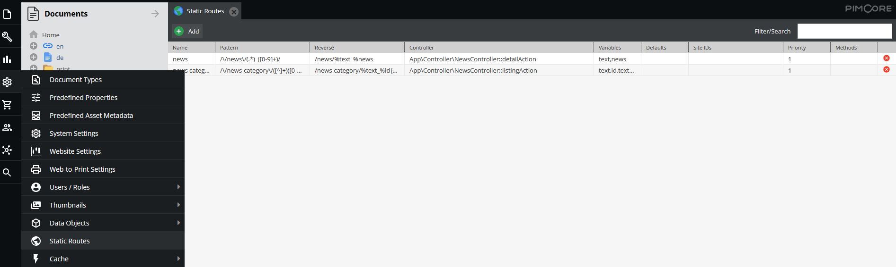
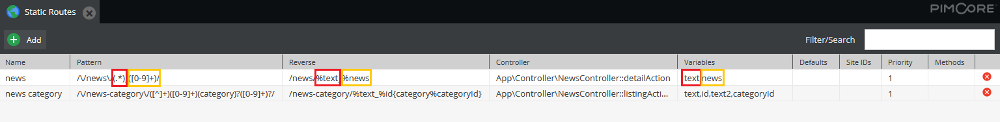

# URLs Based on Custom (Static) Routes 
:::caution

To use this feature, please enable the `PimcoreStaticRoutesBundle` in your `bundle.php` file and install it accordingly with the following command:

`bin/console pimcore:bundle:install PimcoreStaticRoutesBundle`

:::

## Introduction
Static routes are necessary for functionalities where you don't have an underlying document or where you have the need
of dynamic URLs. For example you have a news list, which is generated out of a Pimcore object list and you want to give 
the news a detail page. Or you want create product lists with detail pages, or cart pages, a checkout process, ... 

All things where Documents are not practical. Here Custom Routes come into action and allow the definition of URL patterns 
 that are delegated to specific controllers with specific views.
  
Custom Routes come fourth in the route processing priority.

Custom routes are an alternative to Symfony's routing functionalities and give you a bit more flexibility, but you can 
still use [Symfony's routing capabilities](https://symfony.com/doc/current/routing.html) (eg. #[Route] attribute,
 `routing.yaml`, ...) in parallel to Pimcore Custom Routes.

## Configuring Custom Routes

Custom Routes are configured in the Pimcore backend interface as follows. 



Following options are relevant: 
* *Name* - name of the Custom Route for identifying it
* *Pattern* - URL pattern configured with a regex
* *Reverse* - reverse pattern that is used to build URLs for this route, see also [Building URLs](#building-urls-based-on-custom-routes).
* *Controller* - Module/controller/action configuration for which the request is delegated to. You can use a Service as Controller Name as well.
* *Variables* - comma-seperated list of names for the placeholders in the pattern regex. At least all variables used in the reverse pattern must be listed here.  
* *Defaults* - defaults for variables separated by | - e.g. key=value|key2=value2 
* *Site* - Site for which this route should be applied to. 
* *Priority* - priority in resolving the URL pattern. 
* *Methods* - define which HTTP Methods are valid. You can define multiple by using a comma as delimiter. If empty, all are allowed. (one of `HEAD`, `GET`, `POST`, `PUT`, `PATCH`, `DELETE`, `PURGE`, `OPTIONS`, `TRACE` or `CONNECT`) 

Routes are saved in PHP configuration files on the file system (`var/config/staticroutes.php`), so it's also possible to edit them directly in your 
favorite IDE and keep track of the changes in your VCS (eg. Git).

## Accessing Variables in Controller
This is how you can access (form a controller action) the values of the variables (placeholders) you specified in 
the custom route:



```php
<?php

namespace App\Controller;

use Pimcore\Controller\FrontendController;
use Symfony\Component\HttpFoundation\Request;
use Symfony\Component\HttpFoundation\Response;

class NewsController extends FrontendController
{
    public function detailAction(Request $request): Response
    {
        $id = $request->get('news');
        $text = $request->get('text');
        
        // ...
        return $this->render('news/detail.html.twig');
    }
}
```

The default variables can be accessed the same way.

## Using Param Resolver to convert request ID to Data Object
Pimcore has a built-in [param resolver](https://symfony.com/doc/current/controller/value_resolver.html#built-in-value-resolvers)
for converting data object IDs in the request parameters to actual objects.

To use the param resolver, simply type hint the argument (Symfony routing example):

```php
    use Symfony\Component\HttpFoundation\Request;
    use Symfony\Component\Routing\Attribute\Route;
    ....

    #[Template('/news/test')]
    #[Route('/news/{news}')]
    public function detailAction(DataObject\News $news): array
    {
        return [
            'news' => $news
        ];
    }
```

Param resolvers work with Pimcore Custom Routes as well as with Symfony Routes.

By taking advantage of `#[DataObjectParam]` attribute, we can pass further options on to the object, e.g. working with unpublished objects.
````php
public function detailAction(
    #[DataObjectParam(unpublished: true)] DataObject\News $news
): Response {
    ...
}
````

## Building URLs based on Custom Routes

URLs are generated using the default Twig Extensions provided by Symfony `path()` and `url()`. Additionally to the 
standard extensions for generating URLs, Pimcore offers a special templating extension (`pimcore_url()`) to generate URLs like you did with Pimcore 4. 
You can define a placeholder in the reverse pattern with %NAME and it is also possible to define an optional part, 
to do so just embrace the part with curly brackets { } (see example below).


| Name     | Pattern                | Reverse          | Controller                                    | Variables | Defaults     | Site IDs | Priority     | Methods     |
|----------|------------------------|------------------|-----------------------------------------------|-----------|--------------|----------|--------------|-------------|
| news category  | /\\/news-category\\/([^_]+)_([0-9]+)(_category_)?([0-9]+)?/ |  /news-category/%text_%id\{_category_%categoryId\}    | App\Controller\NewsController::listingAction  | text,id,text2,categoryId   |              |        | 1              |       |
  


Due to optional parameters, the above example matches for the following URL's:

* /news-category/testcategory_12_category_2
* /news-category/testcategory_12

#### Generating URL with Optional Parameters

Source url: `/some-other-url`

```twig
path('news category', {
    text: 'Test',
    id: 67,
    categoryId: 33,
    getExample: 'some value'
})
```

Since there is no default parameter available out of the route pattern, you have to set every not optional parameter. 
In addition there is one parameter which is not in the reverse route. That will be added as a normal GET parameter in the URL.

Output will be: `/news-category/test_67_category_33?getExample=some+value`


### Adding Default Values to the Route

You can use the *Defaults* column to add default values which will be used if you don't specify parameters in the
 url helper.


| ... | Defaults               | ... |
|-----|------------------------|-----|
| ... | text=random text | ... |


```twig
path('news category', {
    categoryId: 776,
})
```

Output will be: `/news-category/random+text_5_category_776`


### Setting locale from a route

Symfony supports a special `_locale` parameter which is automatically used as current locale if set via route 
parameters (see [https://symfony.com/doc/current/translation/locale.html#the-locale-and-the-url](https://symfony.com/doc/current/translation/locale.html#the-locale-and-the-url)).
As an example a simple route matching `/{_locale}/test`:

| Name     | Pattern                | Reverse          | Controller                                    | Variables | Defaults     | Site     | Priority     | Methods     |
|----------|------------------------|------------------|-----------------------------------------------|-----------|--------------|----------|--------------|-------------|
| myroute  | /^\\/([a-z]{2}\\/test/ | /%_locale/test   | App\Controller\ContentController::testAction  | _locale   |              | 1        |              |             |

Whatever is matched in `_locale` will be automatically used as site-wide locale for the request.


#### Mappping other parameters to `_locale`

When migrating an existing site to Pimcore 5/6 you may already have static routes which rely on another parameter (e.g. `language`)
to define the locale for the request. To avoid having to migrate those static routes and locations where the routes are 
generated, you can use the following configuration setting to map parameters to `_locale`. This mapping is only used if 
no `_locale` is set for the matched route.

```yaml
# will map the static route parameter "language" to "_locale"
pimcore:
    routing:
        static:
            locale_params:
                - language
``` 

### Setting priorities

There might be cases where you want to use a same pattern at the beginning, but in same time you require a completely different controller, action or additional parameters.
In the example below you can see when exactly you **need** to set the priorities, if you leave those empty, depending on your environment, you may experience an uncommon behavior where one of your pattern will be completely ignored.

In example below you can see how both routes are regulated by priorities.


| ... | Pattern              | Reverse          | Controller                                    | Variables | ... | Priority | Methods     |
|-----|----------------------|------------------|-----------------------------------------------|-----------|-----|----------|-------------|
| ... | /\/blog\/(.+)/       | /blog/%month     | App\Controller\BlogController::listAction     | month     | ... | 1        |             |
| ... | /\/blog\/(.+)\/(.+)/ | /blog/%month/%id | App\Controller\BlogController::detailAction   | month,id  | ... | 2        |             |


### Site Support

It's possible to generate URL's pointing to a different Site inside Pimcore. To do so, set the option *Site*. 
 
#### Example: Linking to the Site with the ID 3

```twig
{# using the Site object #}
{{ path('news', {
    id: 4,
    text: "some-text",
    site: pimcore_site(3)
}) }}

{# using the ID #}
{{ path('news', {
    id: 4,
    text: "some-text",
    site: 3
}) }}

{# using one of the hostname assiged to the site #}
{{ path('news', {
    id: 4,
    text: "some-text",
    site: "subsite.example.com"
}) }}
```

#### Example: Linking Back to the Main-Site

```twig
{{ path('news', {
    id: 4,
    text: "some-text",
    site: 0
}) }}
```

## Using Controller as Service in Custom Routes

Pimcore supports Controller as Services in Custom Routes. To add them, set the Controller Setting to your Service name.

Service Definition:

```yml
services:
  app.controller.default:
    class: App\Controller\DefaultController
    calls:
      - [setContainer, ['@service_container']]

```

It works similar to the reverse route, you can place your placeholders directly into the controller.
The following configuration should explain the way how it works:

| ... | Pattern              | Reverse          | Controller                                    | Variables | ... | Priority | Methods     |
|-----|----------------------|------------------|-----------------------------------------------|-----------|-----|----------|-------------|
| ... | /\/default/          | /default         | @app.controller.default                       | month     | ... | 10       |             |


## Responding 404 Status Code

Sometimes you want to trigger a correct 404 error within your controller/action (addressed by a custom route), 
for example when a requested object (in the route) doesn't exist anymore. 

Example:

```php
use \Symfony\Component\HttpKernel\Exception\NotFoundHttpException; 

// ...

public function testAction(Request $request): Response
{
    $object = DataObject::getById((int) $request->get('id')); 
    if( !$object || ( !$object->isPublished() && !$this->editmode) ) {
        throw new NotFoundHttpException('Not found');
    }
    
    // ...
}
```
