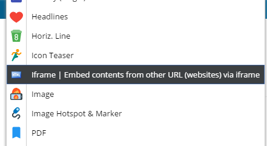
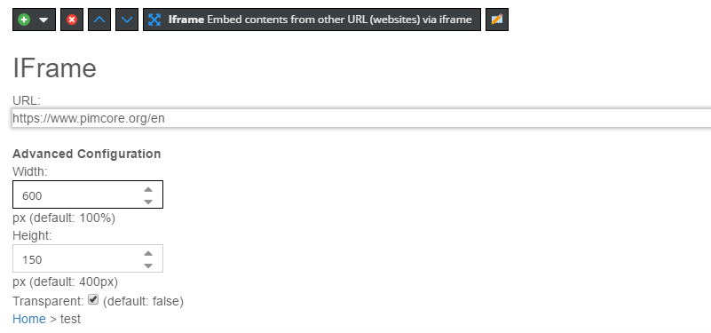

# Create Your Own Bricks

## Architecture of a Brick

A brick is an instance of `Pimcore\Extension\Document\Areabrick\AreabrickInterface` which can either be auto-loaded
by saving the brick to a special namespace inside your bundle or by defining the brick as a service and adding it to the
list of available bricks through a DI tag. The brick class is the only mandatory file for a brick, however most bricks
will at least implement a view template which is rendered in frontend and editmode.

The templates itself are normal templates which are passed to the rendering engine. Therefore you can use all 
existing templating extensions and [Pimcore editables](../README.md).


## Brick registration

A brick will be registered on the system and is represented by a brick ID which has to be unique throughout the
system. If a brick ID is registered twice (e.g. by multiple bundles), an error will be raised. The simple way to 
register a brick is to just save it to a special namespace `Document\Areabrick` inside your bundle. Every bundle will
be scanned for classes implementing `AreabrickInterface` and all found bricks will be automatically registered to 
the system. The brick ID will be built from the class name of the implementing class by converting the class name to 
dashed case. For example, a brick named `MyCustomAreaBrick` will be automatically registered as `my-custom-area-brick`.

A basic brick implementation could look like the following. As it is defined in the special namespace, Pimcore will
implicitly auto-create a service `app.area.brick.iframe` and register it on the areabrick manager with the ID `iframe`.

```php
<?php

namespace App\Document\Areabrick;

use Pimcore\Extension\Document\Areabrick\AreabrickInterface;

class Iframe implements AreabrickInterface
{
    // implementing class methods
}
```

If you need more control over the brick instance (e.g. because your brick has dependencies on other services, or you
want to specify the brick ID manually), you can add the service definition yourself and tag the service with the DI
tag `pimcore.area.brick`. Bricks defined manually will be excluded from the auto-registration, even if they're
defined in the special namespace. Let's define our brick as above, but assume it needs access to a logger instance:

```yaml
# a service.yaml file defining services
services:
    App\Document\Areabrick\Iframe:
        arguments: ['@logger']
        tags:
            - { name: pimcore.area.brick, id: iframe }
```

This will register the brick as above, but you have control over the brick ID and are able to make use of the
container for dependencies.

There's also the `AsAreabrick` attribute, as a way to control its ID when using the auto-loading,
or to automatically tag it when defining the service yourself.

```php
<?php

namespace App\Document\Areabrick;

use Pimcore\Extension\Document\Areabrick\AreabrickInterface;
use Pimcore\Extension\Document\Areabrick\Attribute\AsAreabrick;
use Psr\Log\LoggerInterface;

#[AsAreabrick(id: 'iframe')]
class Iframe implements AreabrickInterface
{
    // implementing class methods
}
```

> Although it might be tempting to overwrite the `getId()` method in your bricks, please make sure the brick always
refers to the ID which is set via `setId($id)` when the brick is registered. Overriding `getId()` won't affect the
brick ID as it is registered on the system as bricks are lazy-loaded. The areabrick manager will set the registered 
ID when the brick instance is fetched.

## Brick template auto discovery

For convenience, you can create a new brick by extending `Pimcore\Extension\Document\Areabrick\AbstractTemplateAreabrick`
to make use of template auto-discovery (thus, needing a minimum of code to get started). The template area brick 
implements the `TemplateAreabrickInterface` which defines the following methods you can use to control template 
auto-discovery. Please make sure your brick is defined inside a bundle as otherwise your templates can't be 
auto-discovered.

The template location defines the base path which will be used to find your templates. It resolves to the following 
locations. `<bundlePath>` is the filesystem path of the bundle the brick resides in, `<brickId>` the ID of the brick 
as registered on the areabrick manager (see below).

| Location | Path                                                                                                                                                                                        |
|----------|---------------------------------------------------------------------------------------------------------------------------------------------------------------------------------------------|
| global   | `templates/areas/<brickId>/`                                                                                                                                                                |
| bundle   | `<bundlePath>/Resources/views/areas/<brickId>/` for legacy (Symfony \<= 4) bundle structure<br/>or<br/>`<bundlePath>/templates/areas/<brickId>/` for modern (Symfony >= 5) bundle structure |

Depending on the template location, the following files will be used. You can always completely control locations by 
implementing the methods for templates and icon yourself (see `AreabrickInterface`):

| Type          | Location                            |
|---------------|-------------------------------------|
| view template | `<templateLocation>/view.html.twig` |

If the brick defines an icon in the `public` resources directory of the bundle, the icon will be automatically used 
in editmode. If the icon is at another location, you can override the `getIcon()` method and specify an URL to be 
included as icon. When rendering editmode, the following location will be searched for the brick icon and is expected
 to be a 16x16 pixel PNG: `<bundlePath>/Resources/public/areas/<brickId>/icon.png` which resolves to the URL  
 `/bundles/<bundleUrl>/areas/<brickId>/icon.png` when included in editmode.

You can optionally implement `Pimcore\Extension\Document\Areabrick\PreviewAwareInterface` to add a custom html tooltip
for your brick that will be shown as a tooltip when hovering over the add-brick button.  
Given our `iframe` brick defined before, the following paths will be used.

### `global` template location

| Location      | Path                                       |
|---------------|--------------------------------------------|
| view template | `templates/areas/iframe/view.html.twig`    |
| icon path     | `public/bundles/app/areas/iframe/icon.png` |
| icon URL      | `/bundles/app/areas/iframe/icon.png`       |

### `bundle` template location

The icon path and URL are the same as above, but the view scripts are expected inside the bundle.

| Location      | Path                                                    |
|---------------|---------------------------------------------------------|
| view template | `templates/areas/iframe/view.html.twig`                 |

## How to Create a Brick
 
Let's suppose that our iframe brick defined above is responsible for generating an `<iframe>` containing contents 
from a specified URL in the editmode. First of all, let's update the class to add metadata for the extension manager, to
make use of template auto-discovery and to load the view template from `templates` instead of the bundle
directory:

```php
<?php
// src/Document/Areabrick/Iframe.php

namespace App\Document\Areabrick;

use Pimcore\Extension\Document\Areabrick\AbstractTemplateAreabrick;

class Iframe extends AbstractTemplateAreabrick
{
    public function getName(): string
    {
        return 'IFrame';
    }

    public function getDescription(): string
    {
        return 'Embed contents from other URL (websites) via iframe';
    }
    
    public function needsReload(): bool
    {
        // optional
        // here you can decide whether adding this bricks should trigger a reload
        // in the editing interface, this could be necessary in some cases. default=false
        return false;
    }
}
```

Let's create a view as next step. Views behave exactly as native controller views, and you have access to the current 
document, to editmode and to editables and templating helpers as everywhere else. In addition, there's a `instance` 
variable on the view which gives you access to the brick instance. A `info` variable (see below) gives you access to 
brick metadata.

```twig
/* templates/areas/iframe/view.html.twig */







    <div>
        <h2>IFrame</h2>
        <div>
            URL: {{ urlField|raw }}
        </div>
        <br/>
        <b>Advanced Configuration</b>
        <div>
            Width: {{ widthField|raw }}px (default: 100%)
        </div>
        <div>
            Height: {{ heightField|raw }}px (default: 400px)
        </div>
        <div>
            Transparent: {{ transparentField|raw }} (default: false)
        </div>
    </div>

    
        
        
        {% set width = "100%" %}
        

        
                
        

        
                
        

        
                
        

        <iframe src="{{ urlField }}" width="{{ width }}" height="{{ height }}" allowtransparency="{{ transparent }}" frameborder="0"></iframe>

    

```

Now you should be able to see your brick in the list of available bricks on your areablock:


In editmode you can see the configuration for the Iframe brick:



## The Brick ***info-object***

Brick views and methods will have access to an `Info` object containing metadata about the current brick. It is 
exposed as `info` variable on views and passed to brick methods as argument. Many methods exist for historical 
reasons, but a couple of methods could be useful when implementing your own bricks.

| Method                  | Description                                      |
|-------------------------|--------------------------------------------------|
| `$info->getEditable()`       | Returns the editable rendering the brick              |
| `$info->getDocument()`  | Retrieve the document   |
| `$info->getDocumentElement($name)` | Retrieve the editable tag from document   |
| `$info->getRequest()`   | Returns the current request                      |
| `$info->getIndex()`     | Returns the current index inside the areablock   |
| `$info->getParam($name)`| Retrieve a param passed by `globalParams` or `params` config option  |
| `$info->getParams()`    | Retrieve all params passed by `globalParams` or `params` config option  |

## Editable Dialog (since 6.8)
Sometimes it is necessary to gather some more optional data or provide some configuration options for a brick,
which shouldn't be visible by default. For those scenarios the editable dialog is the right tool. 


The editable dialog is basically a configurable editing interface where you can use all supported editables in a 
structured layout in the context of the current brick. 
The editing interface is configured by implementing the `EditableDialogBoxInterface` on your brick class and by providing 
a simple config array.

> This config array can either contain the editables themselves, or an array of the format (not recommended):
> 
> ````php
> [
>   'type' => 'input',   // The type of the editable
>   'name' => 'myInput',   // The name of the editable
>   'config' => [],   // An optional array of the documented configurations (see the respective editables)
>   'label' => 'My Input Label',   // An optional label
>   'description' => 'Additional Description',   // An optional description
> ]
> ````

### Simple Example Config
```php
<?php

namespace App\Document\Areabrick;

use Pimcore\Extension\Document\Areabrick\EditableDialogBoxConfiguration;
use Pimcore\Extension\Document\Areabrick\EditableDialogBoxInterface;
use Pimcore\Model\Document;
use Pimcore\Model\Document\Editable;
use Pimcore\Model\Document\Editable\Area\Info;

class WysiwygWithImages extends AbstractAreabrick implements EditableDialogBoxInterface
{
    public function getName(): string
    {
        return 'WYSIWYG w. Images';
    }

    public function getEditableDialogBoxConfiguration(Document\Editable $area, ?Info $info): EditableDialogBoxConfiguration
    {
        $config = new EditableDialogBoxConfiguration();
        $config->setWidth(600);
        //$config->setReloadOnClose(true);
        
        $config->setItems([
            [
                (new Editable\Input())
                    ->setName('myDialogInput')
                    ->setLabel('Some additional Text'), // labels are optional
                    
                (new Editable\Checkbox())
                    ->setName('myDialogCheckbox')
                    ->setLabel('This is the checkbox label')
                    ->setDialogDescription('This is a description for myDialogCheckbox'),  // descriptions are optional
                    
                (new Editable\Date())
                    ->setName('myDialogDate')
            ]
        ]);

        return $config;
    }
}
``` 

### Advanced Example Config using Layouts
It is also possible to use tab panels in your configuration. 
```php
<?php

namespace App\Document\Areabrick;

use Pimcore\Extension\Document\Areabrick\EditableDialogBoxConfiguration;
use Pimcore\Extension\Document\Areabrick\EditableDialogBoxInterface;
use Pimcore\Model\Document\Editable;
use Pimcore\Model\Document\Editable\Area\Info;

class WysiwygWithImages extends AbstractAreabrick implements EditableDialogBoxInterface
{
    public function getName(): string
    {
        return 'WYSIWYG w. Images';
    }

    public function getEditableDialogBoxConfiguration(Editable $area, ?Info $info): EditableDialogBoxConfiguration
    {
        $config = new EditableDialogBoxConfiguration();
        $config->setWidth(600);
        
        $config->setItems([
            'type' => 'tabpanel',
            'items' => [
                [
                    'type' => 'panel',
                    'title' => 'Tab 1',
                    'items' => [
                        (new Editable\Wysiwyg())
                            ->setName('myDialogWysiwyg')
                            ->setLabel('Some additional Text'),
                            
                        (new Editable\Video())
                            ->setName('myDialogVideo'),
                            
                        (new Editable\Textarea())
                            ->setName('myDialogTextarea'),
                            
                        (new Editable\Table())
                            ->setName('myDialogTable'),
                            
                        (new Editable\Snippet())
                            ->setName('myDialogSnippet'),
                            
                        (new Editable\Select())
                            ->setName('myDialogSelect')
                            ->setConfig([
                                'store' => [
                                    ['foo', 'Foo'],
                                    ['bar', 'Bar'],
                                    ['baz', 'Baz'],
                                ]
                            ]),
                            
                        (new Editable\Numeric())
                            ->setName('myDialogNumber'),
                            
                        (new Editable\Multiselect())
                            ->setName('myDialogMultiSelect')
                            ->setConfig([
                                'store' => [
                                    ['foo', 'Foo'],
                                    ['bar', 'Bar'],
                                    ['baz', 'Baz'],
                                ]
                            ]),
                        
                        (new Editable\Checkbox())
                            ->setName('myDialogCheckbox')
                            ->setLabel('This is the checkbox label 😸'),
                        
                        (new Editable\Input())
                            ->setName('myDialogInput'),
                    ]
                ],
                [
                    'type' => 'panel',
                    'title' => 'Tab 2',
                    'items' => [
                        (new Editable\Input())
                            ->setName('anotherInput'),
                        
                        (new Editable\Link())
                            ->setName('myDialogLink'),
                        
                        (new Editable\Image())
                            ->setName('myDialogImage'),
                        
                        (new Editable\Embed())
                            ->setName('myEmbed'),
                        
                        (new Editable\Date())
                            ->setName('myDialogDate'),
                    ]
                ],
                [
                    'type' => 'panel',
                    'title' => 'Tab 3',
                    'items' => [
                        (new Editable\Renderlet())
                            ->setName('myDialogRenderlet'),
                            
                        (new Editable\Relations())
                            ->setName('myDialogRelations'),
                            
                        (new Editable\Relation())
                            ->setName('myDialogRelation')
                            ->setLabel('Just a single relation 😹'),
                            
                        (new Editable\Pdf())
                            ->setName('myDialogPdf'),
                    ]
                ]
            ]
        ]);

        return $config;
    }
}

```

### Accessing Data of the Editable Dialog
The editables in the dialog are just normal editables, there's no difference to editables which are defined 
via the template. So you can either use them as well in the template or access them in your custom code. 


## Methods on the brick class

Sometimes a brick is more than just a view-script and contains some functionality which shouldn't be directly in the view. 
In this case you can use the `action()` and `postRenderAction()` method on the brick class which both get the info 
object as parameter. The `action()` method is no real controller action, it is just a little helper to get some logic
 and code out of the 
view. However, you can use the action method to prepare data for the view (for example parse request params).

You can return a Response object from `action()` and `postRenderAction()` and this response
will be sent back to the client.

If you need to influence the HTML open and close tag, you can do so by customizing `getHtmlTagOpen()` and 
`getHtmlTagClose()` (see example below). 
 
```php
<?php

namespace App\Document\Areabrick;

use Pimcore\Extension\Document\Areabrick\AbstractTemplateAreabrick;
use Pimcore\Model\Document\Editable\Area\Info;
use Symfony\Component\HttpFoundation\RedirectResponse;
use Symfony\Component\HttpFoundation\Response;

class Iframe extends AbstractTemplateAreabrick
{
    // other methods defined above
    // 
    public function action(Info $info): ?RedirectResponse
    {
        $myVar = $info->getRequest()->get('myParam');

        $info->setParam('myVar', $myVar);

        // optionally return a response object
        if ('POST' === $info->getRequest()->getMethod()) {
            return new RedirectResponse('/foo');
        }

        return null;
    }

    // OPTIONAL METHODS

    // executed after a brick is rendered
    public function postRenderAction(Info $info): ?Response
    {
    }

    // returns a custom html wrapper element (return an empty string if you don't want a wrapper element)
    public function getHtmlTagOpen(Info $info): string
    {
        return '<span class="customWrapperDiv">';
    }

    public function getHtmlTagClose(Info $info): string
    {
        return '</span>';
    }
}
```

## Examples

You can find many examples in the [demo package](https://github.com/pimcore/demo/tree/11.x/src/Document/Areabrick).
