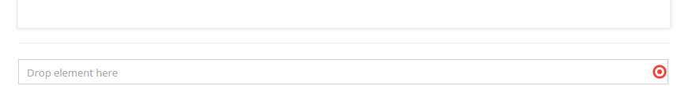

# Relation (Many-To-One) Editable

## General

The relation editable provides the functionality to create a reference to another element in Pimcore (document, asset, object).
In frontend-mode this editable returns the path of the linked element.

## Configuration

| Name         | Type    | Description                                                                                                                                |
|--------------|---------|--------------------------------------------------------------------------------------------------------------------------------------------|
| `types`      | array   | Allowed types (document, asset, object), if empty all types are allowed                                                                    |
| `subtypes`   | array   | Allowed subtypes grouped by type (folder, page, snippet, image, video, object, ...), if empty all subtypes are allowed (see example below) |
| `classes`    | array   | Allowed object class names, if empty all classes are allowed                                                                               |
| `reload`     | boolean | `true` triggers page reload on each change                                                                                                 |
| `width`      | int     | Width of the field in pixel.                                                                                                               |
| `uploadPath` | string  | Target path for (inline) uploaded assets                                                                                                   |
| `class`      | string  | A CSS class that is added to the surrounding container of this element in editmode                                                         |

## Methods

| Name            | Return   | Description                                |
|-----------------|----------|--------------------------------------------|
| `getElement()`  | Element  | Get the assigned element                   |
| `getFullPath()` | string   | Get the full path of the assigned element. |
| `isEmpty()`     | boolean  | Whether the editable is empty or not       |

## Examples

### Basic usage

You can just create the code line like, below:

```twig
{{ pimcore_relation("myRelation") }}
```

After, the view in the administration panel changes like in the picture:



### Using Restriction

If you want specify elements which could be assigned to the relation editable, use `types`, `subtypes` and `classes`
options in the editable configuration.

##### Example

```twig
{{ pimcore_relation("myRelation", {
    "types": ["asset","object"],
    "subtypes": {
        "asset": ["video", "image"],
        "object": ["object"],
    },
    "classes": ["person"]
}) }}
```


We restricted the `myRelation` editable to the following entities: 
* Video / Image (Assets) 
* Person Objects (`\Pimcore\Model\DataObject\Person`) (Objects) 
 
As you see in the picture below, it's impossible to drop any other type to that editable.


### Download Example

Another useful use-case for the relation editable is a download link. 

```twig

    {{ pimcore_relation("myRelation") }}

    
        <a href="{{ pimcore_relation("myRelation").getFullPath() }}">{{ "Download" | trans }}</a>
    

```
