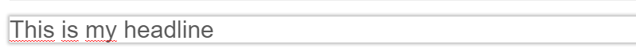

# Input Editable

## General

The input editable is a single line unformatted text placeholder (just as HTMLs `<input>` is), which is useful for text headlines, paragraphs and other values. 
For a multi-line alternative have a look at the [textarea editable](./36_Textarea.md). 

## Configuration

| Name               | Type    | Configuration                                                                                  |
|--------------------|---------|------------------------------------------------------------------------------------------------|
| `width`            | integer | Width of the input in editmode (in pixels)                                                     |
| `htmlspecialchars` | boolean | Set to false to get the raw value without HTML special chars like & (default to true)          |
| `nowrap`           | boolean | set to false to disable the automatic line break                                               |
| `class`            | string  | A CSS class that is added to the surrounding container of this element in editmode             |
| `placeholder`      | string  | A text shown in the field when it is empty to guide the user about the expected type of input. |
| `defaultValue`     | string  | A default value for the available options.                                                     |
| `required`         | boolean | set to true to make field value required for publish                                           |

## Methods

| Name        | Return   | Description                                                           |
|-------------|----------|-----------------------------------------------------------------------|
| `getData()` | string   | Value of the input, this is useful to get the value even in editmode. |
| `isEmpty()` | boolean  | Whether the editable is empty or not                                  |

## Example 

### Basic usage 

```twig
<h2>
 {{ pimcore_input("myHeadline") }}
</h2>
```

The above code generates an editable area which you can fill with the text, see:


### Advanced usage

You could also specify other parameters, like the size:

```twig
<h2>
    {{ pimcore_input("headerLine", {"width": 540}) }}
</h2>
```
