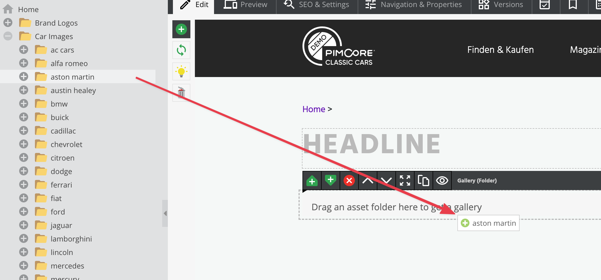
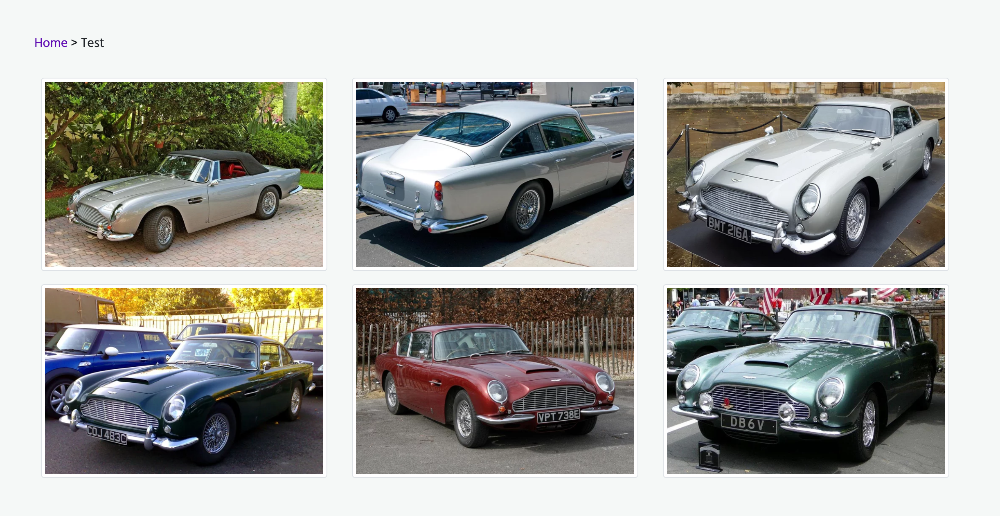

# Renderlet Editable

## General

The renderlet is a special container which is able to handle every element in Pimcore (Documents, Assets, Objects).
You can decide in your controller/action what to do with the element which is linked to the renderlet.
So it's possible to make a multifunctional area in editmode where the editor can drop anything on it.
A typical use-case would be to render product objects within a document. 

## Configuration

| Name           | Type      | Description                                                                        | Mandatory   |
|----------------|-----------|------------------------------------------------------------------------------------|-------------|
| `controller`   | string    | Specify controller reference, e.g. `App\Controller\FooController::myAction`  | X           |
| `template`     | string    | Specify template                                                                   |             |
| `className`    | string or string[] | Specify class name (if type **object** chosen) as single string or as string array |    |
| `height`       | integer or string   | Height of the renderlet in pixel or 'auto'                               |             |
| `reload`       | bool      | Reload document on change                                                          |             |
| `title`        | string    | Add a title to the box in editmode                                                 |             |
| `type`         | string    | The type of the element assigned to the renderlet (document,asset,object)          |             |
| `width`        | integer   | Width of the renderlet in pixel                                                    |             |
| `class`        | string    | A CSS class that is added to the surrounding container of this element in editmode |             |

Optionally you can pass every parameter (with a scalar data type) you like to the renderlet which can be accessed in 
the configured controller with `$request->get('yourKey')`.

## Methods

| Name            | Return    | Description                                                 |
|-----------------|-----------|-------------------------------------------------------------|
| `isEmpty()`     | bool      | Whether the editable is empty or not.                       |

## In the configured Controller Action

In the target controller action, you get the following parameters which can be accessed by `$request->get('key')`.

| Name       | Type                   | Description                                                                                      |
|------------|------------------------|--------------------------------------------------------------------------------------------------|
| `id`       | integer                | The id of the element assigned to the renderlet                                                  |
| `type`     | string                 | The type of the element assigned to the renderlet (document,asset,object)                        |
| `subtype`  | string                 | The subtype of the element assigned to the renderlet (folder, image, link, page, classname, ...) |

If you have defined any custom parameters on the renderlet configuration you can access them also with `$request->get('yourParam')`.

## Example

The code below shows how to use renderlet to create gallery based on it. 

### Specify the Renderlet Editable in a Template

```twig
<section id="renderlet-gallery">
    {{
        pimcore_renderlet("myGallery", {
            "controller": "App\\Controller\\ContentController::myGalleryAction",
            "title": "Drag an asset folder here to get a gallery",
            "height": 400
        })
    }}
</section>
```

Now editors are able to put elements onto the renderlet in the editmode.



### Specify the Controller Action

```php
#[Template('my-gallery.html.twig')]
public function myGalleryAction(Request $request): array
{
    if ('asset' === $request->get('type')) {
        $asset = Asset::getById((int) $request->get('id'));
        if ('folder' === $asset->getType()) {
            return [
                'assets' => $asset->getChildren()
            ];
        }
    }

    return [];
}
```

The action is responsible for validation and transferring assets to the view.
Of course, to limit access to the renderlet, you can use the `type` configuration option as well. 

### Create View

Now you have to create the template file at: `templates/content/my_gallery.html.twig`

```twig

	<div class="my-gallery">
		
			
				<div class="gallery-row">
                    {{ asset.getThumbnail("myThumbnailName").getHTML()|raw }}
				</div>
			
		
	</div>

```

And the final view is like, below:



## Editmode

> Please be aware, that the renderlet itself is not editmode-aware. If you need to determine within the renderlet whether in editmode or not, you need to pass that parameter to the renderlet.

```twig
{{
	pimcore_renderlet("myRenderlet", {
		....
		"editmode": editmode
	})
}}
```

Within the renderlet, you can access the editmode parameter as follows:

```twig

```
