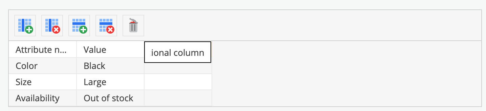

# Table Editable

## General

The table editable provides the ability to edit a table structure.

## Configuration

| Name       | Type    | Description                                                                        |
|------------|---------|------------------------------------------------------------------------------------|
| `defaults` | array   | Array can have the following properties: rows, cols, data (see example)            |
| `width`    | integer | Width of the field in pixel                                                        |
| `class`    | string  | A CSS class that is added to the surrounding container of this element in editmode |

## Methods

| Name        | Return | Description                           |
|-------------|--------|---------------------------------------|
| `getData()` | array  | Get the data of the table as array    |
| `isEmpty()` | bool   | Whether the editable is empty or not. |

# Examples

### Basic usage

```twig
{{ pimcore_table("productProperties", {
    "width": 700,
    "defaults": {
        "cols": 3,
        "rows": 4,
        "data": [
            ["Attribute name", "Value", "Additional column"],
            ["Color", "Black", ""],
            ["Size", "Large", ""],
            ["Availability", "Out of stock", ""]
        ]
    }
}) }}
```

You're now able to change columns and the predefined data in the editmode.



### Processing the Data

Sometimes you need use only the data from a filled table. 
You would just use the `getData()` method instead of rendering the entire HTML of the table.

```twig

    {{ pimcore_table("productProperties", {
        "width": 700,
        "defaults": {
            "cols": 3,
            "rows": 4,
            "data": [
                ["Attribute name", "Value", "Additional column"],
                ["Color", "Black", ""],
                ["Size", "Large", ""],
                ["Availability", "Out of stock", ""]
            ]
        }
    }) }}

    
    
    {# returns the data as an array #}
    {# do something with it ;-) #}

```

The output from `getData()`:

```
array(4) {
  [0] => array(3) {
    [0] => string(14) "Attribute name"
    [1] => string(5) "Value"
    [2] => string(17) "Additional column"
  }
  [1] => array(3) {
    [0] => string(5) "Color"
    [1] => string(5) "Black"
    [2] => string(0) ""
  }
  [2] => array(3) {
    [0] => string(4) "Size"
    [1] => string(5) "Large"
    [2] => string(0) ""
  }
  [3] => array(3) {
    [0] => string(12) "Availability"
    [1] => string(12) "Out of stock"
    [2] => string(0) ""
  }
}
```
