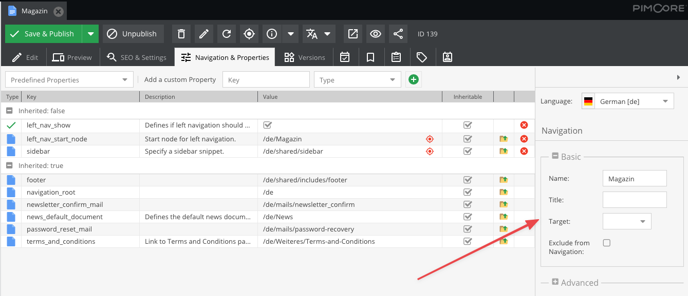

# Navigation

## Basics

Pimcore comes with a standard navigation implementation in the form of a Twig extension. 
It builds a navigation container based on the existing document structure. The process of rendering is divided into 2 steps:

1. Build the navigation: ``
2. Render the navigation: `pimcore_render_nav(nav)` or `pimcore_nav_renderer('menu').render(nav)`

> The building step does not necessarily need to happen in the view script. In fact the view helper just forwards the
 `build()` call to the `Pimcore\Navigation\Builder` service. You can also build the navigation in your controller
 or a service and pass the navigation object to the view.

**Only documents are included** in this structure, Folders are ignored, regardless of their navigation properties.

```twig
{# get root node if there is no document defined (for pages which are routed directly through static route) #}

    


{# get the document which should be used to start in navigation | default home #}


    




{# later you can render the navigation #}
{{ pimcore_render_nav(mainNavigation) }}
```

Having set up the navigation container as shown above, you can easily use it to render a navigation tree, menus, or breadcrumbs.

### Meta Navigation - Only the 1st Level

```twig
{{ pimcore_nav_renderer('menu').renderMenu(mainNavigation,{
    maxDepth: 1,
    ulClass: 'nav navbar-nav'
}) | raw }}

{#alternatively, you can use the render function to use the given renderer and render method#}
<div class="my-menu">
    {# the menu() shortcut is not available in twig #}
    {{ pimcore_render_nav(mainNavigation, 'menu', 'renderMenu', {
        maxDepth: 1,
        ulClass: 'nav navbar-nav'
    }) }}
</div>
```

### Meta Navigation - Multilevel

```twig
<div class="my-menu">
    {# you can use array for ulClass to provide depth level classes #}
    {{ pimcore_render_nav(mainNavigation, 'menu', 'renderMenu', {
        maxDepth: 2,
        ulClass: {
            0: 'nav navbar-nav',
            1: 'nav navbar-nav-second',
            2: 'nav navbar-nav-third'
        }
    }) }}

    {# alternatively, you can use 'default' key to apply class on all depth levels #}
    {{ pimcore_render_nav(mainNavigation, 'menu', 'renderMenu', {
            maxDepth: 2,
            ulClass: {
                default: 'nav navbar-nav'
            }
    }) }}
</div>
```

### Breadcrumbs

```twig
<div class="my-breadcrumbs">
    <a href="/">{{ 'Home'|trans }}</a> >
    {{ pimcore_render_nav(mainNavigation, 'breadcrumbs') }}
</div>
```

### Sidebar Navigation

```twig
<div class="my-sidebar-menu">
   {{ pimcore_nav_renderer('menu').renderMenu(mainNavigation) }}
</div>
```

### Sidebar Navigation with a Different HTML Prefix

```twig
<div class="my-sidebar-menu">
    
    
    {{ pimcore_render_nav(sideNav, 'menu', 'renderMenu', {
        ulClass: 'nav my-sidenav',
        expandSiblingNodesOfActiveBranch: true
    }) }}
</div>
```

The renderMenu() method renders the menu to the deepest available level. 
Levels trees which are not within the active tree, and levels below the latest active page must be hidden using CSS. 

The example CSS below shows how to do that (includes 3 Levels):

```css
#navigation ul li ul {
    display:none;
}

#navigation ul li.active ul {
    display:block;
}

#navigation ul li.active ul li ul {
    display:none;
}

#navigation ul li.active ul li.active ul {
    display:block;
}

#navigation ul li.active ul li.active ul li ul {
    display:none;
}

#navigation ul li.active ul li.active ul li.active ul{
    display:block;
}
```

## Setting a Document's Navigation Property



Pages and links have **Navigation Settings** in their system properties as shown in the screen above. 
These navigation settings include the following properties:

* **Name:** Document's name used in the navigation (label).
* **Title:** Document's title used in the navigation - the HTML Attribute title.
* **Target:** Link target (`_blank`, `_self`, `_top`, `_parent`)
* **Exclude from Navigation:**  Property to quickly exclude a page from the navigation.
 
 In your view template you can use:
 
 ```twig
 
 ```
 
* **Class:** HTML class of the navigation element
* **Anchor:** Anchor appended to the document's URL
* **Parameters:** Parameters appended to the document's URL
* **Relation:** Only available in custom navigation script. Supposedly the HTML rel attribute to open the link in a sort of Lightbox / Clearbox
* **Accesskey:** Only available in custom navigation script
* **Tab-Index:** Only available in custom navigation script

## Individual (Partial) Navigation View Script
If the standard HTML output of the render() method is not suitable for a project, there is the possibility to provide a custom script for the menu HTML. 

For example, inside your view:


```twig
{# \Pimcore\Navigation\Renderer\Menu #}


{# either use the renderPartial method to use a partial once #}
{{ menuRenderer.renderPartial(mainNavigation, 'includes/navigation.html.twig') | raw }}

{# or set the partial on the renderer (will be valid for all subsequent render calls) #}

{{ menuRenderer.render(mainNavigation) | raw }}
```

`templates/includes/navigation.html.twig`

```twig

    <div class="my-menu-element">
        {{ pimcore_nav_renderer('menu').htmlify(page) | raw }}
    </div>

```

## Using the Navigation Helper with Sites.

For example:
```twig


    
        
        
    
        
    



{{ pimcore_render_nav(navigation, 'menu', 'renderMenu', {
    maxDepth: 1,
    ulClass: {
        'default': 'nav navbar-nav'
    }
}) }}
```

## Using Partials Generating a Customized Navigation

For example, generate bootstrap 4.0 style navigation: 

```twig


    
        
        
    
        
    






<nav class="navbar navbar-expand-lg navbar-light bg-light">
    <a class="navbar-brand" href="#">Navbar</a>
    <button class="navbar-toggler" type="button" data-toggle="collapse" data-target="#navbarNavDropdown" aria-controls="navbarNavDropdown" aria-expanded="false" aria-label="Toggle navigation">
        <span class="navbar-toggler-icon"></span>
    </button>
    <div class="collapse navbar-collapse" id="navbarNavDropdown">
        <ul class="navbar-nav">
            
                {# here need to manually check for ACL conditions #}
                
                    
                    
                        <li class="nav-item">
                            <a class="nav-link" href="{{ page.getHref() }}">{{ page.getLabel() }}</a>
                        </li>
                    
                        <li class="nav-item dropdown">
                            <a class="nav-link dropdown-toggle" href="{{ page.getHref() }}" role="button" data-toggle="dropdown" aria-haspopup="true" aria-expanded="false">{{ page.getLabel() }}</a>
                            <div class="dropdown-menu" aria-labelledby="navbarDropdownMenuLink">
                                
                                    
                                            <a class="dropdown-item" href="{{ child.getHref() }}">{{ child.getLabel() }}</a>
                                    
                                
                            </div>
                        </li>
                    
                
            
        </ul>
    </div>
</nav>
```

## Adding Custom Items to the Navigation
 
In the following example we're adding 
- news items (objects) to an existing navigation with the "pageCallback" attribute 
- category items (objects) to the root Navigation with the "rootCallback" attribute 
using Twig Extension. 

```php
<?php

namespace App\Twig\Extension;

use App\Website\LinkGenerator\NewsLinkGenerator;
use App\Website\LinkGenerator\CategoryLinkGenerator; 
use Pimcore\Model\Document;
use Pimcore\Navigation\Container;
use Pimcore\Twig\Extension\Templating\Navigation;
use Twig\Extension\AbstractExtension;
use Twig\TwigFunction;

class NavigationExtension extends AbstractExtension
{
    protected Navigation $navigationHelper;
    protected NewsLinkGenerator $newsLinkGenerator;
    protected CategoryLinkGenerator $categoryLinkGenerator;

    public function __construct(Navigation $navigationHelper, NewsLinkGenerator $newsLinkGenerator, CategoryLinkGenerator $categoryLinkGenerator)
    {
        $this->navigationHelper = $navigationHelper;
        $this->newsLinkGenerator = $newsLinkGenerator;
        $this->categoryLinkGenerator = $categoryLinkGenerator;
    }

    /**
     * @return TwigFunction[]
     */
    public function getFunctions(): array
    {
        return [
            new TwigFunction('app_navigation_links', [$this, 'getNavigationLinks'])
        ];
    }

    /**
     * @throws \Exception
     */
    public function getNavigationLinks(Document $document, Document $startNode): Container
    {
        $navigation = $this->navigationHelper->build([
            'active' => $document,
            'root' => $startNode,
            'pageCallback' => function($page, $document) {
                /** @var \Pimcore\Model\Document $document */
                /** @var \Pimcore\Navigation\Page\Document $page */
                if($document->getProperty("templateType") == "news") {
                    $list = new \Pimcore\Model\DataObject\News\Listing;
                    $list->load();
                    foreach($list as $news) {
                        $detailLink = $this->newsLinkGenerator->generate($news, ['document' => $document]);
                        $uri = new \Pimcore\Navigation\Page\Document([
                            "label" => $news->getTitle(),
                            "id" => "object-" . $news->getId(),
                            "uri" => $detailLink,
                        ]);
                        $page->addPage($uri);
                    }
                }
            },
            'rootCallback' => function(Container $navigation) {
                $list = new \Pimcore\Model\DataObject\Category\Listing;
                $list->load();
                foreach($list as $category) {
                    $detailLink = $this->categoryLinkGenerator->generate($category);
                    $categoryDocument = new \Pimcore\Navigation\Page\Document([
                        "label" => $category->getName(),
                        "id" => "object-" . $category->getId(),
                        "uri" => $detailLink,
                    ]);
                    $navigation->addPage($categoryDocument);
                }
            }
        ]);

        return $navigation;
    }
}
```

```twig


<div class="my-navigation">
    {{ pimcore_render_nav(navigation, 'menu', 'renderMenu', {
        expandSiblingNodesOfActiveBranch: true,
        ulClass: {
            default: 'nav my-sidenav'
        }
    }) }}
</div>
```

## Caching / High-Performance Navigation

The navigation tree / container (`\Pimcore\Navigation\Container`) is automatically cached by pimcore and improves 
significantly the performance of the navigation.
To benefit from the cache it's absolutely necessary to don't use `Pimcore\Model\Document` objects directly in the 
navigation templates / partial scripts, because this would result in loading all the documents again in the navigation and
bypasses the caching mechanism of the navigation container. 

But sometimes it's necessary to get some properties or other data out of the documents in the navigation to build the navigation as it should be. 
For that we've introduced a new parameter for the navigation extension, which acts as a callback and allows to map custom data onto the navigation page item.
```php
<?php

namespace App\Twig\Extension;

use Pimcore\Model\Document;
use Pimcore\Navigation\Container;
use Pimcore\Twig\Extension\Templating\Navigation;
use Twig\Extension\AbstractExtension;
use Twig\TwigFunction;

class NavigationExtension extends AbstractExtension
{
    protected Navigation $navigationHelper;

    public function __construct(Navigation $navigationHelper)
    {
        $this->navigationHelper = $navigationHelper;
    }
    
    /**
     * @return TwigFunction[]
     */
    public function getFunctions(): array
    {
        return [
            new TwigFunction('app_navigation_custom', [$this, 'getCustomNavigation'])
        ];
    }
    
    /**
     * @throws \Exception
     */
    public function getCustomNavigation(Document $document, Document $startNode): Container
    {
        $navigation = $this->navigationHelper->build([
            'active' => $document,
            'root' => $startNode, 
            'pageCallback' => function ($page, $document) {
                $page->setCustomSetting("myCustomProperty", $document->getProperty("myCustomProperty"));
                $page->setCustomSetting("subListClass", $document->getProperty("subListClass"));
                $page->setCustomSetting("title", $document->getTitle());
                $page->setCustomSetting("headline", $document->getEditable("headline")->getData());
            }]
        );

        return $navigation;
    }
}

```

```twig



{{ menuRenderer.render(mainNavigation) | raw }}
```

Later in the template of the navigation (`navigation/partials/navigation.html.twig`) you can use the mapped data directly on the page item object.

```twig

    
        
        <li class="{{ activeClass }}">
            <a href="{{ page.getUri() }}" target="{{ page.getTarget() }}">{{ page.getLabel() }}</a>
            <ul class="{{ page.getCustomSetting("subListClass") }}" role="menu">
                
            </ul>
        </li>
    

```

Using this method will dramatically improve the performance of your navigation. 

### Dynamic Key for the Navigation Cache

Sometimes it's necessary to manually set the key for the navigation cache. 

```twig

```

### Disabling the Navigation Cache

You can disable the navigation cache by setting the `cache` argument to `false`.

```twig

```

## FAQ

**A document does not show up in the navigation. Why?**

Please make sure that the documents and its parent documents are published and that the document itself as well as all its parents have a navigation name set. 
Neither the document itself nor one of its parent documents may have activated **Exclude From Navigation** in their properties. (`Document properties -> System properties`)

**Why is the navigation not appearing?**

See the above question. If none of the documents have a navigation title set the render function will simply return nothing.

**Why is the homepage not appearing in the navigation?**

The homepage will not appear in the navigation by default. You can add the homepage (and any other page) manually:

```twig

```

If you retrieve the **home** document (which always has the ID 1) you can also retrieve its navigation properties so that they can be edited from the Pimcore admin interface like all the other documents.

```twig

 
 {# 
    order: put it in front of all the others
    uri: path to homepage
    label: visible label
    title: tooltip text
    active: active state (boolean)
 #}

```
