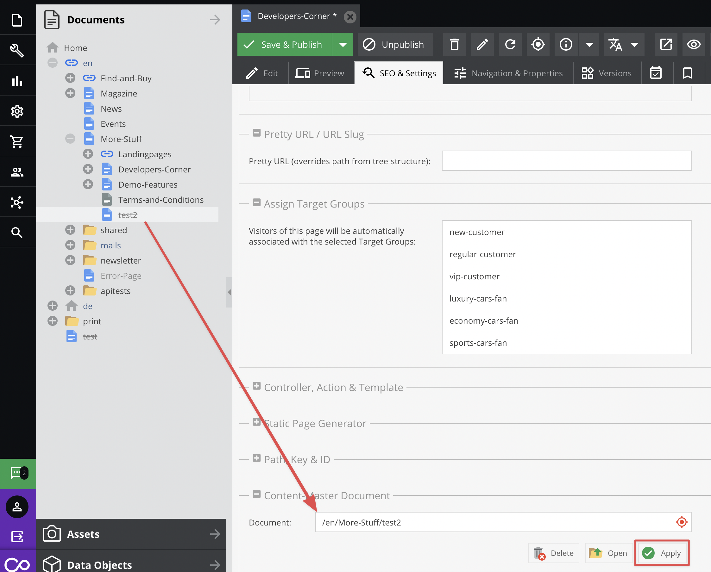

# Document Inheritance 

The *Content Main Document* setting, allows a document to inherit all of its contents from any other document which can 
then be overwritten individually on field level. Notice: Properties are not inherited via Content Main Documents.

If this setting is selected and *Apply new main document* is clicked, all contents will be erased from the current 
document and inherited from the main document. 

# How-To

1. Drag a main document to the document where you'd like to inherit the contents (*Content-Main Document* in settings tab).
2. Press the *Apply new main document* button



3. Confirm the warning dialog 


4. Now you can see grey spaces in the document. 
If you want to overwrite any value, just click the right button on it.
 


## Content Main Document in the Code

Using a main document doesn't change anything in the PHP API. If you load a document which has related a main document, 
then values returned by it will be replaced by values from the main document (unless values are overwritten).

You can get Main document object by `getContentMainDocument` method available in `\Pimcore\Model\Document\Page`.

```php
$document = \Pimcore\Model\Document\Page::getById(130);
dump([
    'main_document' => $document->getContentMainDocument()->getKey(),
    'document' => $document->getKey()
]);
```
