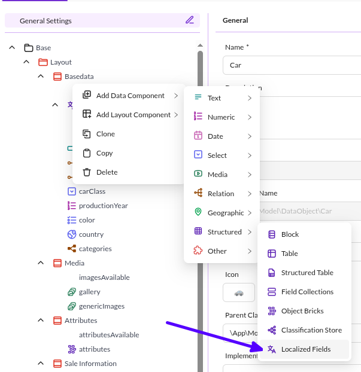
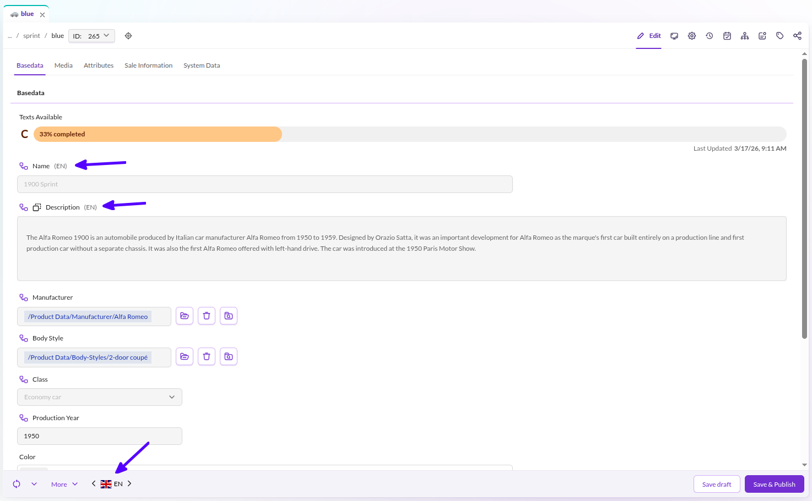
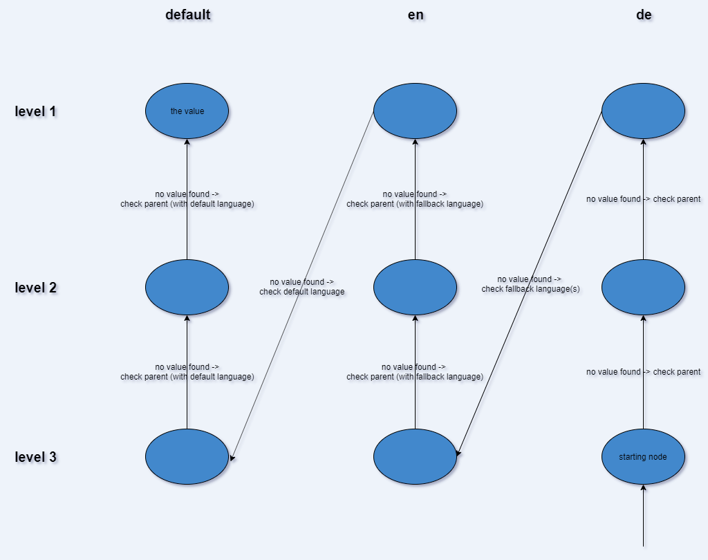

# Localized Fields

Localized fields allow the definition of attributes, that should be translated into multiple languages within an object. 
They can be filled with selected data types and layouts - due to technical and data storage reasons not all data types are
available. 

This simplifies translation of fields to the configured languages.

## Definition of localized fields

Configure localized fields and layouts within your class using the class editor.

<div class="image-as-lightbox"></div>



Then add attributes, that need to be translated, into this container as any other attributes. 
Note, that not all field types are supported for localized fields. 

In the editor, the localized fields are displayed as normal fields with a language indication in the label. 
Language switch is possible via the global language switcher in the bottom toolbar of the editor. 

<div class="image-as-lightbox"></div>



## Definition of available Languages
Specify the valid languages for your website in `System` -> `System Settings` -> `Localization & Internationalization` if not already configured.

## Definition of required Languages
If you want to have mandatory fields in the localized fields, but they are not mandatory for all languages, you can define
which languages are required in `System` -> `System Settings` -> `Localization & Internationalization` with the 
`Mandatory language` checkbox on each language.


## Inheritance

Fallback and inherited values are evaluated in a vertical way first. This is contrary to the [Classification Store](15_Classification_Store.md) where the evaluation is done in a horizontal way. If no value for the current language is found, the parent level is checked. 

If walking up the inheritance levels yields no result, the fallback language of the lowermost level will be checked in the same way. (Also walking up the inheritance levels for this language). 

Consider the following example, assuming English is the fallback language for German. We request the German value for the object at level 3. 
Since the only value can be found on level 1 for the default language the tree is traversed as depicted.





## Working with PHP API

### Getting available languages ###

The following code will create an array containing the available languages for the front end (the user facing website). 

```php
$languages = \Pimcore\Tool::getValidLanguages();
```

### Enable / Disable Fallback languages ###

Whether getters return the value of the fallback language when the requested language has no value is controlled by
the static flag `\Pimcore\Model\DataObject\Localizedfield::setGetFallbackValues()`.

Its default depends on where the code runs:

| Context | Fallback values | Set by |
|---------|-----------------|--------|
| Website and other HTTP requests | enabled | `PimcoreContextListener` |
| Pimcore Studio API requests (`/pimcore-studio/api`) | disabled | `ApiContextSubscriber` of the Studio Backend Bundle |
| CLI commands, scripts and messenger workers | enabled | `\Pimcore\Bootstrap` |
| Code that runs before any of the above | disabled | default value of the flag |

With fallback values disabled, a getter returns no value for a language without data, even if a fallback language is
configured. Inherited values still apply, see [Inheritance](#inheritance). Event listeners run in the context that
triggered them: in a `DataObjectEvents::POST_UPDATE` listener for a save in Pimcore Studio, fallback values are
disabled.

You can change the behavior at any time:

```php
// disable fallback values, e.g. on the website
\Pimcore\Model\DataObject\Localizedfield::setGetFallbackValues(false);

// enable fallback values, e.g. in a Pimcore Studio API request
\Pimcore\Model\DataObject\Localizedfield::setGetFallbackValues(true);

// check the current state
$fallbackEnabled = \Pimcore\Model\DataObject\Localizedfield::getGetFallbackValues();
```

The flag is global for the whole PHP process. Restore the previous value in a `finally` block, so an exception does not
leave it changed for the rest of the request or for later messages in a messenger worker:

```php
$fallbackEnabled = \Pimcore\Model\DataObject\Localizedfield::getGetFallbackValues();
\Pimcore\Model\DataObject\Localizedfield::setGetFallbackValues(true);

try {
    // ... code that relies on fallback values ...
} finally {
    \Pimcore\Model\DataObject\Localizedfield::setGetFallbackValues($fallbackEnabled);
}
```

The flag only affects getters. Listings filter on the localized query tables, which Pimcore fills with fallback values
on every save, regardless of the flag. A listing for German can therefore match an object whose German getter returns
no value. To store only the actual values in the query tables, disable this:

```yaml
pimcore:
    objects:
        ignore_localized_query_fallback: true
```

### Accessing the data

Access the data as follows:

```php
// with global registered locale
$object = DataObject::getById(234);
$object->getInput1(); // will return the en_US data for the field "input1"
 
 
// get specific localized data, regardless which locale is globally registered
$object->getInput1("de"); // will return the German value for the field "input1"
```

### Setting data

Setting data works the same way:

```php
$object = DataObject::getById(234);
$object->setInput1("My Name", "fr"); // set the French value for the field "input1"
```

**Warning:** Moving a field from outside (normal object field) into the localizedfield container causes
data loss for that field in all objects using this class.
