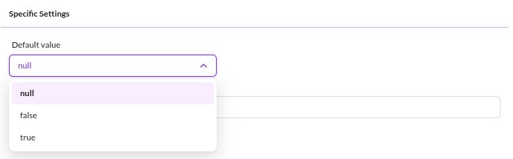
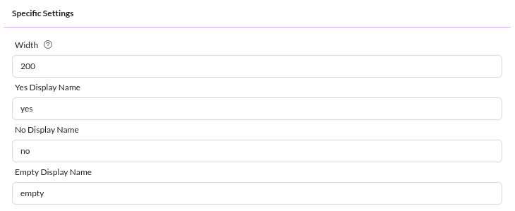
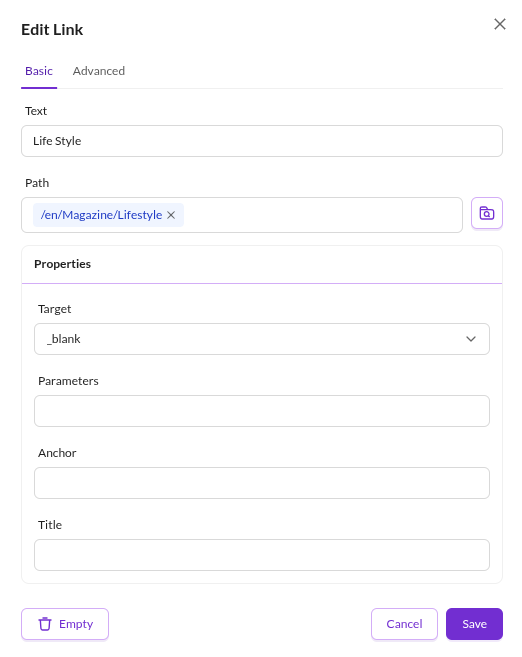
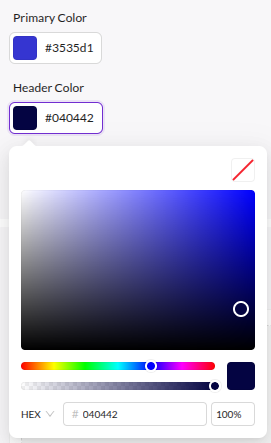
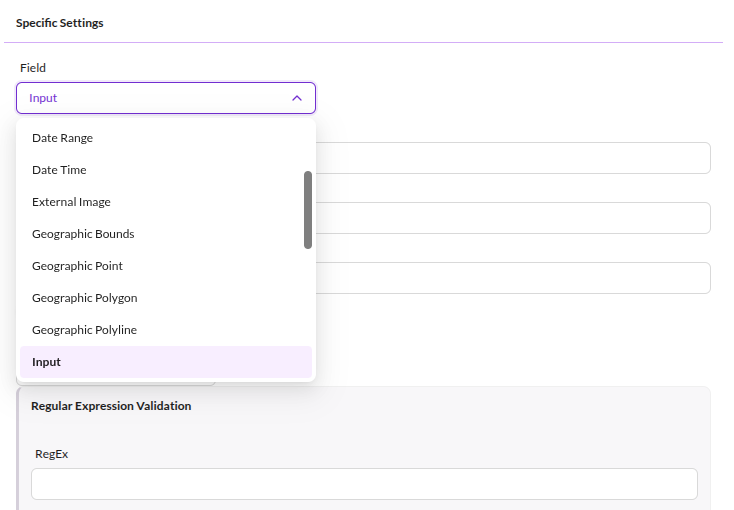
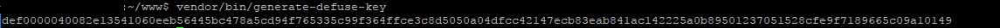

# Other Datatypes

## Checkbox



A checkbox field can be configured to be checked by default when a new object is created. 

It is stored in a TINYINT column in the database with the value 0 or 1. 

Pass a bool value to the object's setter to set a checkbox value:

```php
$object->setCheckbox(true);
```

If inheritance is activated in the corresponding DataObject class, a trashcan icon is displayed next to the checkbox. Use this to reset the checkbox value and restore inheritance from parent objects.

## Boolean Select

A `Boolean Select` is kind of a tri-state checkbox which is rendered as a select datatype in Pimcore Studio.
The background is that a checkbox can only have two states. This is especially important when it comes to inheritance.
A checkbox treats an empty (never set) value just like the unchecked value. The consequence is then as soon as a parent sets it `checked` you can not reset it to `unchecked` in the child nodes anymore.
The boolean select takes care of this problem by introducing a third state. The storage values are -1 (for unchecked), 1 (for checked and
null for empty.
In Pimcore Studio you can specify the display values according to your needs. Default values are `yes`, `no` and `empty`.



## Link 



In the UI a link is displayed as text. Edit its details by clicking the button next to the link text. The object class definition has no special configurations for a link field.

The link field uses the `Pimcore\Model\DataObject\Data\Link` data class. To set a link
programmatically, instantiate a `Pimcore\Model\DataObject\Data\Link` object and pass it to the setter:

```php
$l = new DataObject\Data\Link();               
$l->setPath("http://www.pimcore.org");    
$l->setText("pimcore.org");            
$l->setTitle("Visit pimcore.org");               
$object->setLink($l);
```

In the database the link is stored in a TEXT column which holds the serialized data of an `Pimcore\Model\DataObject\Data\Link`.

In the frontend (template) you can use the following code to get the HTML for the link.

```php
<?php
$object = DataObject::getById(234);
?>

<ul>
  <li><?= $object->getMyLink()->getHtml(); ?></li>
</ul>
```
#### Link Generators

Please also see the section about [Link Generators](../04_Additional_Class_Settings/06_Link_Generator.md)

## RGBA Color

Stores RGBA values. RGB and Alpha values are stored in two separate columns as hex values in the database.




API Examples:

```php
$o = \Pimcore\Model\DataObject\User::getById(50);
// get the color, can be null!
$color = $o->getMyColor();
// get the RGB part as hex with leading #
                
var_dump($color->getHex());

// get the RGBA value (with alpha component) has without leading hash
var_dump($color->getHex(true, false));

// get the RGBA value as array (R,G,B 0-255, Alpha 0-1)
var_dump($color->getCssRgba(true, true));

// set the RGBA value
$color->setRgba(0, 0, 255, 64);
```

## Encrypted Field

Offers data encryption for certain data types.



> Prerequisites: generate a secret key by calling vendor/bin/generate-defuse-key and add it to config/config.yaml

Example:
```
pimcore:
    encryption:
        secret: def00000fc1e34a17a03e2ef85329325b0736a5941633f8062f6b0a1a20f416751af119256bea0abf83ac33ef656b3fff087e1ce71fa6b8810d7f854fe2781f3fe4507f6
```

Key generation:



#### Strict Mode

In strict mode (which is the default) an exception is thrown if existing data cannot be decrypted (e.g. because of a key change).
You can switch this off by calling

```php
Pimcore\Model\DataObject\ClassDefinition\Data\EncryptedField::setStrictMode(false)
```

## URL Slug

A slug is the human-readable part of a URL that identifies a particular page on a website.
For example, if the URL is `https://demo.pimcore.fun/slug`, then the slug is `/slug`.


> URL slugs are currently not supported inside [Blocks](./05_Blocks.md) & [Classification Stores](./15_Classification_Store.md).

This data-type can be used to manage custom URL slugs for data objects, you can add as many fields of this type to a class as you want. 
Pimcore then cares automatically about the routing and calls the configured controller/action if a slug matches.

You could use the [Symfony String component's slugger](https://symfony.com/doc/current/components/string.html#slugger) to generate the slugs.

> Slugs cannot contain the characters `? #` since they are reserved.
> For more information check the [RFC 3986](https://www.rfc-editor.org/rfc/rfc3986#section-2.2).

### Example

```php
<?php

namespace App\Controller;

use Pimcore\Controller\FrontendController;
use Pimcore\Model\DataObject;
use Symfony\Component\HttpFoundation\Request;

class ProductController extends FrontendController
{
    public function slugAction(Request $request, DataObject\Foo $object, DataObject\Data\UrlSlug $urlSlug): array
    {
        // we use param resolver to get the matched data object ($object)
        // $urlSlug contains the context information of the slug

        return [
            'product' => $object
        ];
    }
}
```
