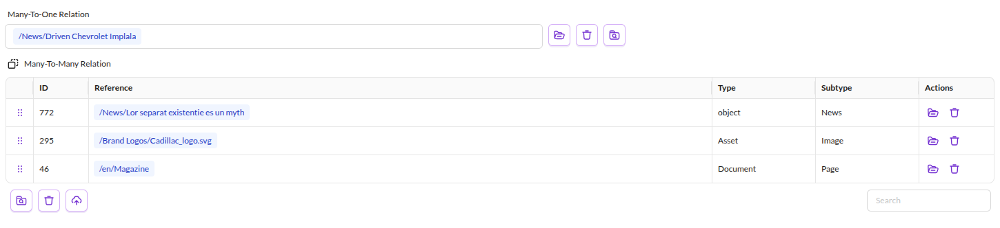
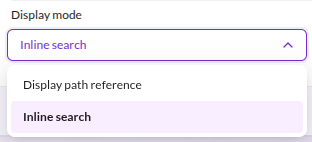
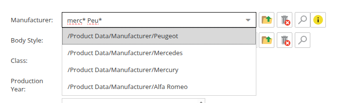
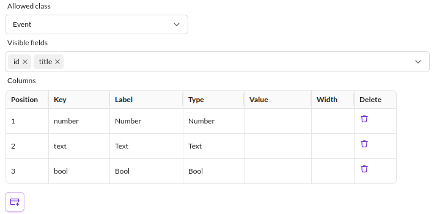
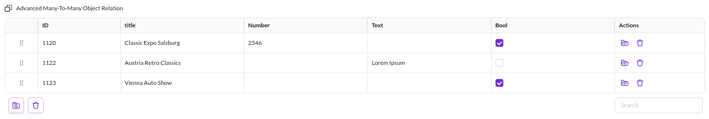
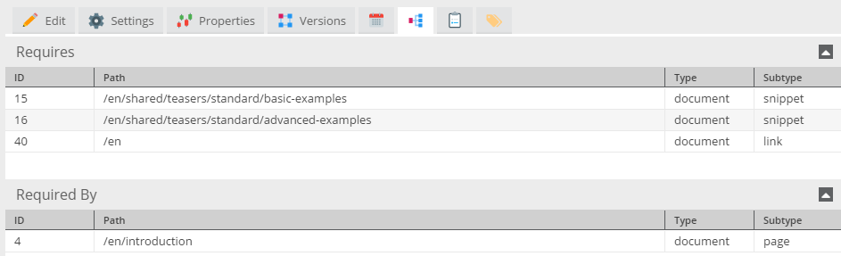

# Relational Datatypes

## Many-To-One, Many-To-Many and Many-To-Many Object Relation Data Fields 

Many-To-One, Many-To-Many and Many-To-Many Objects are pure relation data types, which means they represent a relation to an other Pimcore 
element (document, asset, object). The Many-To-One and Many-To-Many data types can store relations to any other Pimcore element. 
In the object field definition there is the possibility to configure which types and subtypes of elements are allowed.

The Many-To-Many Object field allows relations to one or more data objects, but no other elements. Therefore the restriction settings for 
objects are limited to object classes.

The width and height of the input widget can be configured in the 
object class settings. For a Many-To-One relation only the width can be configured, since it is represented by a single drop area. 
Relations are always lazy loaded (the configuration option was removed in Pimcore 6.5.0).


The input widgets for all three relation data types are represented by drop areas, which allow to drag and drop elements 
from the tree on the left to the drop target in the object layout.

In addition to the drag and drop feature, elements can be searched and selected directly from the input widget. In case 
of objects it is even possible to create a new object and select it for the objects widget.

<div class="image-as-lightbox"></div>




#### Filtering for relations via PHP API
These pure relation types are stored in a separate database table called `object_relations_ID`. In the `object_~ID~` database view used for querying data, the relation fields appear as a comma-separated
list of IDs of related elements. Therefore, if one needs to create an object list with a filter condition on a 
relation column this can be achieved as follows:

```php
$relationId = 162;
$list = new \Pimcore\Model\DataObject\Example\Listing();
$list->setCondition("mySingleRelation__id = ".$relationId);
$objects=$list->load();
 
 
$relationId = 345;
$list = new \Pimcore\Model\DataObject\Example\Listing();
$list->setCondition("myManyToManyRelations like '%,object|".$relationId.",%'");
$objects=$list->load();
```

#### Assigning relations via PHP API
Pass a single Pimcore element to the setter for a Many-To-One data field. For Many-To-Many
and Many-To-Many Objects, pass an array of elements:

```php
use Pimcore\Model\DataObject;
use Pimcore\Model\Document;
use Pimcore\Model\Asset;
 
$object = DataObject::getById(12345);
 
$object->setMyManyToOneField(Document::getById(23));

$object->setMyManyToManyField([
    Asset::getById(350),
    DataObject::getByPath("/products/testproduct")
]);

$object->setMyManyToManyObjectField([
    DataObject\Product::getById(98),
    DataObject\Product::getById(99)
]);
 
$object->save();
```

#### Deleting relations via PHP API
Remove all elements from a Many-To-Many field by calling the setter with null or an empty array:

```php
$object->setMyManyToManyField([]);
 
//that would have the same result
$object->setMyManyToManyField(null);
```
Internally the setter sets the value to an empty array, regardless if an empty array or null is passed to it.


#### Unpublished relations
Pimcore normally excludes unpublished related items. Disable this behavior as follows:
```php
//also include unpublished relations from now on
DataObject::setHideUnpublished(false);
//get a related object that is either published or unpublished
$relationObject = $relation->getObject();
//return to normal behavior
DataObject::setHideUnpublished(true);
```

## Allow inline download of asset
You can enable inline download of assets from relations if you check the "Allow inline download" checkbox.  
If the relation is an asset, it will be directly downloaded. If the relation is a folder, a zip file will  
be downloaded.

## Disable clear complete relation
If you want to disable the possibility to clear the whole relation, you can uncheck the checkbox "Allow to clear all relations of this field"  
in the classdefinition.

## Inline search display mode (not implemented in Studio yet)
You can also configure the display mode of a many-to-one relation as `Inline Search`, which leverages [Boolean Mode Full Text Search](https://dev.mysql.com/doc/refman/8.0/en/fulltext-boolean.html) to quickly locate related records across multiple fields



For example



## Visible fields on Many-To-Many and Advanced Many-To-Many Relations
Like the Many-To-Many Object Relation, the generic Many-To-Many Relation and Advanced Many-To-Many Relation support
additional, read-only columns next to each related element ("visible fields").

> This section documents the core API of the feature. The bundled user interfaces do not expose it yet: the class
> editor offers no field picker for these two types and the relation grids do not render the columns. Until that
> support lands, visible fields can be configured through the PHP API only (`setVisibleFields()`) and are consumed
> by custom code or bundles through the methods described below.

Because these types can reference documents, assets and objects of several classes at once, the fields you can pick
are the union of what every allowed element type offers:

| Allowed type | Offered fields |
|--------------|----------------|
| Objects (per allowed class) | all top-level data fields of the class, plus its localized fields |
| Assets | `filename`, `mimetype`, `fileSize` and every predefined asset metadata definition (filtered by the allowed asset types) |
| Documents | – |
| All types | `creationDate`, `modificationDate` |

A field that does not apply to a related element's type is simply empty for that row: an asset row shows nothing in a
class-field column, an object row nothing in a metadata column. Visible fields are only offered once at least one
element type is allowed; objects contribute class fields only when the relation is restricted to specific classes.

```php
use Pimcore\Model\DataObject\ClassDefinition\Data\ManyToManyRelation;

/** @var ManyToManyRelation $fd */
$fd->setVisibleFields(['title', 'filename', 'copyright']);

// superset of fields that can be selected for this definition, keyed by field name
$available = $fd->getAvailableVisibleFields();

// definitions of the configured fields (populated by enrichLayoutDefinition())
$fd->enrichLayoutDefinition($object);
$columns = $fd->visibleFieldDefinitions;

// values of the configured fields for one related element
$values = $fd->getVisibleFieldData($relatedElement);

// the offered names and their sources only, without describing the fields (cheap enough per element)
$sources = $fd->getVisibleFieldSources();
```

Each entry of `getAvailableVisibleFields()` / `visibleFieldDefinitions` carries `name`, `title`, `fieldtype`,
`noteditable` and `sources` (the origins of the field: `object` for properties of every object, `object:Product` for
the fields of a class, `asset` or `document`); select fields
additionally carry their `options`, predefined metadata its `metadataType`. The edit-mode rows of both types are not
extended with the values: resolving them needs the related elements, so a consumer fetches them per row through
`getVisibleFieldData()` when it renders the columns.

To offer additional asset fields (for example from asset metadata class definitions), extend the type and override
`getAssetVisibleFieldCandidates()` to describe them and `resolveAssetVisibleFieldValue()` to resolve their values; the
names the candidates hook returns are also the ones `getVisibleFieldData()` resolves for assets, so no further
registration is needed. Document fields work the same way through `getDocumentVisibleFieldCandidates()` /
`resolveDocumentVisibleFieldValue()`.

## Advanced Many-To-One Object Relation 
This data type is an extension to the Many-To-One Object data type. To each assigned object additional metadata can be saved. 
The type of the metadata can be text, number, selection or a boolean value.

A restriction of this data type is that only one allowed class is possible. As a result of this restriction, it is 
possible to show data fields of the assigned objects.
Which metadata columns are available and which fields of the assigned objects are shown has to be defined during the 
class definition.



The shown class definition results in the following object list in the object editor. The first two columns contain 
`id` and `title` of the assigned object. The other four columns are metadata columns and can be edited within this 
list.



All the other functionality is the same as with the normal objects data type.


#### Access objects with metadata via PHP API
```php
use Pimcore\Model\DataObject;

$object = DataObject::getById(73585);

//getting list of assigned objects with metadata (array of DataObject\Data\ObjectMetadata)
$objects = $object->getMetadata();

//get first object of list
$relation = $objects[0];

//get relation object
$relationObject = $relation->getObject();

//access meta data via getters (getter = key of metadata column)
$metaText = $relation->getText();
$metaNumber = $relation->getNumber();
$metaSelect = $relation->getSelect();
$metaBool = $relation->getBool();

//setting data via setter
$relation->setText("MetaText2");
$relation->setNumber(5512);
$object->save();
```

#### Save objects with metadata

```php
use Pimcore\Model\DataObject;

//load your object (in this object we save the metadata objects)
$object = DataObject::getById(73585);

//create a empty array for your metadata objects
$objectArray = [];

//loop throu the objectlist (or array ...) and create object metadata
foreach ($yourObjectsList as $yourObject) {
  
    //create the objectmetadata Object, "yourObject" is the referenced object
    $objectMetadata = new DataObject\Data\ObjectMetadata('metadata', ['text', 'number'],  $yourObject);
    //set into the metadata field (named text) the value "Metadata"
    $objectMetadata->setText('Metadata');
    //set into the metadata field (named Number) the value 23
    $objectMetadata->setNumber(23);

    //add to the empty "objectArray" array
    $objectArray[] = $objectMetadata;
}

//set the metadataArray to your object
$object->setMetadata($objectArray);

// now save all
$object->save();
```


## Advanced Many-To-Many Relation

This datatype is similar to the `Advanced Many-To-One Object Relation` data-type in the way that additional information can be 
added to the relation.

The main difference is that all element types (documents, assets and objects) can be added to the relation list. 
The element types can also be mixed. Essentially, the same rules as for the standard Many-To-Many Relation apply.

The API is nearly identical. However, instead of dealing with an `ObjectMetadata` class you have to do the same stuff 
with `ElementMetadata`.

```php
use Pimcore\Model\DataObject;
use Pimcore\Model\Document;

$referencedElement = Document::getById(123);
$references = [];
$elementMetadata = new DataObject\Data\ElementMetadata('metadata', ['text', 'number'], $referencedElement);

//set into the metadata field (named text) the value "my lovely text"
$elementMetadata->setText('my lovely text');

//set into the metadata field (named Number) the value 23
$elementMetadata->setNumber(23);


$references[] = $elementMetadata;

//set the metadata array to your object
$object->setMetadata($references); 
```

## Dependencies

There are several object data types which represent a relation to an other Pimcore element. The pure relation types are
* Many-To-One Relation
* Many-To-Many Relation
* Advanced Many-To-Many Relation
* Many-To-Many Object Relation
* Advanced Many-To-One Object Relation

Furthermore, the following data types represent a relation, but they are not reflected in the `object_relation_..` 
tables, since they are by some means special and not pure relations. (One could argue that the image is, but for now it 
is not classified as a pure relation type)

* Image
* Link
* Wysiwyg

All of these relations produce a dependency. In other words, the dependent element is shown in both element's dependencies
tab and Pimcore issues a warning when deleting an element which has dependencies.


