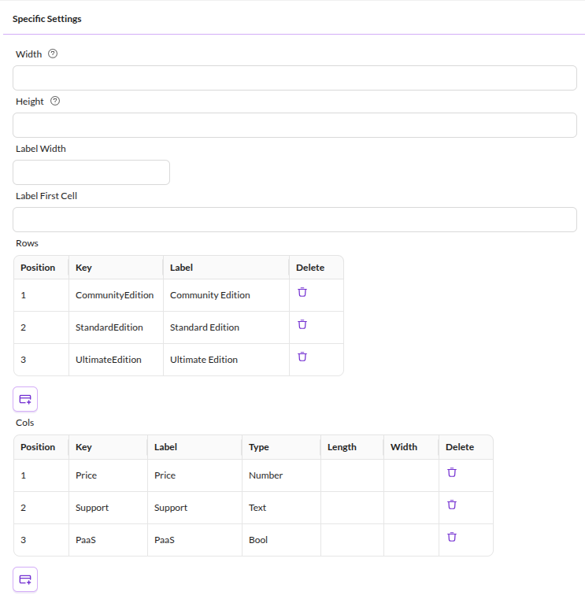
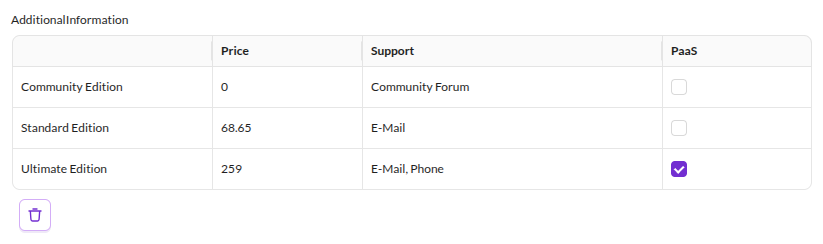

# Structured Table

## Add Structured Table to the Class

Similar to the table widget, the structured table can hold structured data. 
But there are a few fundamental differences:

* The rows and columns are predefined and named.
* The data type per column can be defined. Possible data types are text, number and boolean.
* Access structured table data via getters and setters. Pimcore stores the data in a structured format in the database.

You can add structured table component in a class definition. Define rows and column headers 
to structure the table content.

<div class="image-as-lightbox"></div>



Use the table in your object as shown below:

<div class="image-as-lightbox"></div>



## Storage of Structured tables

Each row and column combination creates a new column in the structured table's database table.

Avoid this data type for tables with many rows or columns. The maximum number of database columns per table applies as a technical restriction.

## Using structured table with PHP API

Access field data using these methods:

```php
/** @var \Pimcore\Model\DataObject\Data\StructuredTable $structuredData */
$structuredData = $object->getAdditionalinfo();

//Returns an associated array of row CommunityEdition with all columns
$structuredData->getCommunityedition();

//Returns an associated array of row CommunityEdition with all columns
$structuredData->getCommunityedition__support();

//Sets the value of the CommunityEdition support column
$structuredData->setCommunityedition__support("Forum");

//Alternative way of setting data to a structured table
$data = [];
$data['communityedition']['opensource'] = true;
$structuredData->setData($data);
```
