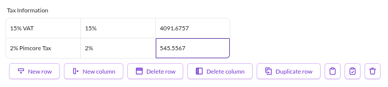
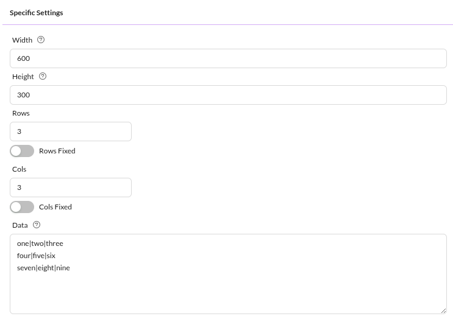
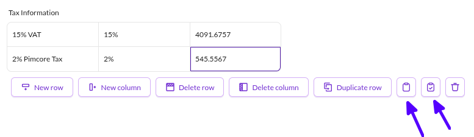

# Table

The table widget can hold structured data in the form of an array. 
The input widget for table data is a table with variable rows and columns as shown below.

<div class="image-as-lightbox"></div>



The data is stored in an array, which needs to be flattened for storage in the database. 
For this purpose columns are separated with a "|" and rows are distinguished with line breaks. 
The database field for a table is a TEXT column. 
For example, the data shown in the screen above would be stored as:

```text
one|two|three
four|five|six
seven|eight|nine
```

<div class="image-as-lightbox"></div>



The input widget can be preconfigured with default data or a fixed amount of rows and columns. 
Change the default rows, columns, and data later when entering data. Set the "Rows fixed" or "Cols fixed" checkbox to prevent adding or removing rows and columns. When set to fixed, the add and delete buttons for rows and columns disappear.

Pass an array to the setter to set table data programmatically:

```php
$object->setTable([
    ["one", "two", "three"], 
    ["four", "five", "six"], 
    ["seven", "eight", "nine"]
]);
```


## Using copy and paste feature in an object using table data type

Use copy and paste to fill tables from Excel sheets:



Copy data directly from Excel to the system clipboard. 
Paste any tab-separated data (from text files, etc.).