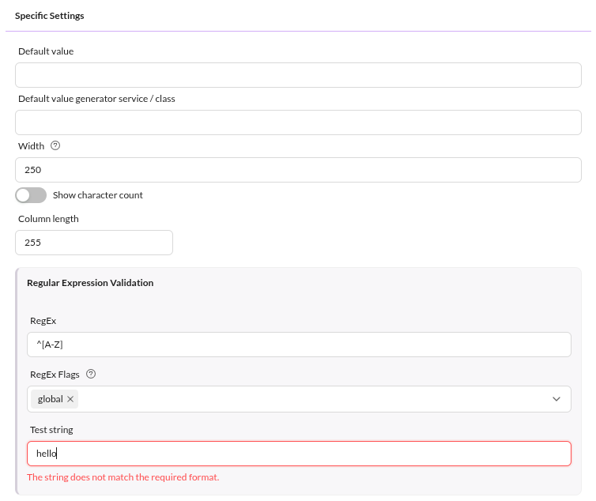
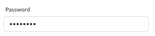
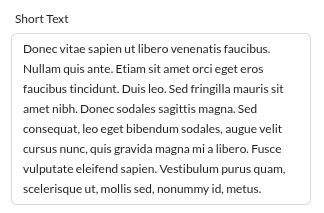
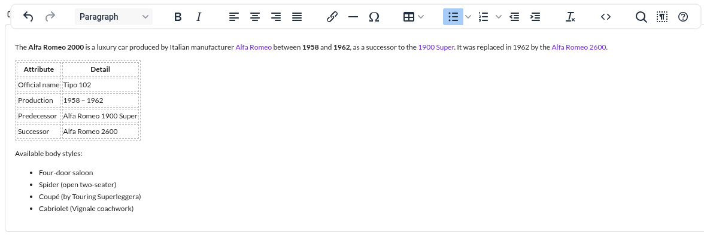

# Text Datatypes

## Input


The input field stores text data in a VARCHAR column in the database. The display 
width and database column length can be configured in the object class definition.

<div class="image-as-lightbox"></div>




Pass the string value to the setter to set an input field:

```php
$object->setInput("Some Text");
$object->save();
```


## Password



The password field resembles the input field with hidden characters. Column length is fixed because passwords are hashed with the `password_hash` algorithm.

Use [password_get_info()](https://www.php.net/manual/en/function.password-get-info.php) to check if a string is already hashed. The string will not be hashed again if it is already hashed.

Pimcore uses the `password_hash` algorithm as the default hashing method. No other hashing algorithms are currently supported. 

## Textarea



The textarea stores unformatted plain text in a TEXT column in the database. Set values the same way as input fields. The width and height of the input widget can be configured in the object 
field definition.


## WYSIWYG

The WYSIWYG (What You See Is What You Get) input field resembles the textarea but allows formatted text, images, and links (references to assets and documents). Images and documents in WYSIWYG widgets create dependencies. Drag assets into the widget to insert images; drag documents onto selected text to create links. The system stores text as HTML.

<div class="image-as-lightbox"></div>




## Input Quantity Value

Quite similar to [Quantity Value](55_Number_Types.md) except that text values are allowed instead of the strict restriction to numeric values.
