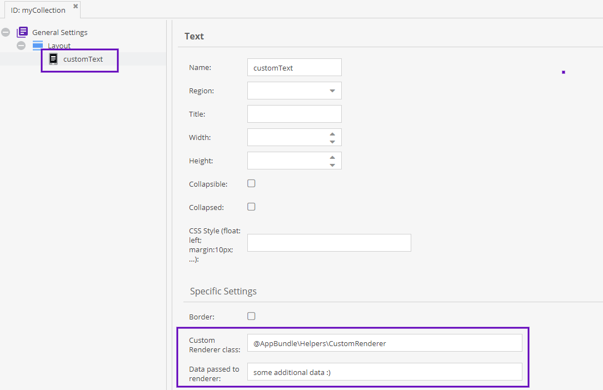
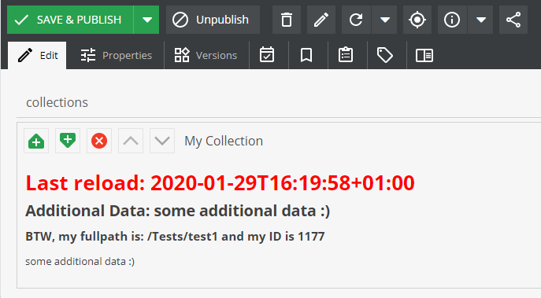
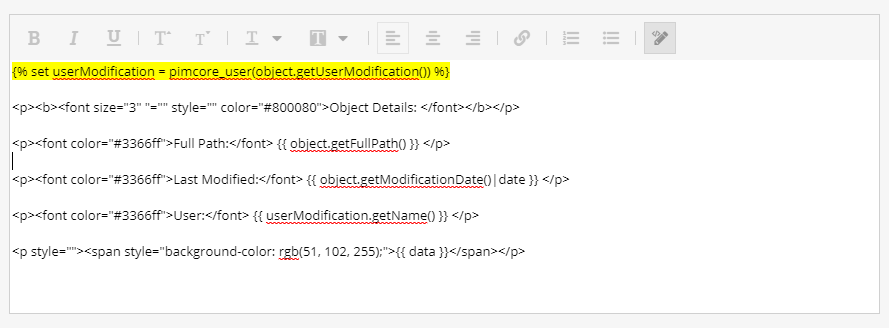
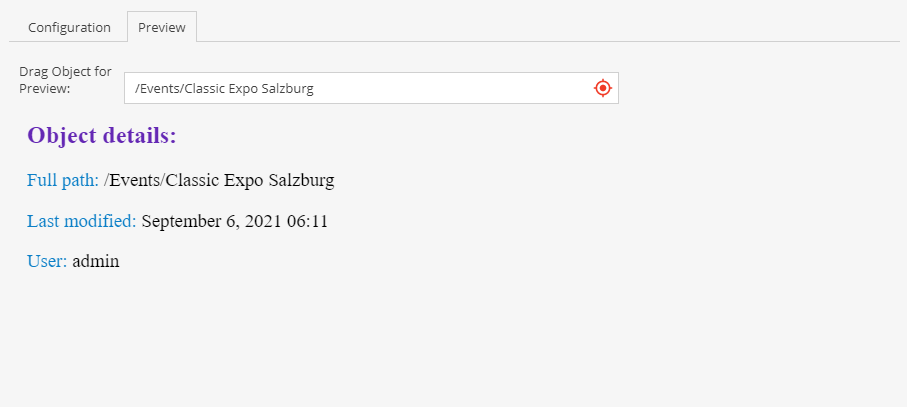

# Dynamic Text Labels

Similar to the [CalculatedValue](../01_Data_Types/10_Calculated_Value_Type.md) data type,
generate the Layout Text dynamically based on the current object and the label's context. Two options exist for defining dynamic content: 
- Providing a custom renderer class
- Using twig in template
This is an alternative to the static text defined in the class definition.

The preview tab shows a preview of the generated content. If your content uses object context, drag and drop an object onto the "Drag Object for Preview" field to check the output in the preview tab.


## Custom Renderer Class

Consider the following example.

It uses a custom renderer service implementing `DynamicTextLabelInterface` that returns a dynamic text string from the `renderLayoutText` method, with additional data passed to the rendering method.



Here is an example for a rendering class.

```php
<?php

namespace App\Helpers;

use Pimcore\Model\DataObject\Concrete;

class CustomRenderer implements DynamicTextLabelInterface
{
    /**
     * @param string $data as provided in the class definition
     */
    public function renderLayoutText(string $data, ?Concrete $object, array $params): string
    {
        $text = '<h1 style="color: #F00;">Last reload: ' . date('c') . '</h1>' .
            '<h2>Additional Data: ' . $data . '</h2>';

        if ($object) {
            $text .= '<h3>BTW, my fullpath is: ' . $object->getFullPath() . ' and my ID is ' . $object->getId() . '</h3>';
        }

        return $text;
    }
}
```

*$data* will contain the additional data from the class definition. In *$params* you will find additional information about the current context.
For example: If the text label lives inside a field collection, *$params* will contain the name of the field collection (and the name of the label itself).

The result will be as follows:



## Twig & Preview
Use Twig syntax inside the HTML editor (Source Edit) or Renderer class. You can also check the generated output in preview tab.

Following variables are available in twig context: 
- `object` - current data object
- `data` - data provided to renderer defined in the class definition

Here is an example of Twig content in htmleditor source edit mode:





### Sandbox Restrictions
Dynamic Text renders user-controlled Twig templates in a sandbox with restrictive
security policies for tags, filters, and functions. Use the following configuration to allow more in template rendering:

```yaml
    pimcore:
          templating_engine:
              twig:
                sandbox_security_policy:
                  tags: ['if']
                  filters: ['upper']
                  functions: ['include', 'path']
```
