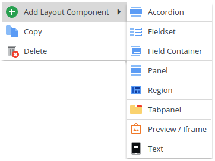

# Layout Elements

Structure object data layouts with 3 panel types and 4 other layout elements. Data fields are
always contained in a panel. Nest panels to design a data input interface tailored to the user's needs.

The three available panel types are:
* Panel - a plain panel holding fields
* Region - a region panel able to hold nested panels in its regions north, east, west and south
* Tabpanel - a panel holding further nested panels as tabs

Moreover, within a panel fields can be put into the following layout Components
* Accordion
* Fieldset
* Field Container

And last but not least there are two extra layout elements:
* Text - adds minimally formatted text to an object layout for descriptions and hints that don't fit into
a field's tooltip. Since release 4.4.2, generate this text dynamically.
See [Dynamic Text Labels](./01_Dynamic_Text_Labels.md) for details.
* IFrame - provide a URL and make use of the context parameter to render the response of your choice.
See [Preview Iframe](./02_Preview_Iframe.md) for details.

Pimcore uses Ext JS layout components for all object layout elements. See the
[Ext JS documentation pages](https://docs.sencha.com/extjs/7.0.0/classic/Ext.html) and
[examples](http://www.sencha.com/products/js/) for a deeper understanding.
