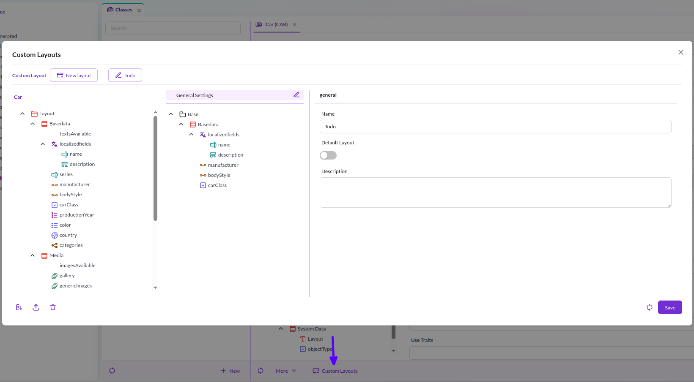
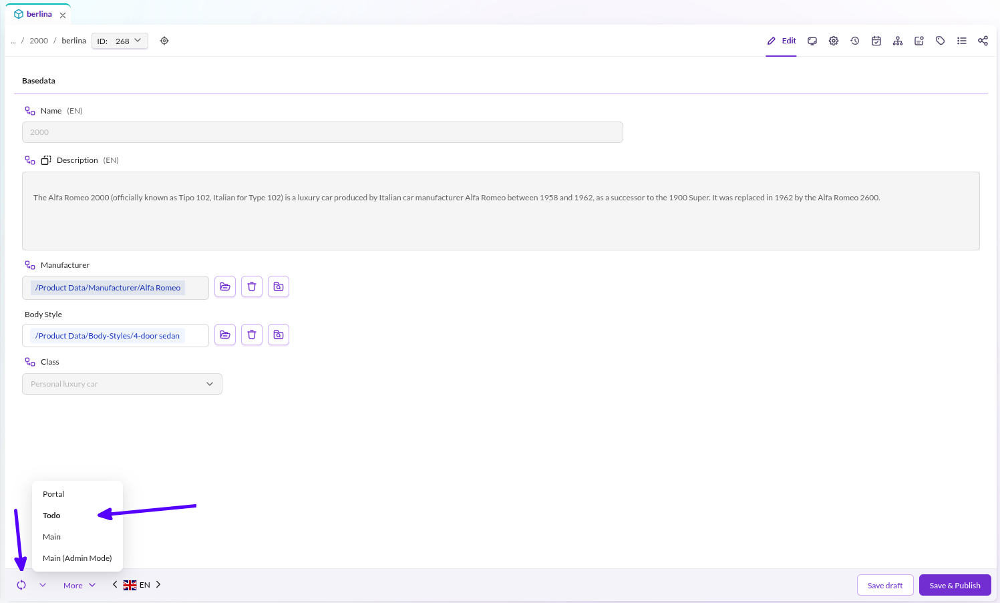
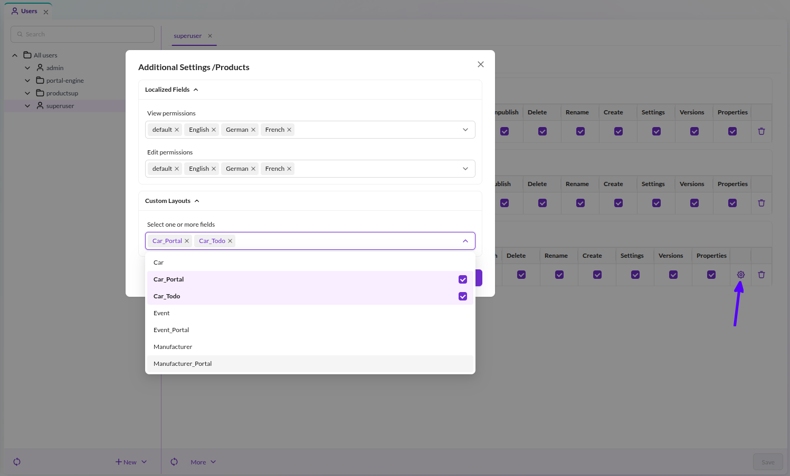

# Custom Layouts
Create customized layouts based on the main definition and override the visual settings of layout and data components. Fields marked as non-editable in the main layout can be made editable in a custom layout. Custom layouts are available for all admin users and can be assigned to standard users through the workspace settings.

> **Security Note**    
> Custom layouts are not intended to restrict access to sensitive data in high-security scenarios.

To define a custom layout, open the `Custom Layout Editor` through the `Configure Custom Layouts` button in the `Classes` editor. You can define as many layouts as you want. 

In the left panel, you will see the main definition. In the middle is the custom layout you are currently editing. And on the right, the specific settings for the selected field. 

You can modify all visual aspects of the field. Other settings concerning the data aspects are locked. 
You can drag and drop elements from the main layout to the custom layout tree, or you can add layout components using the context menu.

There is no need to add all data elements from the main layout. Add only those required - this does not affect your data.

In the `Data Objects` editor, the layout can then be chosen via the `reload` button.

Admin users will notice an extra layout called `Main (Admin Mode)`, which is basically the same as the `Main` 
layout, except that invisible fields are shown, and non-editable fields are made editable again. This layout is available for admin users only. 

Assign custom layouts to standard users through the workspace settings in the user permissions.

If no layout is selected for the given class, then the data will be presented using the main layout. Otherwise, the user will have the choice between the selected layouts.

