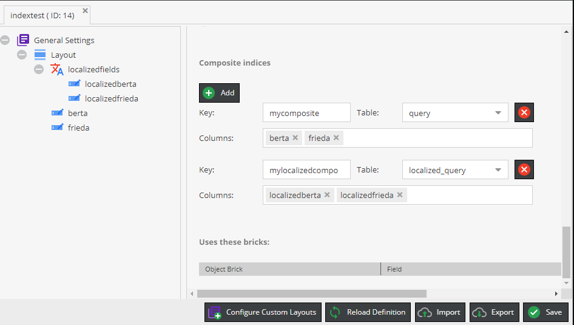
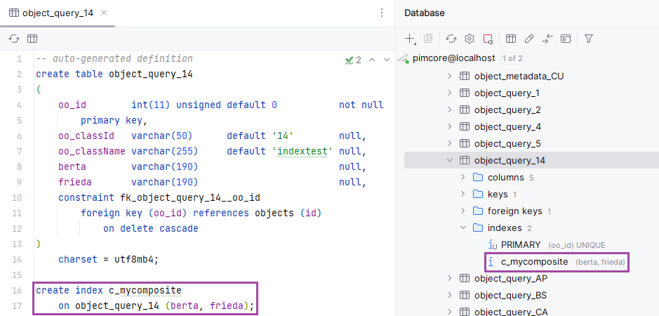

# Composite Indices

Pimcore can create composite indices on `object_query_*`, `object_store_*`, `object_localized_data_*` and `object_localized_query_*` tables for you.

Read [this](../../../08_Development_Details/02_Database_Model.md) for
more information about the database model.

