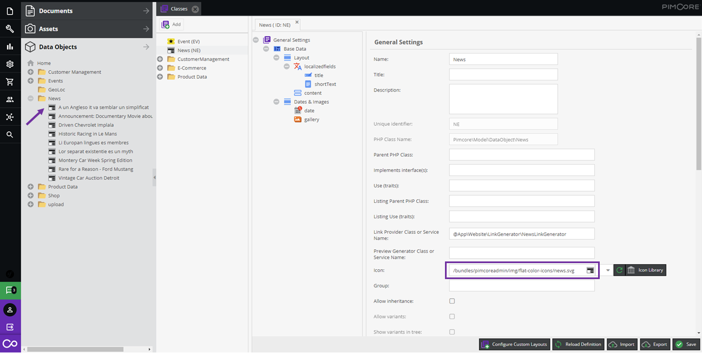

# Custom Icons for Objects

Define custom icons for objects. Icons can be the same for all objects of a class
(via class configuration) or vary based on data values (see below). 
In addition to that, the tooltip of an object in the object tree can be customized via `AdminStyle`.   

## Static Custom Icons for Classes

Display objects in Pimcore with custom icons to visually distinguish them by class.
Users immediately see what each object represents in the object tree. The example below shows
custom icons assigned to a class and their display in the object tree, making "News" objects instantly recognizable.

Icons that come along with Pimcore by default can be found in `<YOUR-DOMAIN>/pimcore-studio/misc/icon-list` (Pimcore Studio session needed).

#### Icon Sizes
As icons SVG graphics are recommended. If you use pixel graphics, the maximum size is 18x20 pixels. 

## Dynamic Icons and Tooltips (AdminStyle)

Beyond static class-level icons, you can dynamically change icons, CSS classes, and tooltips
based on the element's data. For example, show a different icon for published vs. draft objects,
or display key attributes in the tree node tooltip.

This is done by implementing `AdminStyleInterface` in your class. See the full guide in the
Extending Pimcore section:
[Custom Icons & Tooltips](../../../10_Extending_Pimcore/03_Custom_Extension_Guides/10_Custom_Icons_and_Tooltips.md).
