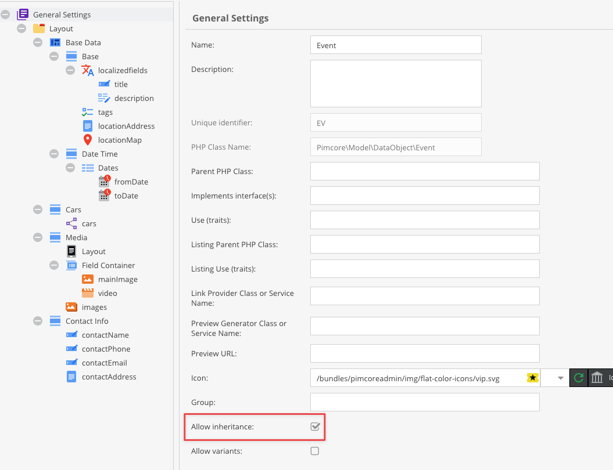
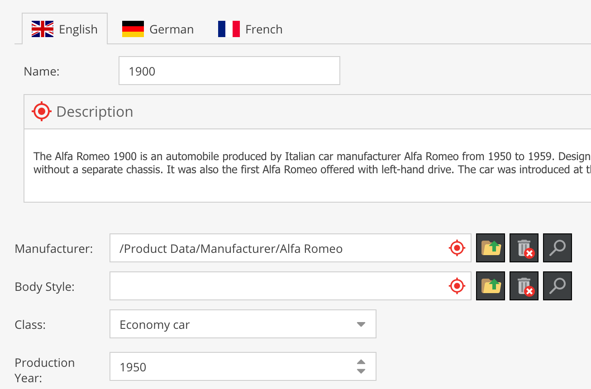
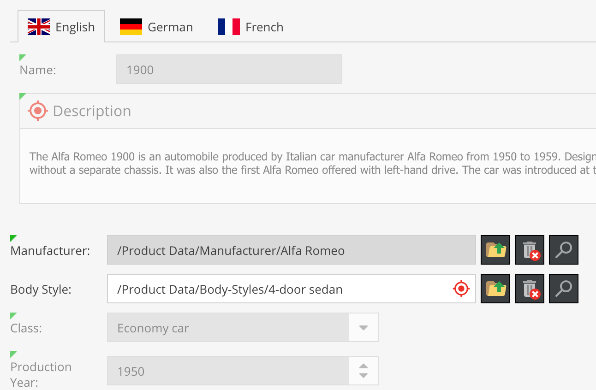
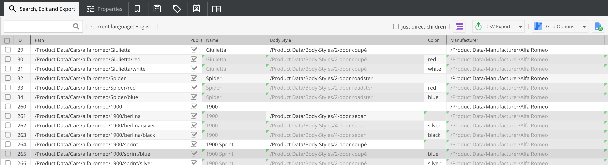

# Data Inheritance

A key feature for PIM use cases is data inheritance. Data inheritance allows objects of the same
class to inherit data from their parent objects in the object tree.

**Example:** You have a group of products that share many attributes and differ only in a few
(size, color, etc.). Create a parent product that stores the common attributes, then add child
products that specify only the differing attributes. All other values are inherited from the parent.

## Enabling Data Inheritance

Data inheritance must be enabled in the class definition:



When enabled, if an attribute of an object is empty, Pimcore retrieves the value from the nearest
parent object of the same class. Inheritance between different classes is not supported.

## How Inherited Values Appear in Pimcore Studio

Inherited values are displayed with a grey, slightly transparent style and a green marker in the
upper left corner. Click the green marker to open the source object that provides the inherited value.







> **Important: Changing the inheritance flag after creating objects**
> If you toggle the inheritance flag after creating objects, the `object_*_query_*` tables may
> contain incorrect values even after saving the object again. Pimcore disables dirty detection
> when the class is newer than the object, which should fix this issue.
> You can also call `DataObject::disableDirtyDetection()` before saving the object
> to explicitly fix this.

> **Default Values**
> Make sure you understand the impact of defining a default value, which is described
> in the [Data Types](../01_Data_Types/README.md) documentation.

## Accessing Inherited Values in Code

To get inherited values, use the getter methods of the attributes. Accessing attributes directly
does not return inherited values.

Getting values from an object without inheritance:

```php
// Set the first argument to false so as not to inherit any values
DataObject\Service::useInheritedValues(false, function() {
    // ... your code goes here
});
```

> **Note**
> Field Collections do not support inheritance.

## Modifying Values from Getters

When inheritance is enabled, values returned by getters may be references to objects from the
parent. Modifying these values could also alter the parent object. To prevent this, clone the
returned object before making any changes.

```php
$silverCar = Car::getById(262);
if ($silverCar instanceof Car) {
    $location = $silverCar->getLocation();
    if($location === null) {
        throw new RuntimeException("...");
    }
    $locationClone = clone $location;
    $locationClone->setLongitude(99);
    $locationClone->setLatitude(99);
    $silverCar->setLocation($locationClone);
    $silverCar->save();
}
```
