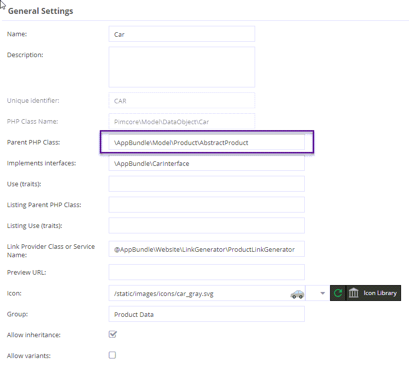
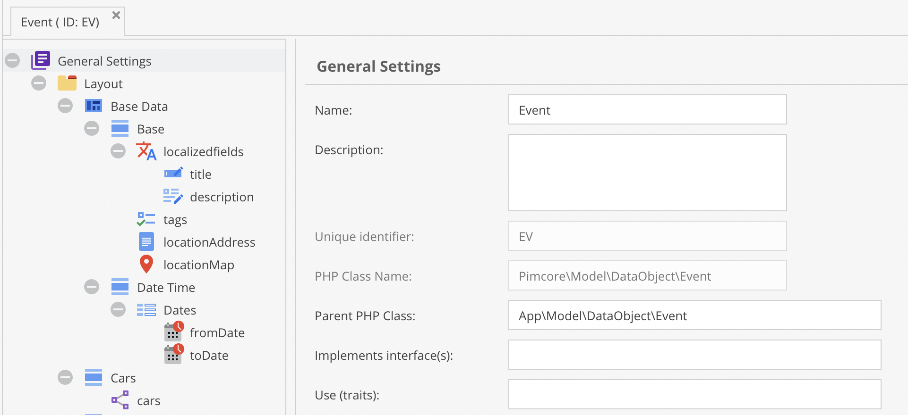

# Parent Class (Class Inheritance)

Pimcore data objects support PHP class inheritance. By default, a data class extends
`Pimcore\Model\DataObject\Concrete`, but you can change the parent class in the class definition.



> **Warning**
> This is an advanced feature. Only use it if you understand the consequences of changing the
> parent class from `Pimcore\Model\DataObject\Concrete` to something else.

To maintain all Pimcore functionality, the custom parent class must extend
`Pimcore\Model\DataObject\Concrete` at some point in its class hierarchy. Its methods must not
override or clash with existing methods of `Pimcore\Model\DataObject\Concrete` or any magic
functions in its parent classes.

## Configuration in Pimcore Studio

Define a `Parent class` in the class's basic configuration. The generated data object class will
then extend the specified parent class.



Make sure your custom class extends `Pimcore\Model\DataObject\Concrete` at some point in its
hierarchy. Otherwise the object class will not work.

## Listing Parent Class

You can also make the object listing model extend a custom parent class. Define a
`Listing Parent class` in the class's basic configuration. The generated listing class will then
extend the specified listing parent class.

## Traits

You can use class inheritance in combination with traits for both object and listing data object
models. See [Interfaces and Traits](./05_Interfaces_and_Traits.md) for details.

## Hooks

Currently one hook is available. Implement the corresponding interface in your custom parent class.

| Interface | Description |
|-----------|-------------|
| `PreGetValueHookInterface` | Modify data before returning it to the caller. Called at the beginning of every field getter. |

### Example

```php
namespace Website\DataObject;

use \Pimcore\Model\DataObject;

class Special extends DataObject\Concrete implements DataObject\PreGetValueHookInterface
{
    public function preGetValue(string $key): mixed
    {
        if ($key == "myCustomProperty") {
            return strtolower($this->myCustomProperty);
        }

        return null;
    }
}
```

## Overriding Pimcore Models

In addition to parent classes, you can override Pimcore object classes with custom classes and
tell Pimcore to use the custom classes instead of the generated ones. See
[Overriding Models](../../../10_Extending_Pimcore/03_Custom_Extension_Guides/08_Overriding_Models.md)
for details.
