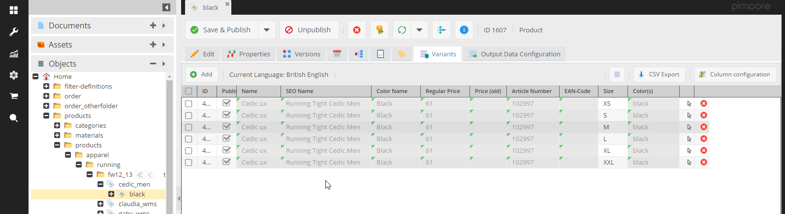
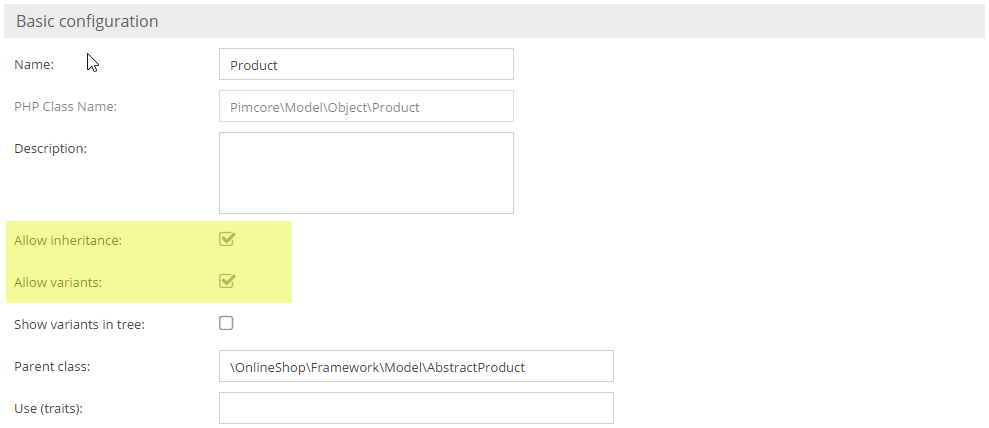
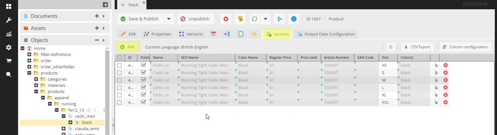

# Object Variants
The best way to show the use and function of object variants is via a use case:

Your goal is to store lots of products in Pimcore. Many of these products are variants of each other, for example a 
yellow t-shirt, a blue t-shirt, a red t-shirt etc. Most of the t-shirts' attributes have the same values and they 
just differ in color and EAN code.

One way to achieve this is to make a generic t-shirt object and then create for each variant a child object within the 
tree which inherits most attributes and sets only those which differ. This approach works, but dozens or hundreds of variants make the object tree large and difficult to navigate.

Object variants solve this. They are objects configured to be hidden from the object tree. In the tree, create the generic t-shirt. For each variant of this t-shirt, you create an object variant. While variants are hidden from the tree, edit them via a dedicated tab in the object editor.

The only difference between objects and variants in behaviour is that you cannot add an object of another class below a variant.

So, you can create hundreds of object variants without blowing your object tree.



As the normal object grid, the object variant grid supports paging, filtering, hiding of columns and visualization of 
inherited values. So even a big number of variants should be manageable.

## Create and organize Object Variants
Activate object variants in the class definition first. Object variants only make sense, 
if inheritance is activated. Therefore, inheritance is a requirement for object variants.



Once they are activated, the object editor has an additional tab 'Variants'. There, all variants of the current object 
are shown in a grid. Via buttons object variants can be created, opened and deleted.




To create object variants via code, create a normal object, set the generic t-shirt as the parent, and set the object 
type to `DataObject::OBJECT_TYPE_VARIANT`.

```php
$objectX = new DataObject\Product();
$objectX->setParent(DataObject\Product::getById(362603));
$objectX->setKey("variantname");
$objectX->setColor("black");
$objectX->setType(DataObject::OBJECT_TYPE_VARIANT);
$objectX->save();
```

## Query Object Variants

#### Get all Object Variants of an object
Call `getChildren` and pass the desired object types as an array.
To return only variants:

```php
$objectX->getChildren([DataObject::OBJECT_TYPE_VARIANT]);
```

By default, `getChildren` delivers objects, variants, and folders.


#### Object Variants in Object Lists

Similar to `getChildren`, the object list objects now have an object type property, which defines the object types to 
deliver. Per default objects, variants and folders are delivered. To deliver object variants, use one of the following code 
snippets:

```php
$list = new DataObject\Product\Listing();
$list->setObjectTypes([DataObject::OBJECT_TYPE_VARIANT]);
$list->load();

// or

DataObject\Product::getList([
    "objectTypes" => [DataObject::OBJECT_TYPE_VARIANT]
]);
```

If you want regular objects and variants, you should use:

```php
$list = new DataObject\Product\Listing();
$list->setObjectTypes([DataObject::OBJECT_TYPE_VARIANT,DataObject::OBJECT_TYPE_OBJECT]);
$list->load();
```
