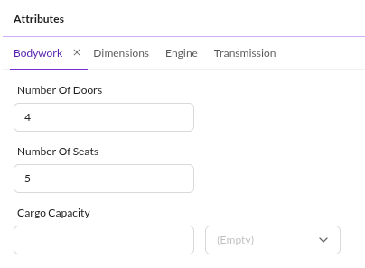
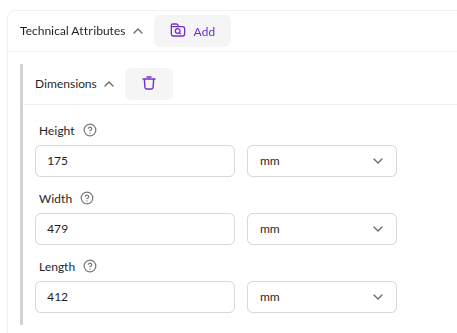

# Object Bricks vs Classification Store

Pimcore offers several options for data modeling with structured data (Data Objects).
Two options that often raise questions are Object Bricks and Classification Store.

## Common Goal

Object Bricks and Classification Store share a common goal, best explained with an example:

A shop has products across many categories (shoes, tents, flashlights, etc.). All products share
some common attributes (name, photo, description, article number, color). These go into a common
product class definition.

Beyond that, each category has its own specific attributes: shoes have sole profiles, tents have
floor material, flashlights have light intensity. Adding all possible attributes to the common
class definition would make it large and confusing. Object Bricks and Classification Store solve
this by making the rigid class definition extensible at the object level.

Both data types support display, filtering, and editing in the object grid view.

## Technical Differences

| | Object Bricks | Classification Store |
|--------|--------------|---------------------|
| **Editor layout options** | All layout options provided by Pimcore (Panels, Tabs, Regions, Fieldsets, Text Descriptions, etc.)  | All attributes arranged vertically in regions, limited layout influence.  |
| **Available data types** | Almost all Pimcore data types, except structured types such as Field Collections, Classification Store, Object Bricks | Only simple data types: text fields, numbers, dates, selects and multiselects (no relations). |
| **Data storage** | Standard Pimcore schema in dedicated database tables with one column per attribute. | Entity-Attribute-Value (EAV) schema: one row per attribute in a single table (affects loading and filtering performance). |
| **PHP API access** | Standard getter/setter as known from Pimcore objects, see [Object Bricks API](./01_Data_Types/60_Object_Bricks.md#working-with-php-api) | Generic getter/setter calls, see [Classification Store API](./01_Data_Types/15_Classification_Store.md#using-classification-store-via-php-api) |
| **Filtering in listings** | Using JOINs directly in the Object-Listing query, see [Querying for ObjectBrick data](./01_Data_Types/60_Object_Bricks.md#querying-for-objectbrick-data) | Only possible via custom subqueries. |

## When to Use Which

### Rule of Thumb

- For a manageable number of categories with specific attributes, use **Object Bricks**.
- For many categories (more than 30) with many attributes, use **Classification Store**.

### Additional Decision Criteria

- Do the attributes include relations? Currently only works with **Object Bricks**.
- Do the attributes need to be created automatically (e.g., via an interface)? Easier with **Classification Store**.

There is no single rule that always applies. The right choice depends on the project requirements,
and sometimes a combination of both is the best approach. A developer should make this decision
based on the specific use case.
