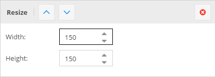
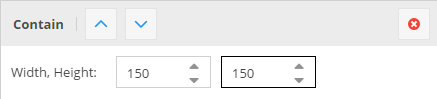
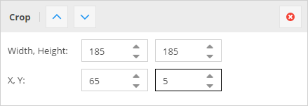
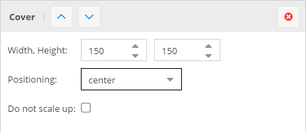
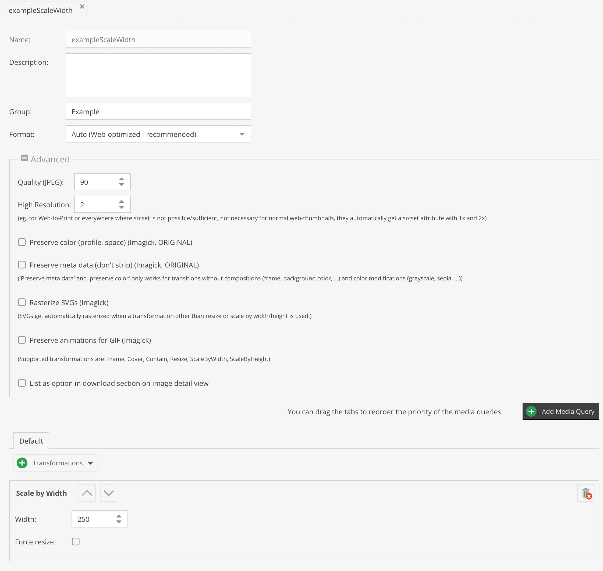
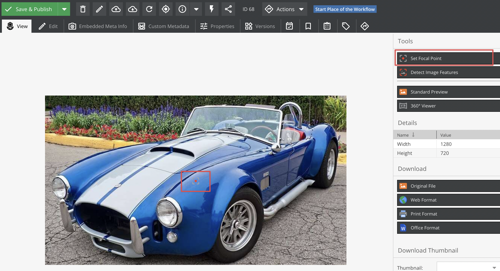

# Image Thumbnails

For images, Pimcore offers an advanced thumbnail-service also called 'image-pipeline'. It allows you to transform images
in unlimited steps to the expected result. You can configure them in _Settings_ > _Thumbnails_.

With this service every image which is stored as an asset can be transformed. Pimcore doesn't support to modify images
which are not stored as an asset inside Pimcore.

> **IMPORTANT**  
> Use Imagick PECL extension for best results, GDlib is just a fallback with limited functionality
> (only PNG, JPG, GIF) and less quality!
> Using ImageMagick Pimcore can support hundreds of formats including: AI, EPS, TIFF, PNG, JPG, GIF, PSD, etc.
> Not all formats are allowed out of the box. To extend the list [see](./README.md#allowed-formats).

To use the thumbnailing service of Pimcore, you have to create a transformation pipeline first. To do so, open
_Settings_ > _Thumbnails_ and click on _Add Thumbnail_ to create a new configuration.
The fields name, description, format and quality should be self-explanatory, the interesting part are now the transformations.
Click on _+_ to add a new transformation, so that it look like that for example:


**Important**: The transformations are performed in the order from the top to the bottom. This is for example important
in the configuration above. If you first round the corners this would be performed on the original image,
and then the image will get resized, so the rounded corners are also resized which is not intended.

To retrieve a thumbnail from an asses simply call `$asset->getThumbnail("thumbnail-name")` on the asset object, which will return
an `\Pimcore\Model\Asset\Image\Thumbnail` object. The thumbnail object's `__toString()` method returns the path to the thumbnail file, for example:
`/Car%20Images/ac%20cars/68/image-thumb__68__content/automotive-car-classic-149813.jpg`

**Important**: The function `getThumbnail()` does not generate the Thumbnail itself. It just returns the path were the thumbnail file will be stored.
If you want to generate the Thumbnail directly have a look at [Deferred Rendering of Thumbnails](#deferred-rendering-of-thumbnails)

This path can then be directly used to display the image in a `` or `<picture`> tag. For example:

```php
$image = Asset::getById(1234);

// get path to thumbnail, e.g. `/foo/bar/362/image-thumb__362__content/foo.webp
$pathToThumbnail = $image->getThumbnail("myThumbnailName");

// preferred alternative - let Pimcore create the whole image tag
// including high-res alternatives (srcset) or media queries, if configured
$htmlCode = $image->getThumbnail("myThumbnail")->getHtml();
```

Same in Twig:

```twig


{# get path to thumbnail, e.g. `/foo/bar/362/image-thumb__362__content/foo.webp #}


{# preferred alternative - let Pimcore create the whole image tag #}
{# including high-res alternatives (srcset) or media queries, if configured #}
{{ image.thumbnail('myThumbnailName').html|raw }}
```

## Explanation of the Transformations

| Transformation   | Description                                                                                                                                                                                                                                                                                                               | Configuration                                                    | Result                                                           |
| ---------------- | ------------------------------------------------------------------------------------------------------------------------------------------------------------------------------------------------------------------------------------------------------------------------------------------------------------------------- | ---------------------------------------------------------------- | ---------------------------------------------------------------- |
| ORIGINAL IMAGE   | This is the image which is used in the following transformations                                                                                                                                                                                                                                                          | NONE ;-)                                                         |      |
| RESIZE           | The image is exactly resized to the given dimensions without respecting the ratio.                                                                                                                                                                                                                                        |          |          |
| SCALE BY HEIGHT  | The image is scaled respecting the ratio to the given height, the width is variable depending on the original ratio of the image (portrait, landscape).                                                                                                                                                                   |          |          |
| SCALE BY WIDTH   | The image is scaled respecting the ratio to the given width, the height is variable depending on the original ratio of the image (portrait, landscape).                                                                                                                                                                   |            |            |
| CONTAIN          | The image is scaled to either the given height or the width, depending on the ratio of the original image. That means that the image is scaled to fit into a "virtual" box with the dimensions given in the configuration.                                                                                                |        |        |
| CROP             | Cuts out a box of the image starting at the given X,Y coordinates and using the width and height.                                                                                                                                                                                                                         |              |              |
| COVER            | The image is resized so that it completely covers the given dimensions. Then the overlapping pieces are cropped depending on the given positioning or based on the focal point set on the source image. This is useful if you need a fixed size for a thumbnail but the source images have different ratios.              |            |            |
| FRAME            | The transformation is the same as CONTAIN the difference is, that the image gets exactly the entered dimensions by adding transparent borders left / right or top / bottom.                                                                                                                                               |            |            |
| ROTATE           | Rotates the image with the given angle. The background is transparent by default.                                                                                                                                                                                                                                         |          |          |
| BACKGROUND COLOR | Background color is especially useful if you have transparent PNG as source data or if you're using the FRAME or the ROTATE transformations where you get transparencies. It allows you to give transparencies a color, and gives you the possibility to use them for examples JPEG's which doesn't support transparency. |  |  |
| ROUNDED CORNERS  | Rounds the corners to the given width/height.                                                                                                                                                                                                                                                                             |          |          |

For thumbnails in action also have a look at our [Live Demo](https://demo.pimcore.fun/en/More-Stuff/Developers-Corner/Thumbnails).

## Generating HTML for Thumbnails

Pimcore offers the method `getHTML(array $options)` to get a ready to use `<picture>` tag for your thumbnail. When a `<picture>` element is not needed or desired an `` element can used by calling `getImageTag(array $options)` instead.

You can configure the generated markup with the following options:

| Name                           | Type     | Description                                                                                                                        |
|--------------------------------| -------- |------------------------------------------------------------------------------------------------------------------------------------|
| `disableWidthHeightAttributes` | bool     | Width & height attributes are set automatically by Pimcore, to avoid this set this option (eg. to true => isset check)             |
| `disableAutoTitle`             | bool     | Set to true, to disable the automatically generated title attribute (containing title and copyright from the origin image)         |
| `disableAutoAlt`               | bool     | Set to true, to disable the automatically generated alt attribute                                                                  |
| `disableAutoCopyright`         | bool     | Set to true, to disable the automatically appended copyright info (alt & title attribute)                                          |
| `disableAutoCopyright`         | bool     | Set to true, to disable the automatically appended copyright info (alt & title attribute)                                          |
| `pictureAttributes`            | array    | An key-value array of custom attributes which should be applied to the generated `<picture>` tag                                   |
| `imgAttributes`                | array    | An key-value array of custom attributes which should be applied to the generated `` tag                                       |
| `lowQualityPlaceholder`        | bool     | Put's a small SVG/JPEG placeholder image into the `src` (data-uri), the real image path is placed in `data-src` and `data-srcset`. |
| `pictureCallback`              | callable | A callable to modify the attributes for the generated `<picture>` tag. There 1 argument passed, the array of attributes.           |
| `sourceCallback`               | callable | A callable to modify the attributes for any of the generated `<source>` tag. There 1 argument passed, the array of attributes.     |
| `imgCallback`                  | callable | A callable to modify the attributes for the generated `` tag. There 1 argument passed, the array of attributes.               |
| `disableImgTag`                | bool     | Set to `true` to not include the `` fallback tag in the generated `<picture>` tag.                                            |
| `useDataSrc`                   | bool     | Set to `true` to use `data-src(set)` attributes instead of `src(set)`.                                                             |
| `useFrontendPath`              | bool     | Set to `true` to use the full url (including the frontend_prefix).                                                                 |

## Usage Examples

```twig
/* Use directly on the asset object */
{{ pimcore_asset_by_path('/path/to/image.jpg').thumbnail('myThumbnail').html|raw }}

/* ... with some additional options */
{{ pimcore_asset_by_path('/path/to/image.jpg').thumbnail('myThumbnail').html({
    pictureAttributes: {
        data-test: "my value"
    },
    disableImgTag: true
})|raw }}

/* Use with the image tag in documents */
<div>
    <p>
        {{ pimcore_image('myImage', {'thumbnail': 'myThumbnail'}) }}
    </p>
</div>

/* Use without pre-configured thumbnail */
{{ pimcore_image('myImage', {
    'thumbnail': {
        'width': 500,
        'aspectratio': true,
        'interlace': true,
        'quality': 85,
        'format': 'png'
    }
}) }}

/* Use from an object-field */
/* where "myThumbnail" is the name of the thumbnail configuration in settings -> thumbnails */

   {{ myObject.myImage.thumbnail('myThumbnail').html|raw }}



/* Use from an object-field with dynamic configuration */


/* Use directly on the asset object using dynamic configuration */
{{ pimcore_asset_by_path('/path/to/image.jpg').thumbnail({'width': 500, 'format': 'png'}).html|raw}}
```

## Advanced Examples

Pimcore returns an `\Pimcore\Model\Asset\Image\Thumbnail` object when calling `$asset->getThumbnail("thumb-name")`
which gives you even more flexibility when working with thumbnails.

```php
$thumbnail = $asset->getThumbnail("myThumbnail");

// get the final dimensions of the thumbnail (especially useful when working with dynamic configurations)
$width = $thumbnail->getWidth();
$height = $thumbnail->getHeight();

// get the html "<picture>" tag for the thumbnail incl. custom class on the containing `` tag:
echo $thumbnail->getHtml(['imgAttributes' => ["class" => "custom-class"]]);

// get the path to the thumbnail
$path = $thumbnail->getPath();

// get path and disable deferred thumbnails
$path = $thumbnail->getPath(["deferredAllowed" => false]);
// possible options: ["deferredAllowed" => true, "cacheBuster" => false, "frontend" => false]

// getting the full url to a thumbnail (including the frontend_prefix) - also works in console commands
$path = $thumbnail->getFrontendPath();
//or
$path = $this->getPath(['deferredAllowed' => false, 'frontend' => true]);

// Asset\Image\Thumbnail implements __toString(), so you can still print the path by
echo $thumbnail; // prints something like /Car%20Images/....png

// examples for callbacks, etc. for the generated <picture> tag
$thumbnail->getHtml([
    'useDataSrc' => true,
    'pictureAttributes' => [
        'data-bar' => uniqid(),
    ],
    'imgAttributes' => [
        'data-foo' => uniqid(),
    ],
    'imgCallback' => function ($attributes) {
        // modify  tag attributes
        $attributes['data-foo'] = 'new value';
        return $attributes;
    },
    'sourceCallback' => function ($attributes) {
        // modify <source> tag attributes
        $attributes['data-custom-source-attr'] = uniqid();
        return $attributes;
    },
    'pictureCallback' => function ($attributes) {
        // modify <source> tag attributes
        $attributes['data-custom-picture-attr'] = uniqid();
        return $attributes;
    },
    'disableImgTag' => true,
    'lowQualityPlaceholder' => true,
]);
// get thumbnail instance in a specific file format
$webpThumbnail = $thumbnail->getAsFormat('webp');
$webpThumbnail->getHtml();
```

## More Examples

```twig

/* adding custom html attributes to the generated  or <picture> tag, using a dynamic thumbnail */
{{ image.thumbnail({
    'width': 180,
    'height': 180,
    'cover': true,
}).html({
    'imgAttributes': {
        'class': 'thumbnail-class',
    },
    'data-my-name': 'my value',
    'attributes': {
        'non-standard': 'HTML attributes',
        'another': 'one'
    }
})|raw }}

/* same with a thumbnail definition */
{{ image.thumbnail('exampleScaleWidth').html({
    'pictureAttributes': {
        'class': 'thumbnail-class',
    },
    'data-my-name': 'my value',
})|raw }}

/* disable the automatically added width & height attributes */
{{ image.thumbnail('exampleScaleWidth').html({}, ['width', 'height'])|raw }}

/* add alt text */
{{ image.thumbnail('exampleScaleWidth').html({'alt': 'top priority alt text'})|raw }}
/* OR */
{{ image.thumbnail('exampleScaleWidth').html({'defaultalt': 'default alt, if not set in image'})|raw }}


/* Output only  element wihout <picture> and <source> around it */
{{ image.thumbnail('exampleScaleWidth').imageTag({'alt': 'top priority alt text'}) }}
```

Additionally, there are some special parameters to [customize generated image HTML code](../../03_Documents/01_Editables/14_Image.md#configuration).

## Lazy Loading

By default, the images are lazy loading. This can be changed by setting the value to "eager" in the imgAttribute:

```twig

{{ image.thumbnail('example').html({
    'imgAttributes': {
        'loading': 'eager',
    }
})|raw }}


```

## Using ICC Color Profiles for CMYK -> RGB

Pimcore supports ICC color profiles to get better results when converting CMYK images (without embedded color profile)
to RGB.

Due licensing issues Pimcore doesn't include the color profiles (\*.icc files) in the download package, but
you can download them for free here: [Adobe ICC Profiles](https://www.adobe.com/support/downloads/iccprofiles/iccprofiles_win.html)
or here: [ICC (color.org)](http://www.color.org/profiles.xalter).

After downloading the profiles put them into your project folder or anywhere else on your sever
(eg. `/usr/share/color/icc`). Then configure the path in the Pimcore config file:

```yaml
pimcore:
    assets:
        # Absolute path to default ICC RGB profile (if no embedded profile is given)
        icc_rgb_profile: null

        # Absolute path to default ICC CMYK profile (if no embedded profile is given)
        icc_cmyk_profile: null
```

## Dynamic Generation on Request

Pimcore auto-generates a thumbnail if requested but doesn't exist on the file system and is directly called via it's file path (not using any of
the `getThumbnail()` methods).
For example: Call `https://example.com/examples/panama/6644/image-thumb__6644__contentimages/img_0037.jpeg`
(`/examples/panama/` is the path to the source asset, `6644` is the ID of the source asset, `contentimages` is the name of the thumbnail configuration, `img_0037.jpeg` the filename of the source asset) directly in your browser. Now Pimcore checks
if the asset with the ID 6644 and the thumbnail with the key "contentimages" exists, if yes the thumbnail is
generated on-the-fly and delivered to the client. When requesting the images again the image is directly served by
the webserver (Apache, Nginx), because the file already exists (just the same way it works with the getThumbnail() methods).

The structure of the path is identically with the one generated by the `getThumbnail()` methods, so it doesn't
matter whether the thumbnail is generated by `getThumbnail()` (inside a PHP process) or on-the-fly (in a separate
process).

Of course this works only with predefined (named) thumbnail configurations and not with dynamic configurations.

## Deferred Rendering of Thumbnails

For performance reasons, Pimcore doesn't generate the thumbnail image directly when calling `getThumbnail()`
on an asset, instead it generates them when they are actually needed (on request).

But sometimes it's necessary to have the actual image already generated, in this case you can pass a
2nd parameter to `getThumbnail()` to force the processing of the image.

```php
$asset = Asset\Image::getById(123);
$asset->getThumbnail("myConfig", false); // set the 2nd parameter to false
```

The processing is also forced when calling the method `getPathReference()` or `getPath(["deferredAllowed" => false])` on
the returning thumbnail object:

```php
$asset->getThumbnail("myConfig")->getPathReference();
// or
$asset->getThumbnail("myConfig")->getPath(['deferredAllowed' => false]);
```

## High-Resolution Support

This is a special functionality to allow embedding high resolution (ppi/dpi) images.
The following is only necessary in special use-cases like Web-to-Print, in typical web-based cases, Pimcore
automatically adds the `srcset` attribute to `` and `<picture>` tags automatically, so no manual work is necessary.

The high resolution scaling factor is limited to `5.0` eg. `@5x`. Float values are supported.
If you need to scale an image more than that, you can use the `max_scaling_factor` option in the configuration.
```yaml
  pimcore:
    assets:
      thumbnails:
        max_scaling_factor: 6.0
```

### Use in the Thumbnail Configuration:


The above configuration will generate a thumbnail with 500px width.

When using this configuration in combination with the [image editable](../../03_Documents/01_Editables/14_Image.md)
using the following code

```twig
{{ pimcore_image('myImage', {'thumbnail': 'contentimages'}) }}
```

this will create the following output:

```php

```

It's also possible to add the high-res dynamically:

```twig
{{ pimcore_image('myImage', {thumbnail: {
    width: 250,
    contain: true,
    highResolution: 2
}}) }}
```

This will create an image `width = 500px`

#### Combining "Dynamic Generation on Request" with High Resolution Images

This is especially useful in the case you want to serve thumbnails depending on the ppi of the device screen or in
combination with Web2Print documents (browser preview with normal size, tripled in size for PDF ouptut).
Pimcore also utilizes this functionality internally to provide the automatically added high.res support on `` and `<picture>` tags.
So again, this feature is only useful in some edge-cases.

##### Example

```twig
{{ image.thumbnail('testThumbnailDefinitionName').path }}
```

this generates the followinig ouput:

```sh
/Car%20Images/ac%20cars/68/image-thumb__68__testThumbnailDefinitionName/automotive-car-classic-149813.jpg
```

To get an high-res version of the thumbnail, you can just add `@2x` before the file extension:

```sh
/Car%20Images/ac%20cars/68/image-thumb__68__content/automotive-car-classic-149813@2x.png
/Car%20Images/ac%20cars/68/image-thumb__68__content/automotive-car-classic-149813@5x.png
```

Using float is possible too:

```sh
/Car%20Images/ac%20cars/68/image-thumb__68__content/automotive-car-classic-149813@3.2x.png
```

Pimcore will then dynamically generate the thumbnails accordingly.

## Media Queries in Thumbnail Configuration

If your're using media queries in your thumbnail configuration Pimcore automatically generates a `<picture>` tag when calling `$asset->getThumbnail("example")->getHtml()`.
But in some cases it is necessary to get single thumbnails for certain media queries out of the thumbnail object, which is described in the examples below.

```php
$a = Asset::getById(71);

// list all available medias in "galleryCarousel" thumbnail configuration
p_r(array_keys(Asset\Image\Thumbnail\Config::getByName("galleryCarousel")->getMedias()));

// get the <picture> element for "galleryCarousel" => default behavior
$a->getThumbnail("galleryCarousel")->getHtml();

// get path of thumbnail for media query min-width: 940px
$a->getThumbnail("galleryCarousel")->getMedia("(min-width: 940px)");

// get  tag for media query min-width: 320px including @srcset 2x
$a->getThumbnail("galleryCarousel")->getMedia("(min-width: 320px)")->getHtml();

// get 2x thumbnail path for media query min-width: 320px
$a->getThumbnail("galleryCarousel")->getMedia("(min-width: 320px)", 2);
```

## Focal Point

Pimcore supports focal points on images, which are considered when images are automatically cropped.
At the moment this makes only sense if the transformation `COVER` is used. If a focal point is set on
the source image, it is automatically considered and the thumbnail is cropped accordingly to ensure the focus
of the image is on the focal point.




## Clipping Support

Images with an embedded clipping path (8BIM / Adobe profile meta data) are automatically clipped when generating thumbnails of them.

If you do not want to use thumbnail auto clipping, you can disable the support by adding the following config option:

```yml
pimcore:
    assets:
        image:
            thumbnails:
                clip_auto_support: false
```

### Note on using WebP with Imagick using delegates

Please ensure that your delegate definition for WebP encoding includes the `-q` flag, otherwise the quality
setting on thumbnails will not be considered and the default value of `75` is being used by `cwebp`.

Working example of a WebP encode delegate (defined in `/etc/ImageMagick-6/delegates.xml`):

```xml
<delegate decode="png" encode="webp" command="&quot;cwebp&quot; -quiet -q %Q &quot;%i&quot; -o &quot;%o&quot;"/>
```

## Downloading Asset Thumbnails

Besides embedding thumbnails into CMS pages and distributing them via other channels, backend users can download a thumbnail of an asset.
In order to make a thumbnail downloadable, mark "List as option in download section on image detail view" option in Image Thumbnail Advanced settings. All thumbnails with this option enabled are listed in the "Download Thumbnail" dropdown on the detail view of an Asset. To download the thumbnail of the asset choose the thumbnail from the list and hit the "Download" button.

## Customize Auto (Web-Optimized) Format

For most web-based applications it's recommended to use the auto configuration, which does multiple things:

- automatically select the target image format (`jpeg`, `png`) based on image characteristics (such as alpha channel)
- multiple additional optimized image formats (`webp`, `avif`) using progressive enhancement (in `<picture` tag)
- runs image optimizers (such as `jpegoptim` and `pngout`) on generated images using an async queue

Even if this setting does quite a lot of stuff automatically, it's still required to set a quality in the thumbnail
configuration. This quality will be used by `jpeg` and `png` and if not configured otherwise also for `webp`.
If `avif` is supported by Imagick this won't use the quality from the thumbnail configuration, but uses a fixed value.  
It is possible to customize the used alternative image formats and their qualities by using the following configuration:

```yaml
pimcore:
    assets:
        image:
            thumbnails:
                auto_formats:
                    # the quality is used by Imagick, set to null if quality value from config should be used
                    # the following config is used as the default by Pimcore
                    # the order of the formats is used for the priority of the <source> in the <picture> tag
                    avif:
                        quality: 15
                    webp:
                        quality: null
                        enabled: true
```

### Config for disabling all auto-formats

```yaml
pimcore:
    assets:
        image:
            thumbnails:
                auto_formats: null
```
