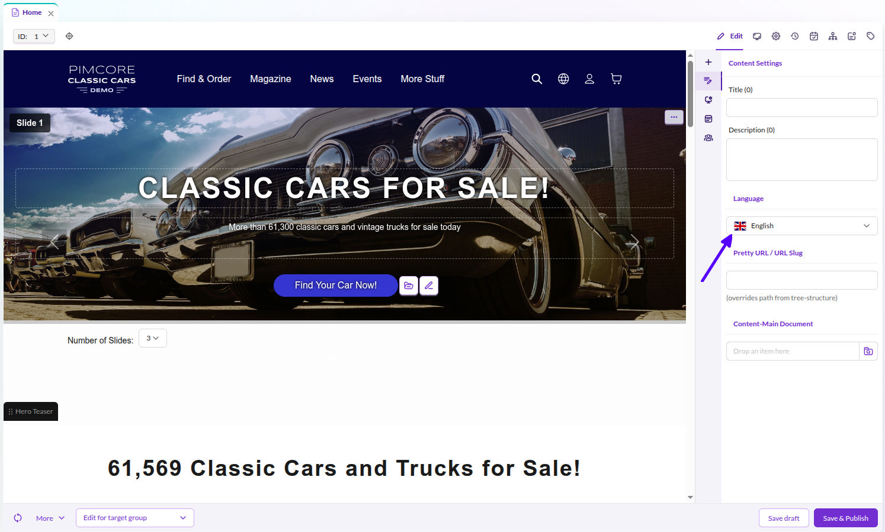
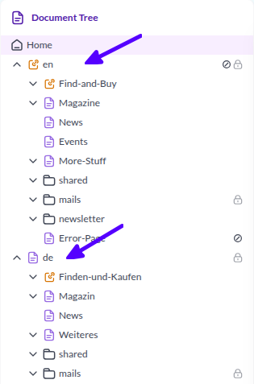
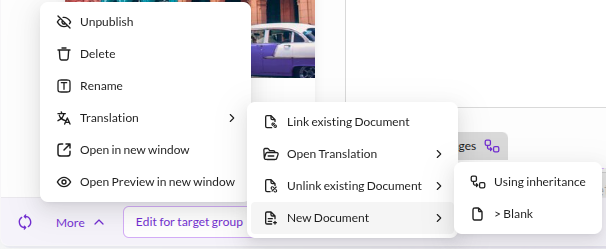

# Document Localization

Pimcore allows you to localize every document. Each document carries a language property that determines its locale,
which Pimcore uses automatically for shared translations, localized object lists, and all other localized content.
This page covers how to set the document language, how to structure your site for multiple languages, and how to use
the built-in localization tools.

## Setting the Document Language

You can assign a language to any document in Pimcore Studio. Open the document and navigate to the **Content Settings** 
sidebar, where you can choose from the languages configured in the system settings.

The selected language is registered as a property on the document and inherited by all of its children.

When a language is set, Pimcore automatically applies it to the request object (`$request->getLocale()`). This means
shared translations, localized object lists, and all other locale-aware content pick up the correct language without
additional configuration.

<div class="image-as-lightbox"></div>



Since the language is a standard document property, you can access it like any other property:

```php
// in your controller / action
$locale = $request->getLocale();
// or
$language = $this->document->getProperty("language");

// any document
$doc = \Pimcore\Model\Document::getById(234);
$language = $doc->getProperty("language");
```

```twig

```

## Site Structure for Multi-Language Websites

Every document has one single language/locale assigned. Pimcore's best practice for building multi-language websites
is to create a separate document subtree per language.

<div class="image-as-lightbox"></div>



This approach provides several advantages:

* Localized document keys, URLs, and navigation structures
* Clear structure that makes it easy to find content in each language
* Transparent permission management based on the document tree

Pimcore provides two additional features to support editors in translating and managing documents for several languages:
the Localization Tool and Content Inheritance.

## Localization Tool

The localization tool for Pimcore documents supports creation and management of the same document for multiple
languages. You can access it in the editor button row of every document in Pimcore Studio.



The localization tool supports the following features:

* **Creating new documents** for another language, either as an empty document or as a document using content
  inheritance (see below)
* **Linking existing documents** to establish the language link between documents
* **Open Translation** to quickly navigate to the corresponding document in another language

## Content Inheritance

Content inheritance is a Pimcore feature that reduces duplicate data maintenance within documents. This feature is
useful in multi-language document structures because it allows you to maintain language-independent content only once.

For details, see [Document Inheritance / Content Main Document](../01_Documents/07_Document_Inheritance.md).

## Using Translations in Templates

Once you have defined the language of your documents, you can use the Symfony `trans` filter in your Twig templates.
Pimcore uses the standard Symfony Translator component, so you can also access all translations provided by your
bundles. Use [Shared Translations](./02_Shared_Translations.md) to manage predefined template content such as button
names and labels - everything that the template defines rather than what an editor enters.
