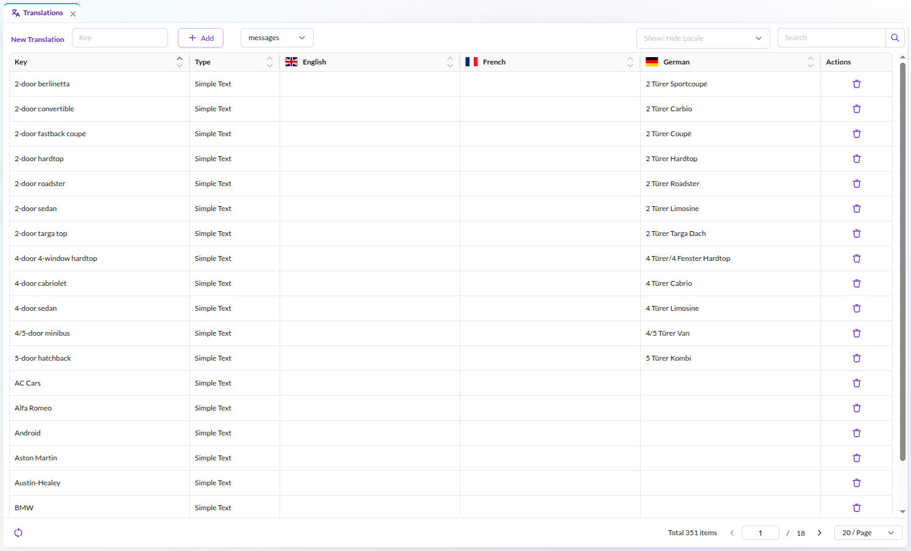
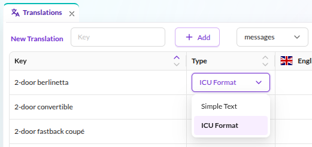
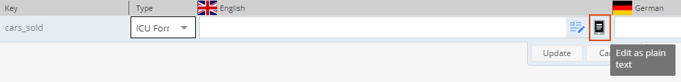
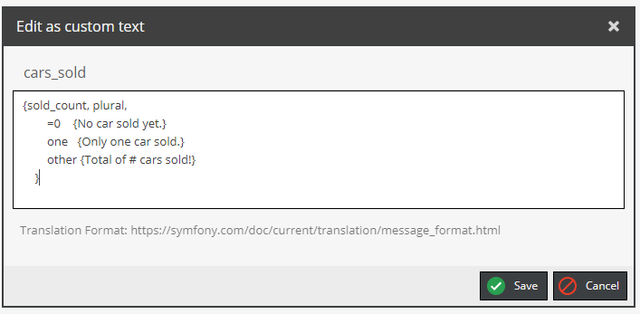
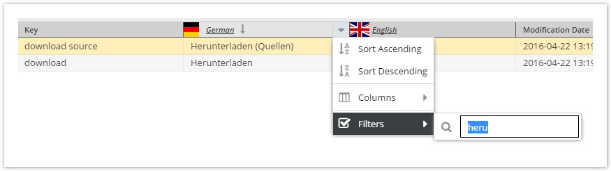
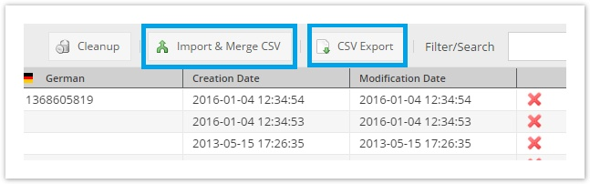
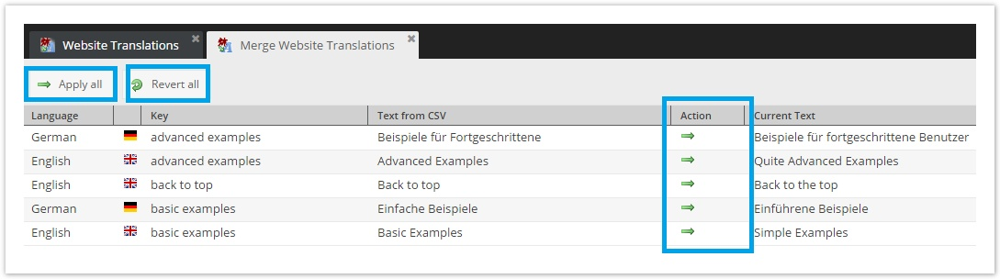

# Shared Translations

Pimcore provides an easy way for editors to manage commonly used translation terms across the application.
You can find shared translations in Pimcore Studio under **Translations > Translations**, filtered to the `messages` domain.
In the background, Pimcore uses the standard Symfony Translator component to provide this functionality.
The main benefit is that you have a single translator for all your translations.

Shared translations use the `messages` domain, which is the default Symfony translation domain. The translator
automatically uses the locale specified on the current document or from a fallback mechanism. Pimcore also uses other
domains internally, for example the `studio` domain for Pimcore Studio UI translations. If you need to register your own
custom domains, see [Custom Translation Domains](./04_Custom_Translation_Domains.md).

For more information, check out the [Symfony Translator component](https://symfony.com/doc/current/translation.html).



Available languages are defined within the system languages, see
[Multi-Language & Localization](./README.md).

Shared translations are stored in the `translations_messages` database table and can be versioned using
[Migrations](https://pimcore.com/docs/pimcore/current/Development_Documentation/Development_Tools_and_Details/Migrations.html).

## Translations Case Sensitivity

Translations are case sensitive by default. You can reconfigure Pimcore to handle website and admin translations as
case insensitive. However, this implies a performance hit (translations might be looked up twice) and does not conform
with the Symfony Translator component. You are encouraged to reference translation keys with the same casing as they
were saved.

## Working with Shared Translations / the Translator in Code

### Example in Templates / Views

Use the Symfony `trans` filter in Twig templates. You can also pass variables for interpolation in localized messages.

```twig
<div>
    <address>&copy; {{ 'Copyright'|trans }}</address>
    <a href="/imprint">{{ 'Imprint'|trans }}</a>
    {# variable interpolation, 'about' translates to 'About {{siteName}}' #}
    <a href="/about">{{ 'about'|trans({'{{siteName}}': siteName}) }}</a>
</div>
```

Parameters in translations can be wrapped in double curly braces (`{{` and `}}`), but you are free to use other
placeholder wrappers as well. For example, `%parameter%` as shown in the
[Symfony docs](https://symfony.com/doc/current/translation.html#translatable-objects) also works.

### Example in a Controller
 
```php
<?php

namespace App\Controller;

use Pimcore\Controller\FrontendController;
use Symfony\Component\HttpFoundation\Response;
use Symfony\Contracts\Translation\TranslatorInterface;

class ContentController extends FrontendController
{
    public function defaultAction(TranslatorInterface $translator): Response
    {
        $translatedLegalNotice = $translator->trans("legal_notice");
        $siteName = "Demo"; // or get dynamically
        // variable interpolation, 'about' translates to 'About {{siteName}}'
        $translatedAbout = $translator->trans("about", ['siteName' => $siteName]);
        
        // ...
    }
}
```

### Translation Pluralization/Selection

Since Pimcore uses the Symfony Translator component, you can store and use translations in
[ICU Message Format](https://symfony.com/doc/current/translation.html#message-format) for pluralization, selection,
and more. To use ICU format, select type "ICU Format" in the Pimcore Studio translations view and pass the required
parameters in your template or controller.

 - Add a translation key and select type "ICU Format".

    
    
 - Click the plain text button on the language cell to open the editor.
    

   Add the translation in ICU format `{variable_name, function_name, function_statement}`:
    

 - Use in view
```twig
    {{ 'cars_sold'|trans({'sold_count': 0}) }}
    {# output: No car sold yet. #}
   
    {{ 'cars_sold'|trans({'sold_count': 1}) }}
    {# output: Only one car sold. #}
   
    {{ 'cars_sold'|trans({'sold_count': 100}) }}
    {# output: Total of 100 cars sold! #}
```

## Pimcore Studio Features

The Pimcore Studio translations view provides several tools for managing shared translations.

### Sorting & Filtering per Language




### Translation Export & Import

Translations can be exported to a CSV file and then re-imported later on.



Translations are still imported automatically as long as the translation key does not exist in the target system or the 
translation itself is still empty. Conflicts (i.e. the translation in the target system does not match the version of 
the source) are shown in an overview tab and then can be merged manually.


