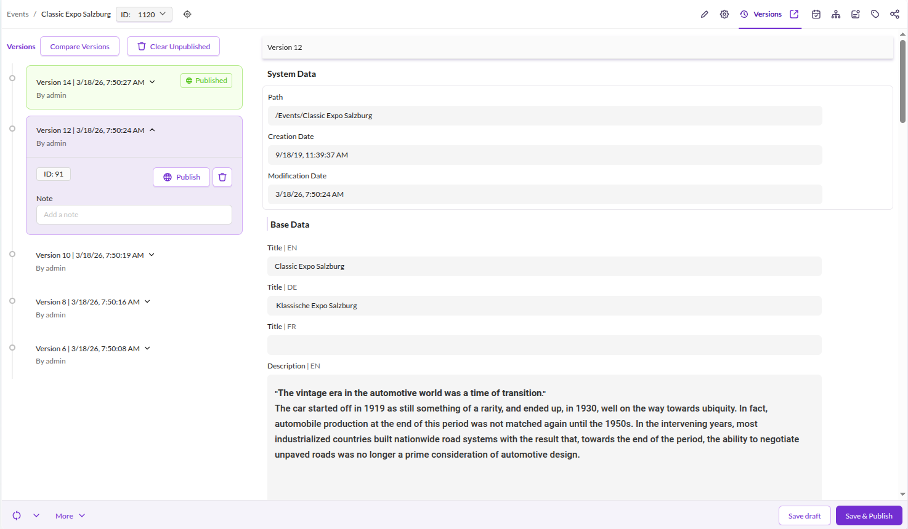
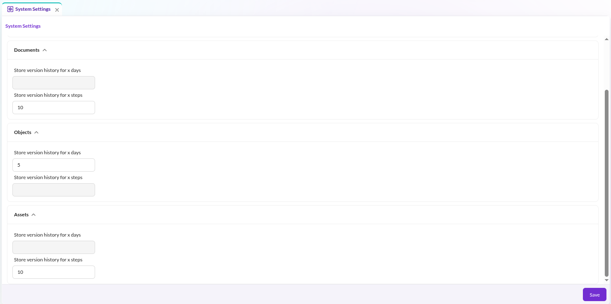

# Versioning

## General

Pimcore versions all documents, assets, and data objects automatically. Every save creates a new version
with no limit on retained versions unless configured otherwise.

Open the **Versions** tab on any element to view the change history, compare revisions,
and restore or publish a specific version.

<div class="image-as-lightbox"></div>




## Settings

Configure the number of retained versions and the retention period in the system settings
for Documents, Assets, and Objects within Pimcore Studio.

<div class="image-as-lightbox"></div>



### Stack Trace

Pimcore stores a stack trace in the database for each version. Disable this per element type:

```yaml
pimcore:
    assets:
        versions:
            disable_stack_trace: true
    documents:
        versions:
            disable_stack_trace: true
    objects:
        versions:
            disable_stack_trace: true
```

A maintenance job (`VersionsCleanupStackTraceDbTask`) automatically removes stack traces older than 7 days.

## Version Storage

Every version stores metadata and, if present, binary data. Since version data can grow quickly,
Pimcore provides three storage strategies.

### Configuration

#### Filesystem

*This is the default.* Store version data on the filesystem using `FileSystemStorageAdapter`:

```yaml
Pimcore\Model\Version\Adapter\VersionStorageAdapterInterface:
    public: true
    alias: Pimcore\Model\Version\Adapter\FileSystemVersionStorageAdapter

Pimcore\Model\Version\Adapter\FileSystemVersionStorageAdapter: ~
```

#### Database

Store version data in a database using `DatabaseVersionStorageAdapter`.
Pass a configured Doctrine connection as an argument - this allows using a dedicated database for version data only:

```yaml
Pimcore\Model\Version\Adapter\VersionStorageAdapterInterface:
    public: true
    alias: Pimcore\Model\Version\Adapter\DatabaseVersionStorageAdapter

Pimcore\Model\Version\Adapter\DatabaseVersionStorageAdapter:
    arguments:
        $databaseConnection: '@doctrine.dbal.versioning_connection'
```

The target database needs a `versionsData` table. Create it with:

```sql
CREATE TABLE `versionsData` (
  `id` bigint(20) unsigned NOT NULL AUTO_INCREMENT,
  `cid` int(11) unsigned DEFAULT NULL,
  `ctype` enum('document','asset','object') DEFAULT NULL,
  `metaData` longblob DEFAULT NULL,
  `binaryData` longblob DEFAULT NULL,
  PRIMARY KEY (`id`)
)
```

### Delegate

Route version data to different storage backends based on size using `DelegateVersionStorageAdapter`.
When metadata or binary data exceeds the configured `byteThreshold`, the fallback adapter handles storage:

```yaml
Pimcore\Model\Version\Adapter\VersionStorageAdapterInterface:
    public: true
    alias: Pimcore\Model\Version\Adapter\DelegateVersionStorageAdapter

Pimcore\Model\Version\Adapter\DelegateVersionStorageAdapter:
    public: true
    arguments:
        $byteThreshold: 1000000
        $defaultAdapter: '@Pimcore\Model\Version\Adapter\DatabaseVersionStorageAdapter'
        $fallbackAdapter: '@Pimcore\Model\Version\Adapter\FileSystemVersionStorageAdapter'

Pimcore\Model\Version\Adapter\FileSystemVersionStorageAdapter: ~

Pimcore\Model\Version\Adapter\DatabaseVersionStorageAdapter:
    arguments:
        $databaseConnection: '@doctrine.dbal.versioning_connection'
```

In this example, version data up to 1,000,000 bytes goes to the database; larger data falls back to the filesystem.

## Disable Versioning for the Current Process

For bulk operations like imports or third-party synchronizations, disable versioning temporarily:

```php
\Pimcore\Model\Version::disable(); // disable versioning for the current process
\Pimcore\Model\Version::enable(); // re-enable versioning for the current process
```

This only affects the current PHP process. The setting is not persisted and does not affect other requests.

## Coauthor Information

In addition to the user, every version can carry an optional coauthor: a second, machine-readable attribution
for saves that a system performed together with the user, for example an AI agent acting on the user's behalf.

A coauthor consists of two fields, both stored on the version:

| Field | Meaning | Example |
|---|---|---|
| `coauthorType` | Short machine string categorizing the coauthor | `agent` |
| `coauthor` | Free-form identifier of the coauthor | `product-data-agent` |

Versions without a coauthor store `null` in both fields. The Versions tab in Pimcore Studio shows a
"Co-authored by" tag on stamped versions.

### Setting a Coauthor

The coauthor context is a container service (`Pimcore\Model\Version\CoauthorContextInterface`). While the
context is active, every newly created version is stamped automatically:

```php
$coauthorContext = \Pimcore::getContainer()->get(\Pimcore\Model\Version\CoauthorContextInterface::class);

// stamp a single save
$coauthorContext->withCoauthor('automation', 'my-importer', fn () => $object->save());

// or stamp everything until clear() is called
$coauthorContext->set('automation', 'my-importer');
$object->save();
$anotherObject->save();
$coauthorContext->clear();
```

In services, inject `CoauthorContextInterface` instead of accessing the container directly.

Setting the coauthor explicitly via `$version->setCoauthorType()` / `$version->setCoauthor()` always wins over
the context. Only newly created versions are stamped; re-saving an existing version never changes its coauthor.

### Disable Coauthor Stamping for the Current Process

```php
$coauthorContext->disable(); // suppress stamping, the context values are kept
$coauthorContext->enable();  // resume stamping
```

This only affects the current PHP process, analogous to `Version::disable()` above.

## Working with the PHP API

When saving elements programmatically, set `userModification` so the correct user appears in version history.
Set it to `0` to display `system` as the user:

```php
$object->setUserModification(0);
$object->save();
```

### Retrieve a Previous Version

```php
$versions = $currentObject->getVersions();
$previousVersion = $versions[count($versions)-2];
$previousObject = $previousVersion->getData();
```
