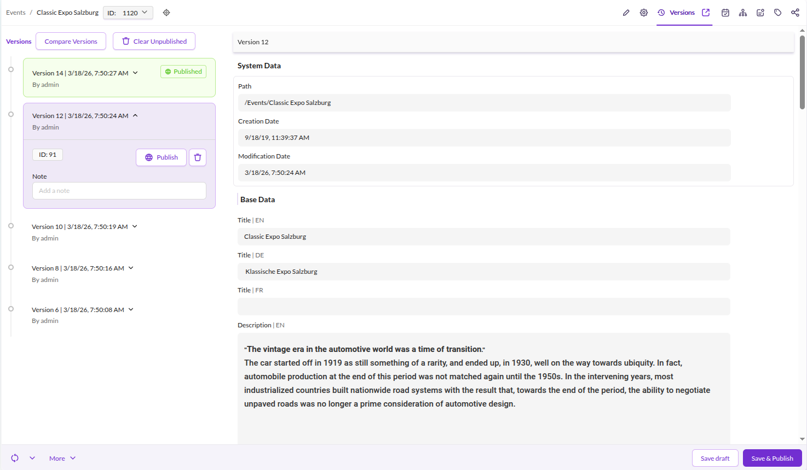
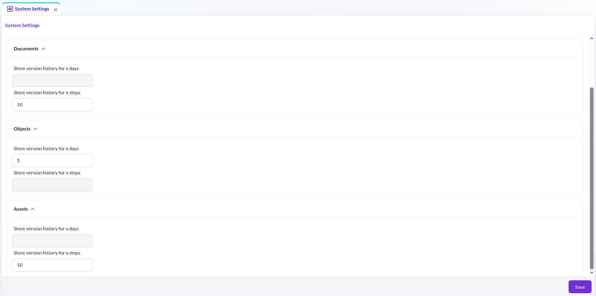

# Versioning

## General

Pimcore versions all documents, assets, and data objects automatically. Every save creates a new version
with no limit on retained versions unless configured otherwise.

Open the **Versions** tab on any element to view the change history, compare revisions,
and restore or publish a specific version.

<div class="image-as-lightbox"></div>




## Settings

Configure the number of retained versions and the retention period in the system settings
for Documents, Assets, and Objects within Pimcore Studio.

<div class="image-as-lightbox"></div>



### Stack Trace

Pimcore stores a stack trace in the database for each version. Disable this per element type:

```yaml
pimcore:
    assets:
        versions:
            disable_stack_trace: true
    documents:
        versions:
            disable_stack_trace: true
    objects:
        versions:
            disable_stack_trace: true
```

A maintenance job (`VersionsCleanupStackTraceDbTask`) automatically removes stack traces older than 7 days.

## Version Storage

Every version stores metadata and, if present, binary data. Since version data can grow quickly,
Pimcore provides three storage strategies.

### Configuration

#### Filesystem

*This is the default.* Store version data on the filesystem using `FileSystemStorageAdapter`:

```yaml
Pimcore\Model\Version\Adapter\VersionStorageAdapterInterface:
    public: true
    alias: Pimcore\Model\Version\Adapter\FileSystemVersionStorageAdapter

Pimcore\Model\Version\Adapter\FileSystemVersionStorageAdapter: ~
```

#### Database

Store version data in a database using `DatabaseVersionStorageAdapter`.
Pass a configured Doctrine connection as an argument - this allows using a dedicated database for version data only:

```yaml
Pimcore\Model\Version\Adapter\VersionStorageAdapterInterface:
    public: true
    alias: Pimcore\Model\Version\Adapter\DatabaseVersionStorageAdapter

Pimcore\Model\Version\Adapter\DatabaseVersionStorageAdapter:
    arguments:
        $databaseConnection: '@doctrine.dbal.versioning_connection'
```

The target database needs a `versionsData` table. Create it with:

```sql
CREATE TABLE `versionsData` (
  `id` bigint(20) unsigned NOT NULL AUTO_INCREMENT,
  `cid` int(11) unsigned DEFAULT NULL,
  `ctype` enum('document','asset','object') DEFAULT NULL,
  `metaData` longblob DEFAULT NULL,
  `binaryData` longblob DEFAULT NULL,
  PRIMARY KEY (`id`)
)
```

### Delegate

Route version data to different storage backends based on size using `DelegateVersionStorageAdapter`.
When metadata or binary data exceeds the configured `byteThreshold`, the fallback adapter handles storage:

```yaml
Pimcore\Model\Version\Adapter\VersionStorageAdapterInterface:
    public: true
    alias: Pimcore\Model\Version\Adapter\DelegateVersionStorageAdapter

Pimcore\Model\Version\Adapter\DelegateVersionStorageAdapter:
    public: true
    arguments:
        $byteThreshold: 1000000
        $defaultAdapter: '@Pimcore\Model\Version\Adapter\DatabaseVersionStorageAdapter'
        $fallbackAdapter: '@Pimcore\Model\Version\Adapter\FileSystemVersionStorageAdapter'

Pimcore\Model\Version\Adapter\FileSystemVersionStorageAdapter: ~

Pimcore\Model\Version\Adapter\DatabaseVersionStorageAdapter:
    arguments:
        $databaseConnection: '@doctrine.dbal.versioning_connection'
```

In this example, version data up to 1,000,000 bytes goes to the database; larger data falls back to the filesystem.

### Element-Type Delegate

Route version data to a different storage per element type (`asset`, `document`, `object`) using
`ElementDelegateVersionStorageAdapter`. Element types without a configured adapter use the default adapter. For
example, asset and data object versions on an S3 bucket, and document versions on the local filesystem:

```yaml
flysystem:
    storages:
        pimcore.version_s3.storage:
            adapter: 'aws'
            visibility: private
            options:
                client: 'assets_s3'
                bucket: '%env(S3_PRIVATE_BUCKET)%'
                prefix: versions

services:
    Pimcore\Model\Version\Adapter\VersionStorageAdapterInterface:
        public: true
        alias: Pimcore\Model\Version\Adapter\ElementDelegateVersionStorageAdapter

    app.version_storage.s3:
        class: Pimcore\Model\Version\Adapter\FileSystemVersionStorageAdapter
        arguments:
            $storage: '@pimcore.version_s3.storage'

    # local filesystem, uses the pimcore.version.storage
    Pimcore\Model\Version\Adapter\FileSystemVersionStorageAdapter: ~

    Pimcore\Model\Version\Adapter\ElementDelegateVersionStorageAdapter:
        arguments:
            $adapters:
                asset: '@app.version_storage.s3'
                object: '@app.version_storage.s3'
            $defaultAdapter: '@Pimcore\Model\Version\Adapter\FileSystemVersionStorageAdapter'
```

Several element types can share one adapter, the storage paths contain the element type. Any adapter can be used
for an element type, including the size-based `DelegateVersionStorageAdapter` (e.g. small object versions in the
database, larger ones on S3). Each version records the storage type of the adapter it was written by.

#### Switching the Storage of Existing Versions

The adapters don't fall back to each other: after changing where the versions of an element type are stored, its
existing versions are still listed, but can't be loaded until their data has been moved to the new storage. Moving
them is project-specific. This works in any direction (e.g. from the local filesystem to S3 and back):

1. Enable the maintenance mode and stop the workers, so that no versions are written in the meantime.
2. Copy the data of the re-routed element types to the new storage. For filesystem-based storages these are the
   `<element type>/` directories of the version storage, e.g. `aws s3 sync var/versions/asset s3://<bucket>/versions/asset`
   or `rclone copy`. For the database adapter, export and import the rows of the element type from the
   `versionsData` table.
3. Deploy the new configuration.
4. Verify it, e.g. by opening and restoring a version of each re-routed element type.
5. Remove the data from the old storage.

## Disable Versioning for the Current Process

For bulk operations like imports or third-party synchronizations, disable versioning temporarily:

```php
\Pimcore\Model\Version::disable(); // disable versioning for the current process
\Pimcore\Model\Version::enable(); // re-enable versioning for the current process
```

This only affects the current PHP process. The setting is not persisted and does not affect other requests.

## Coauthor Information

In addition to the user, every version can carry an optional coauthor: a second, machine-readable attribution
for saves that a system performed together with the user, for example an AI agent acting on the user's behalf.

A coauthor consists of two fields, both stored on the version:

| Field | Meaning | Example |
|---|---|---|
| `coauthorType` | Short machine string categorizing the coauthor | `agent` |
| `coauthor` | Free-form identifier of the coauthor | `product-data-agent` |

Versions without a coauthor store `null` in both fields. The Versions tab in Pimcore Studio shows a
"Co-authored by" tag on stamped versions.

### Setting a Coauthor

The coauthor context is a container service (`Pimcore\Model\Version\CoauthorContextInterface`). While the
context is active, every newly created version is stamped automatically:

```php
$coauthorContext = \Pimcore::getContainer()->get(\Pimcore\Model\Version\CoauthorContextInterface::class);

// stamp a single save
$coauthorContext->withCoauthor('automation', 'my-importer', fn () => $object->save());

// or stamp everything until clear() is called
try {
    $coauthorContext->set('automation', 'my-importer');
    $object->save();
    $anotherObject->save();
} finally {
    $coauthorContext->clear();
}
```

In services, inject `CoauthorContextInterface` instead of accessing the container directly.

Setting the coauthor explicitly via `$version->setCoauthorType()` / `$version->setCoauthor()` always wins over
the context. Only newly created versions are stamped; re-saving an existing version never changes its coauthor.

### Disable Coauthor Stamping for the Current Process

```php
$coauthorContext->disable(); // suppress stamping, the context values are kept
$coauthorContext->enable();  // resume stamping
```

This only affects the current PHP process, analogous to `Version::disable()` above.

## Working with the PHP API

When saving elements programmatically, set `userModification` so the correct user appears in version history.
Set it to `0` to display `system` as the user:

```php
$object->setUserModification(0);
$object->save();
```

### Retrieve a Previous Version

```php
$versions = $currentObject->getVersions();
$previousVersion = $versions[count($versions)-2];
$previousObject = $previousVersion->getData();
```
