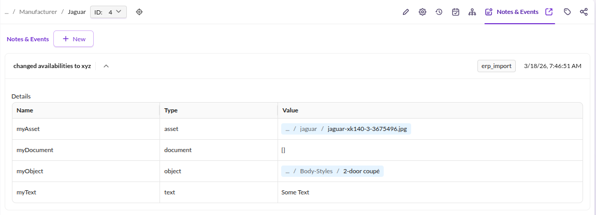
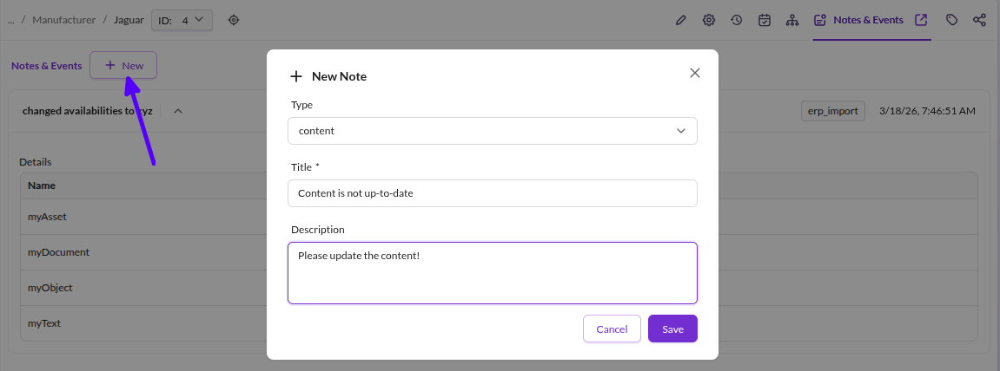

# Notes & Events

## General

Notes & Events log changes or events on elements independently from versioning.
Use them to record actions by marketers, editors, automated importers, or synchronizations -
anything not captured in the data itself but relevant for context.

## Use Cases

* An importer that logs which field values it changed on an object
* A marketer recording SEO optimizations performed on a document, e.g. *"optimized for keyword xyz"*

## Create Notes & Events

### Using the API

```php
use Pimcore\Model;

$object = Model\DataObject::getById(4);

$note = new Model\Element\Note();
$note->setElement($object);
$note->setDate(time());
$note->setType("erp_import");
$note->setTitle("changed availabilities to xyz");
$note->setUser(0);

// attach additional data of various types
$note->addData("myText", "text", "Some Text");
$note->addData("myObject", "object", Model\DataObject::getById(7));
$note->addData("myDocument", "document", Model\Document::getById(18));
$note->addData("myAsset", "asset", Model\Asset::getById(20));

$note->save();
```

The resulting entry in Pimcore Studio:



> **Note:** Note titles are translatable (studio domain). Avoid variable text in titles to prevent
> unintended translation entries. Use the description or data fields for dynamic details instead.

### Add Notes in Pimcore Studio

Add notes directly from the edit view of any object, document, or asset:




#### Custom Note Types

Configure the selectable note types per element type (asset, document, data object):

```yaml
# config/config.yaml or any other Symfony config file

pimcore_studio_backend:
    notes:
        types:
            asset:
                - ''
                - content
                - seo
                - warning
                - notice
            document:
                - ''
                - content
                - seo
                - warning
                - notice
            data-object:
                - ''
                - content
                - seo
                - warning
                - notice
```

The defaults are `content`, `seo`, `warning`, and `notice`. Override them per element type as shown above.
The key for data objects is `data-object` (hyphenated).

For more details on extending note types, see the
[Extending Notes](https://github.com/pimcore/studio-backend-bundle/blob/1.x/doc/02_Installation_and_Configuration/03_Extending_Notes.md)
guide in the Studio Backend Bundle documentation.
