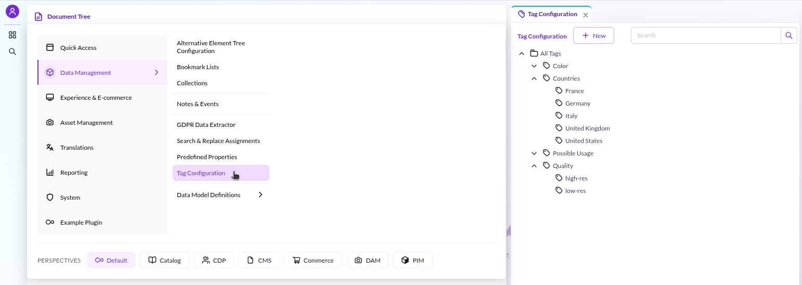
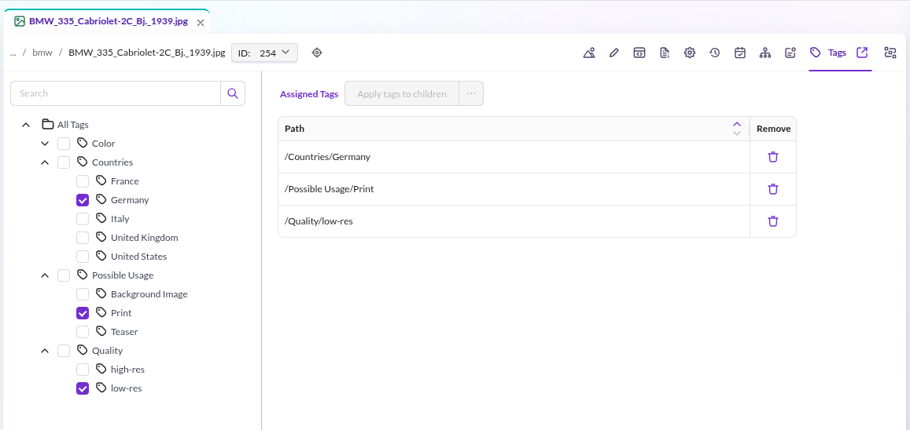
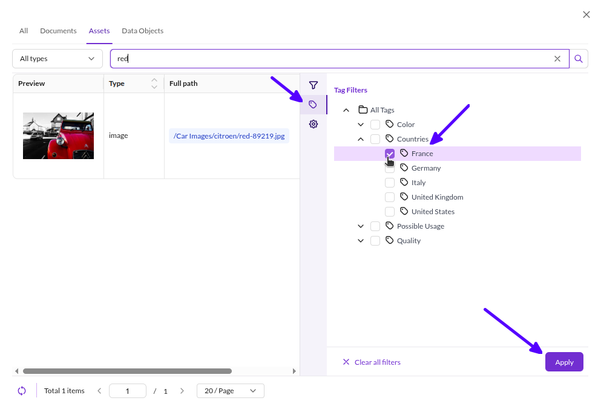
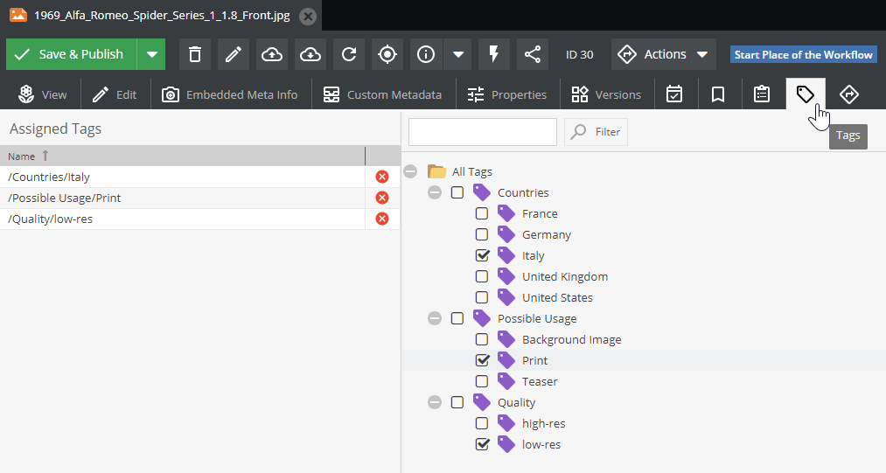
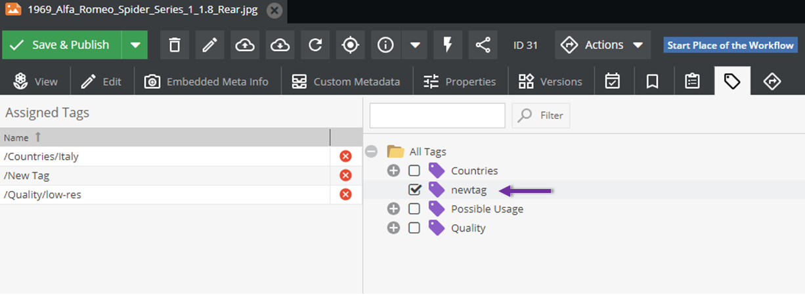

# Tags

## General

Tags provide additional taxonomies and classifications for documents, assets, and data objects.
Use them to filter elements in search by custom criteria beyond the built-in fields.

## Tags Definition

Define available tags centrally in Pimcore Studio (requires the *tags configuration* user permission).



## Tags Assignment

The **Tags** tab in the document, asset, or data object editor allows assigning tags to the current element
(requires the *tags assignment* user permission).



## Tags Usage

In the Pimcore Studio search dialog, select tags as additional filter criteria
(requires the *tags search* user permission).



## Working with Tags via API

### Overview

Manage tags programmatically via static methods on `Pimcore\Model\Element\Tag`:

```php
/**
 * returns all assigned tags for element
 *
 * @return Tag[]
 */
public static function getTagsForElement(string $cType, int $cId): array
{
    $tag = new Tag();

    return $tag->getDao()->getTagsForElement($cType, $cId);
}

/**
 * adds given tag to element
 */
public static function addTagToElement(string $cType, int $cId, Tag $tag): void
{
    $tag->getDao()->addTagToElement($cType, $cId);
}

/**
 * removes given tag from element
 */
public static function removeTagFromElement(string $cType, int $cId, Tag $tag): void
{
    $tag->getDao()->removeTagFromElement($cType, $cId);
}

/**
 * sets given tags to element and removes all other tags
 * to remove all tags from element, provide empty array of tags
 *
 * @param Tag[] $tags
 */
public static function setTagsForElement(string $cType, int $cId, array $tags): void
{
    $tag = new Tag();
    $tag->getDao()->setTagsForElement($cType, $cId, $tags);
}
```

### API Usage Examples

#### Get Tags for an Element

Given this asset:



Retrieve its tags by specifying the element type (`asset`) and ID:

```php
$tags = \Pimcore\Model\Element\Tag::getTagsForElement('asset', 30);
dump($tags);
```

The result is an array of `Pimcore\Model\Element\Tag` objects:

```
array:3 [▼
  0 => Pimcore\Model\Element\Tag {#7351 ▼
    #id: 9
    #name: "Italy"
    #parentId: 7
    #idPath: "/7/"
    #children: null
    #parent: Pimcore\Model\Element\Tag {#7354 ▶}
    #dao: Pimcore\Model\Element\Tag\Dao {#7349 ▶}
    id: 9
    name: "Italy"
    parentId: 7
    idPath: "/7/"
    children: null
    parent: Pimcore\Model\Element\Tag {#7354 ▶}
  }
  1 => Pimcore\Model\Element\Tag {#7357 ▶}
  2 => Pimcore\Model\Element\Tag {#7345 ▶}
]
```

#### Assign a New Tag to an Element

Create the tag first, then assign it:

```php
$tag =  new \Pimcore\Model\Element\Tag();
try {
    $tag->setName('newtag')->save();
    \Pimcore\Model\Element\Tag::addTagToElement('asset', 30, $tag);
} catch (Exception $e) {
// ....
}

```



The `$cType` parameter accepts `document`, `asset`, or `object`.
