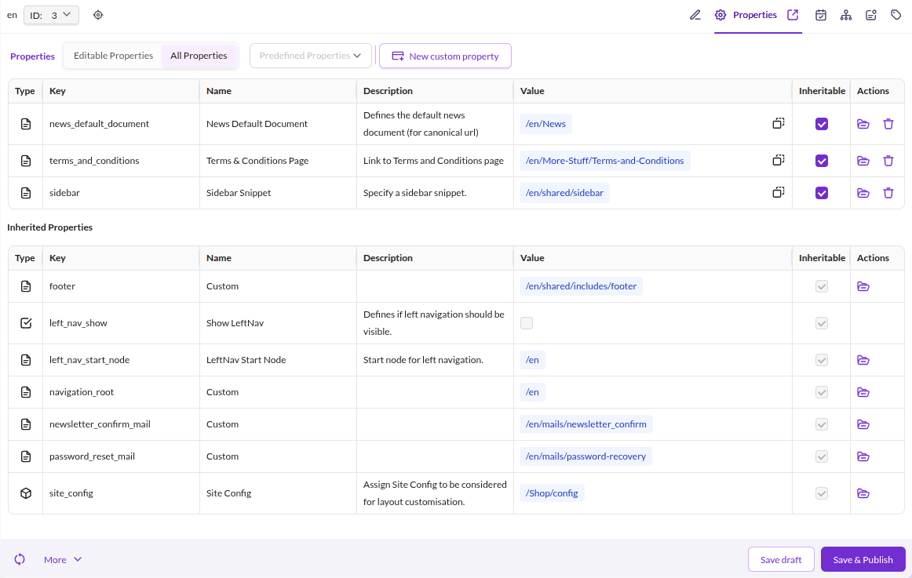
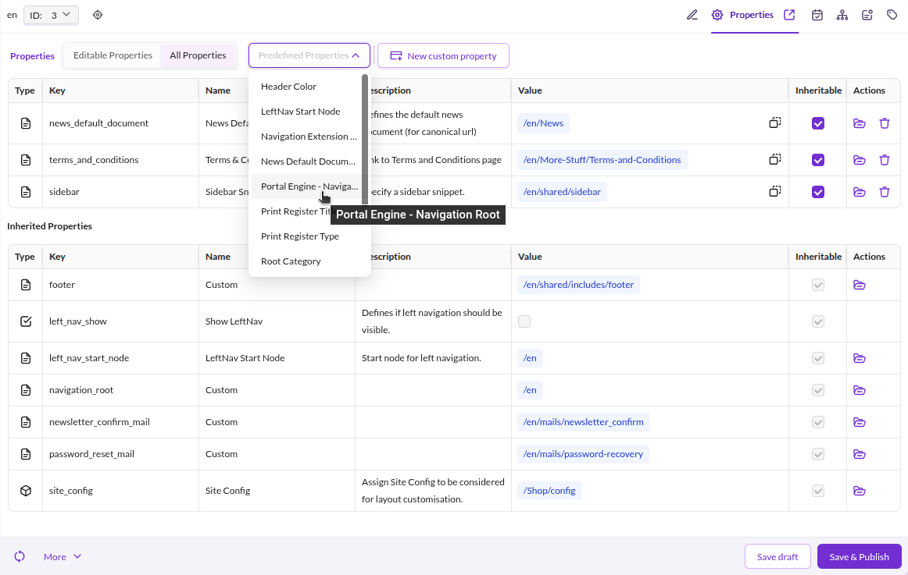

# Properties

## General

Every element (document, asset, data object) can carry custom properties, accessible via the **Properties** tab.

<div class="image-as-lightbox"></div>



Properties control rendering behavior in templates. Common use cases:

* Hide the main navigation
* Show the sidebar
* Load an additional stylesheet

## Access a Property in a Template

```twig
{# retrieve the value of a property named "hideNavigation" #}

```


## Predefined Properties

Predefined properties show editors which properties are available in your Pimcore installation
and provide default values for each. This guides editors toward consistent usage and reduces
repetitive configuration when adding properties to elements.

**Predefined** does not mean the value is automatically available on every element.
For globally available key-value pairs, use [Website Settings](../01_Documents/09_Website_Settings.md) instead.

<div class="image-as-lightbox"></div>



## Configuration Example

Open **Data Management > Predefined Properties** in Pimcore Studio to manage predefined properties.

| Name          | Required | Description                                                                                                             |
|---------------|----------|-------------------------------------------------------------------------------------------------------------------------|
| Name          | Yes      | Friendly name shown in the selection dropdown.                                                                          |
| Description   | No       | Explains the purpose of this property to editors.                                                                       |
| Key           | Yes      | The key used in code to retrieve the property value, e.g. `$document->getProperty("key");`                              |
| Type          | Yes      | Allowed content type: text, document, asset, object, bool (checkbox), or select.                                        |
| Value         | No       | Default value added automatically when the property is assigned to an element.                                          |
| Configuration | No       | Additional configuration. Currently only used by the *select* type - specify options separated by commas.               |
| Content-Type  | Yes      | Element types this property applies to (document, asset, or object).                                                    |

> **Note**
> Each predefined field can be overridden on the individual element after assignment.
