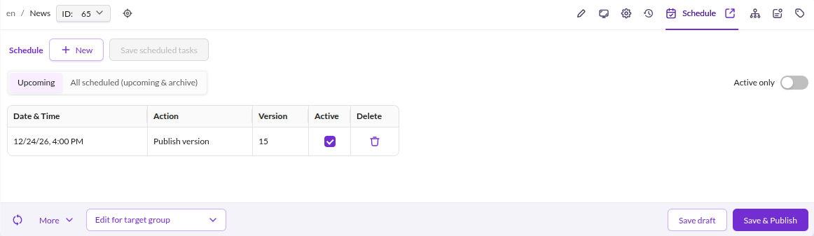
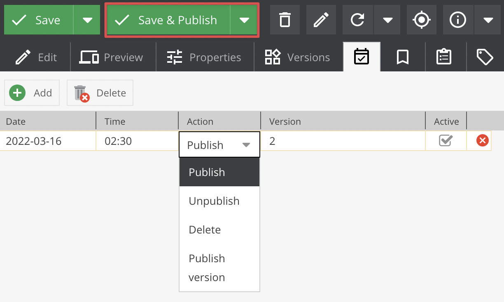
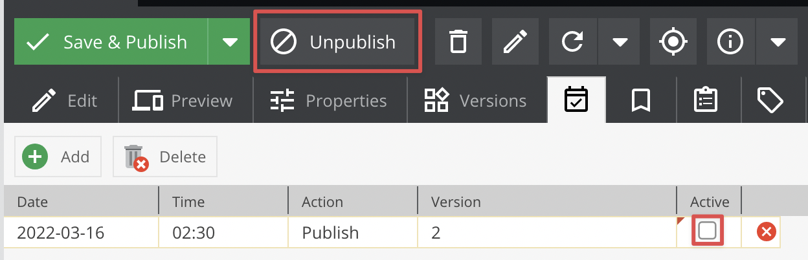

# Scheduling

## General

Every element type (documents, data objects, assets) supports scheduled tasks:

* **Publish** - Publish the element
* **Unpublish** - Unpublish the element
* **Delete** - Delete the element
* **Publish version** - Publish a specific version (see [Versioning](./01_Versioning.md))

:::note
If a data object is already published, the `Publish` action does not publish the latest unpublished version.
Use `Publish version` to publish a specific version instead.
:::

Scheduled tasks require the Symfony Messenger worker to be running. Configure it with the `pimcore_messenger`
transport as described in the
[Symfony Messenger setup guide](https://github.com/pimcore/platform-version/blob/2026.x/doc/03_Getting_Started/01_Installation/03_Advanced_Installation_Topics/01_Symfony_Messenger.md).
Alternatively, run scheduled tasks directly via `bin/console pimcore:maintenance -j scheduledtasks`.


## Usage

Open the **Schedule** tab on a data object in Pimcore Studio:



Click **Add** to create a new task row with these options:

- `date` and `time` - When the task runs
- `action` - Which operation to perform
- `version` - Only used with the *Publish version* action
- `active` - Indicates the task has not been processed yet

To schedule automatic publishing of an unpublished object, configure the task as shown:



The resulting database entry:

```
`schedule_tasks`
# id, cid, ctype, date, action, version, active
'7', '76', 'object', '1474034700', 'publish', NULL, '1'
```

After the maintenance worker processes the task:



```
`schedule_tasks`
# id, cid, ctype, date, action, version, active
'8', '76', 'object', '1474034700', 'publish', NULL, '0'
```
