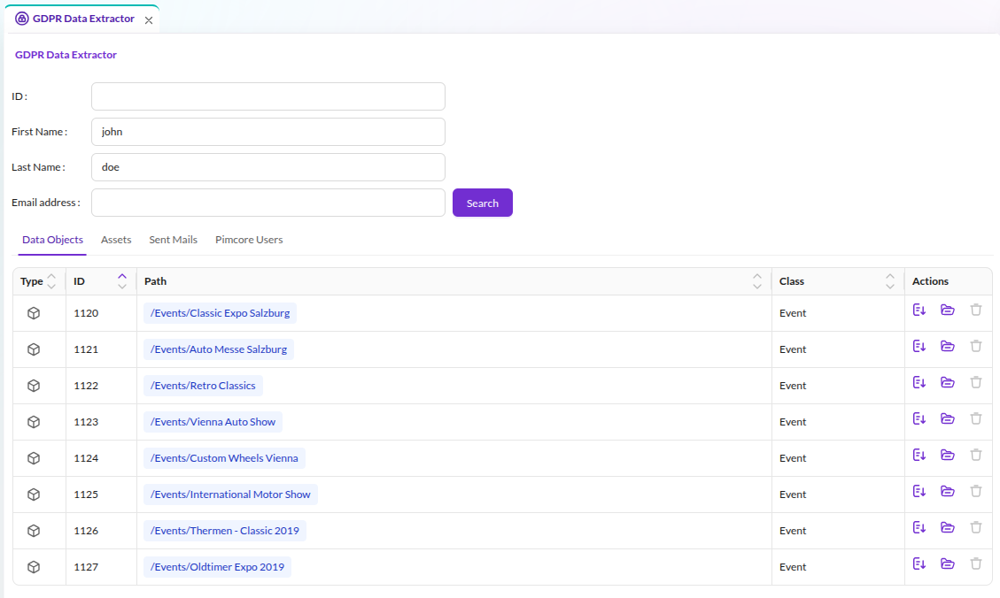

# GDPR Data Extractor

The GDPR Data Extractor supports the *right of access by the data subject* by searching and exporting
personal data across data objects, sent mails, Pimcore users, and custom providers.

<div class="image-as-lightbox"></div>



## Configuration

Define which data object classes and asset types the Data Extractor includes,
and whether the result view allows direct deletion:

```yaml
pimcore_studio_backend:
    gdpr_data_extractor:
        # Settings for DataObjects DataProvider
        dataObjects:
            # Configure which classes should be considered, array key is class name
            classes:
                Person:
                    allowDelete: true    # Allow delete of objects directly in preview grid (default: false)
                Customer:
                    allowDelete: false
        # Settings for Assets DataProvider
        assets:
            types:
                # Configure which asset types should be considered
                - image
                - document
                - video
```

By default, the search covers all data object classes, the export includes all attributes
directly on the data object, and deletion from the result list is off.


## Extending with Custom Data Sources

Add custom data sources to the GDPR Data Extractor to include application-specific data exports
or external systems. Each custom provider requires both a PHP backend and a React/TypeScript frontend.

The [Studio Example Bundle](https://github.com/pimcore/studio-example-bundle/tree/main/assets/js/src/examples/gdpr-data-extractor)
provides a complete working example (backend + frontend).

### Backend: Implement the Data Provider

Implement `Pimcore\Bundle\StudioBackendBundle\Gdpr\Provider\DataProviderInterface`:

| Method | Description |
|--------|-------------|
| `findData(FilterParameter $filter): Collection` | Search data based on filter parameters |
| `getName(): string` | Display name for the provider tab |
| `getKey(): string` | Unique identifier |
| `getSortPriority(): int` | Display order (higher = first) |
| `getRequiredPermissions(): array` | Permission strings required to access this provider |
| `getSingleItemForDownload(int $id): array\|Response` | Export a single item for download |

Your provider class **must** accept an `array $gdprConfig = []` constructor parameter. A compiler
pass injects the `pimcore_studio_backend.gdpr_data_extractor` configuration into every tagged
provider. The container fails to build if the parameter is missing.

Register the service with the `pimcore.studio_backend.gdpr_data_provider` tag:

```yaml
services:
    App\Gdpr\DataProvider\MyCustomDataProvider:
        tags:
            - { name: pimcore.studio_backend.gdpr_data_provider }
```

See the
[backend example](https://github.com/pimcore/studio-example-bundle/blob/main/src/Gdpr/MyDataProvider.php)
and its
[service registration](https://github.com/pimcore/studio-example-bundle/blob/main/config/services.yaml)
in the Studio Example Bundle.

### Frontend: Register a Dynamic Type Provider

The GDPR Extractor uses the Pimcore Studio **dynamic type system** to render a tab for each
data provider. Every backend provider needs a corresponding frontend class that defines
what the tab displays. Implement it as a
[Pimcore Studio plugin](https://github.com/pimcore/studio-ui-bundle/blob/1.x/doc/04_Extending/README.md)
(Module Federation bundle).

The built-in providers use this pattern:

| Backend Provider | Frontend Dynamic Type | Key |
|-----------------|----------------------|-----|
| `DataObjectProvider` | `DynamicTypeDataObjectGDPRProvider` | `data_objects` |
| `AssetsProvider` | `DynamicTypeAssetsGDPRProvider` | `assets` |
| `PimcoreUserProvider` | `DynamicTypeUsersGDPRProvider` | `pimcore_users` |
| `SentMailProvider` | `DynamicTypeEmailsGDPRProvider` | `sent_mails` |

A custom provider frontend requires three steps, each linking to the corresponding source
file in the Studio Example Bundle's
[GDPR Data Extractor example](https://github.com/pimcore/studio-example-bundle/tree/main/assets/js/src/examples/gdpr-data-extractor):

#### Step 1: Tab Component

Create a React component that renders search results as a grid. The component receives data
from the GDPR framework via `GDPRProviderTabProps` and maps it to table columns using
TanStack Table's `createColumnHelper`. The SDK provides an `ExportButton` that triggers
the backend's `getSingleItemForDownload()` for each row.

See:
[components/my-provider-tab.tsx](https://github.com/pimcore/studio-example-bundle/blob/main/assets/js/src/examples/gdpr-data-extractor/components/my-provider-tab.tsx)

#### Step 2: Dynamic Type Class

Create a class extending `DynamicTypeAbstractGDPRProvider` that connects your tab component
to the GDPR framework. The `id` property must match the `getKey()` return value of your
backend provider.

See:
[dynamic-types/dynamic-type-my-provider.tsx](https://github.com/pimcore/studio-example-bundle/blob/main/assets/js/src/examples/gdpr-data-extractor/dynamic-types/dynamic-type-my-provider.tsx)

#### Step 3: Plugin and Module Registration

Register the dynamic type in the plugin's `onInit` via the DI container, then register a module
in `onStartup` that hooks it into the `DynamicTypeGDPRProviderRegistry`.

See:
[index.ts (plugin)](https://github.com/pimcore/studio-example-bundle/blob/main/assets/js/src/examples/gdpr-data-extractor/index.ts)
and
[modules/my-provider-module.ts](https://github.com/pimcore/studio-example-bundle/blob/main/assets/js/src/examples/gdpr-data-extractor/modules/my-provider-module.ts)

### How the Framework Pairs Providers

The framework matches each backend provider to its frontend tab by key: the backend's
`getKey()` return value must equal the frontend dynamic type's `id`. When a user opens the
GDPR Data Extractor, Pimcore Studio fetches the provider list from the backend API and
renders a tab for each provider that has a matching frontend registration.

## Further Reading

- [Extending GDPR Data Providers](https://github.com/pimcore/studio-backend-bundle/blob/1.x/doc/03_Extending/12_Extending_GDPR_Data_Providers.md) -
  detailed backend reference with full code example and configuration options table
- [GDPR Data Extractor Plugin Example](https://github.com/pimcore/studio-ui-bundle/blob/1.x/doc/04_Extending/02_Plugin_Development_Examples/11_GDPR_Data_Extractor.md) -
  frontend plugin overview linking to the Studio Example Bundle
