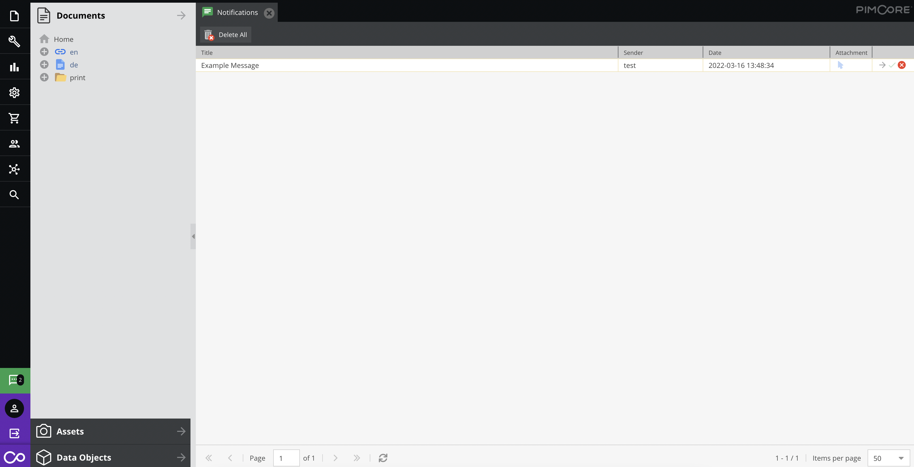
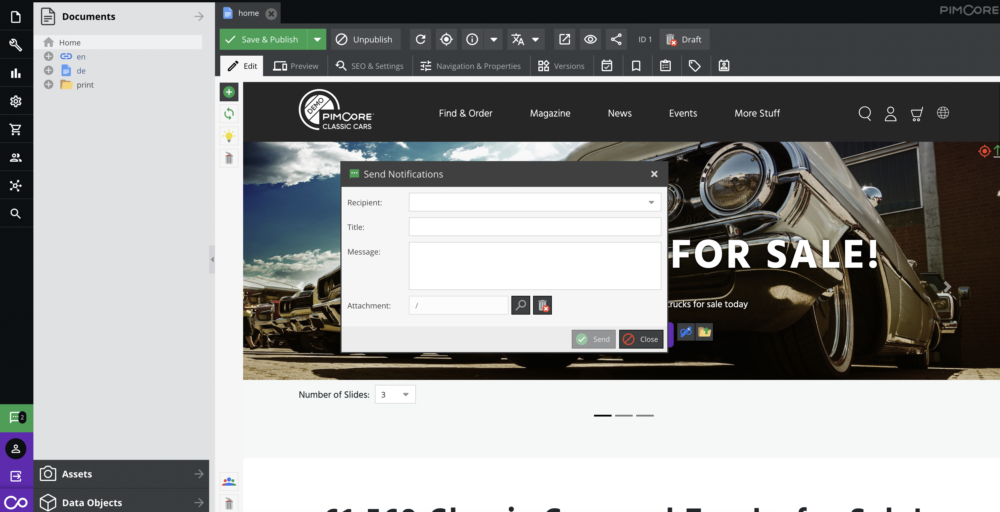

# Notifications

Send messages to users directly within Pimcore Studio. The notification icon in the status bar
displays an unread count badge; clicking it opens the notifications tab.



Use the **Share via Notifications** button to create a notification with an element pre-filled
as the attachment.



## Working with Notifications via API

### Overview

`Pimcore\Model\Notification\Service\NotificationService` provides methods for managing notifications
programmatically. This service is marked as internal and may change in future releases.

Key methods:

```php
<?php
    // Find a single notification by ID
    public function find(int $id): Notification;

    // Find all notifications matching filters, with pagination support
    // Returns ['total' => int, 'data' => Notification[]]
    public function findAll(array $filter = [], array $options = []): array;
```

> **Note:** `findAll` filters by `isStudio = 0` by default, returning only non-Studio notifications.

### Send a Notification to a User

```php
<?php

use Pimcore\Model\Asset;
use Pimcore\Model\Notification\Service\NotificationService;
use Symfony\Component\HttpFoundation\Request;
use Symfony\Component\HttpFoundation\Response;

public function defaultAction(
    Request $request,
    NotificationService $notificationService
): Response {
    $element = Asset::getById(1); // Optional

    $notificationService->sendToUser(
        4, // User recipient
        2, // User sender 0 - system
        'Example notification',
        'Example message',
        $element // Optional linked element
    );

    // ...
}
```

### Send a Notification to a Group

```php
<?php

use Pimcore\Model\Asset;
use Pimcore\Model\Notification\Service\NotificationService;
use Symfony\Component\HttpFoundation\Request;
use Symfony\Component\HttpFoundation\Response;

public function defaultAction(
    Request $request,
    NotificationService $notificationService
): Response {
    $element = Asset::getById(1); // Optional

    $notificationService->sendToGroup(
        4, // Group recipient
        2, // User sender 0 - system
        'Example notification',
        'Example message',
        $element // Optional linked element
    );

    // ...
}
```
