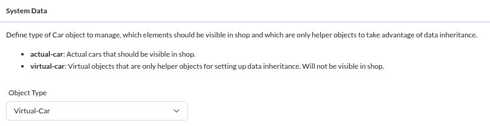
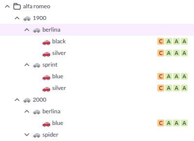

# Object Data Inheritance in Action

[Object Data Inheritance](../03_Objects/01_Object_Classes/04_Additional_Class_Settings/03_Data_Inheritance.md)
minimizes data maintenance: child objects inherit field values from their parents and override only what differs.

The [e-commerce demo](https://github.com/pimcore/demo-ecommerce) applies this to fashion products
with different colors and sizes. A generic article holds all shared information (names, descriptions, material,
gender assignment, specific attributes). Color and size variants inherit everything and override only
the relevant fields.

Enter and update generic information once per generic article - variants pick it up automatically,
eliminating redundant data entry.

## Reducing Maintenance Further with Virtual Products

Products in the same category, from the same manufacturer, or within a series share common attributes -
assigned categories, manufacturer references, technical values, sometimes images.

Virtual products extend this pattern. They use the same class as real products but carry a special flag:

This flag marks the object as a data container only, excluded from output channels like product listings
and exports.

With virtual products, build deep product hierarchies and maintain data in a single place:

Use [Custom Icons](../03_Objects/01_Object_Classes/04_Additional_Class_Settings/02_Custom_Icons.md)
to visually distinguish virtual products (e.g. grey icons) from real products (colored icons).

Combine [Custom Layouts](../03_Objects/01_Object_Classes/03_Custom_Layouts.md) with
[Custom Layouts based on Object Data](../10_Extending_Pimcore/03_Custom_Extension_Guides/13_Custom_Layouts_Based_on_Object_Data.md)
to show different editor masks for virtual products - for example, displaying only the attributes relevant
to the current hierarchy level along with explanatory text.

## Modifying Inherited Data

Review the [Data Inheritance](../03_Objects/01_Object_Classes/04_Additional_Class_Settings/03_Data_Inheritance.md)
documentation, especially the *Modifying values from getters when using inheritance* section, for details
on how getter methods resolve inherited values.
