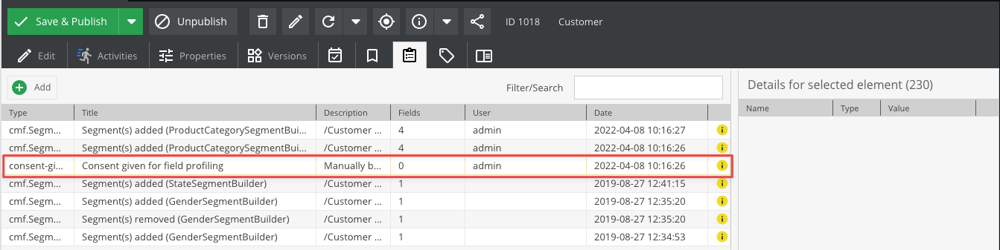

# Consent

This data type can be used to store consent of users for something like permission for sending direct mailings.

Consent itself is stored as checkbox in data object, additional meta information (like timestamp and all other things) 
are stored as a note on the corresponding object. This note is created for both actions - when a consent is given and 
when a consent is revoked. 




### Usage in Pimcore Admin Backend
The consent value can be changed directly in object editor. Every time the value changes, a note with default values
is added automatically.

### Usage in PHP API
When setting consent in custom controllers or in other places, use the service `Pimcore\DataObject\Consent\Service` 
and its methods `giveConsent` and `revokeConsent`. Please make sure that your DataObject was saved before using the Consent Service. If your DataObject doesent have an Id the note cannot be saved!


```php
<?php 

    $customer = Customer::getById(345);

    $consentMessage = "lorem ipsum"; //insert exact text that was displayed to the user
    $metaInfo = [
        'ip' => $request->getClientIp()
    ]; 
    
    /**
    *  @var Pimcore\DataObject\Consent\Service $consentService
    **/
    $consentService->giveConsent($customer, "directMailing", $consentMessage, $metaInfo);
``` 
