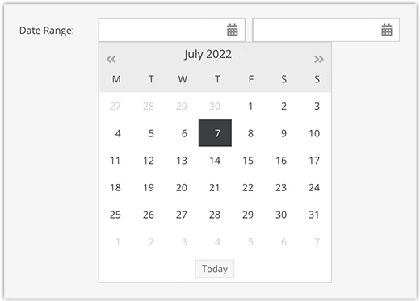

# Date Datatypes

## Date, Date & Time

The `date` and `date & time` object fields are represented by a calender widget in the Pimcore GUI. 

In the database its data is saved either as `date`/`datetime` field type or as unix timestamp (`bigint(20)`) depending on the configured column type. Programmatically 
these data types are represented by a [DateTime/Carbon](https://github.com/briannesbitt/Carbon) Object.

### Behaviour regarding user timezones

The `date` and `date & time` object fields can be configured to respect the user's timezone. If timezone support is enabled the Pimcore admin UI will display the date and time in the user's timezone. Without timezone support the date and time will be shown exactly as it was entered independent of the user's timezone.

For the `date` object field timezones are taken into account when the `bigint` column type is chosen whereas for the `date` column type the timezone is ignored.

For the `date & time` object field timezones are taken into account when the "respect timezone" option in the class editor is enabled. Disabling the timezone support will only work in combination with the `datetime` column type.

## Time

The `time` data field is the same drop down list of day times as in the `date & time` field.

It's stored as a string in a VARCHAR(5) column in the database and can be set programmatically by simply passing a 
string like for example "11:00" to the field's setter.

## Date Range

The `dateRange` object field consists of two `date` fields (start and end date) and can be filled
with the usual calendar widget in the Pimcore GUI or programmatically via the Pimcore API.

The two dates are stored as unix timestamps in two separate INT columns in the database. Programmatically
the date range is represented by a [CarbonPeriod](https://carbon.nesbot.com/docs/#api-period) Object.
