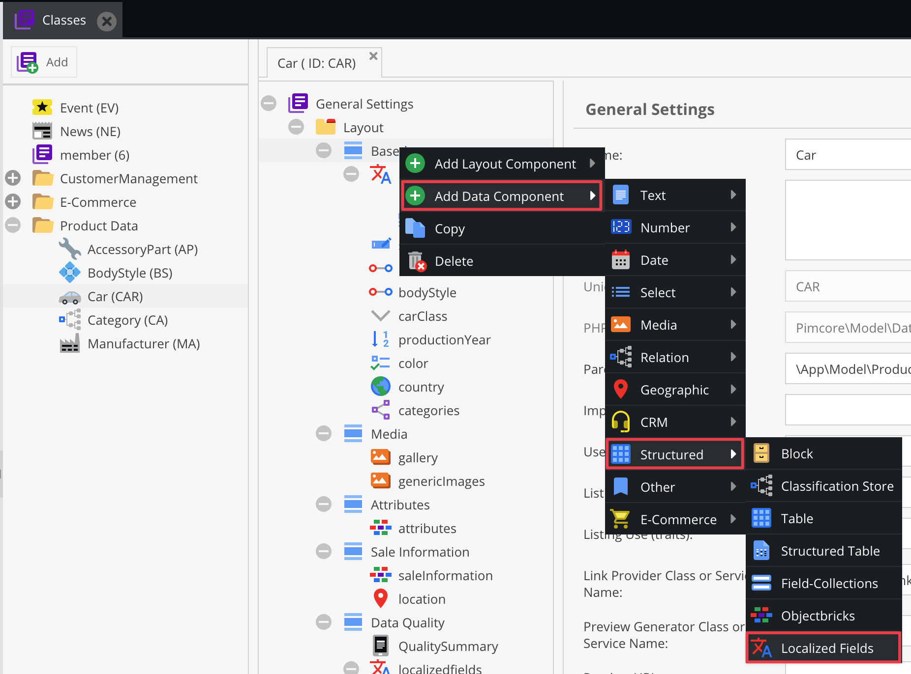
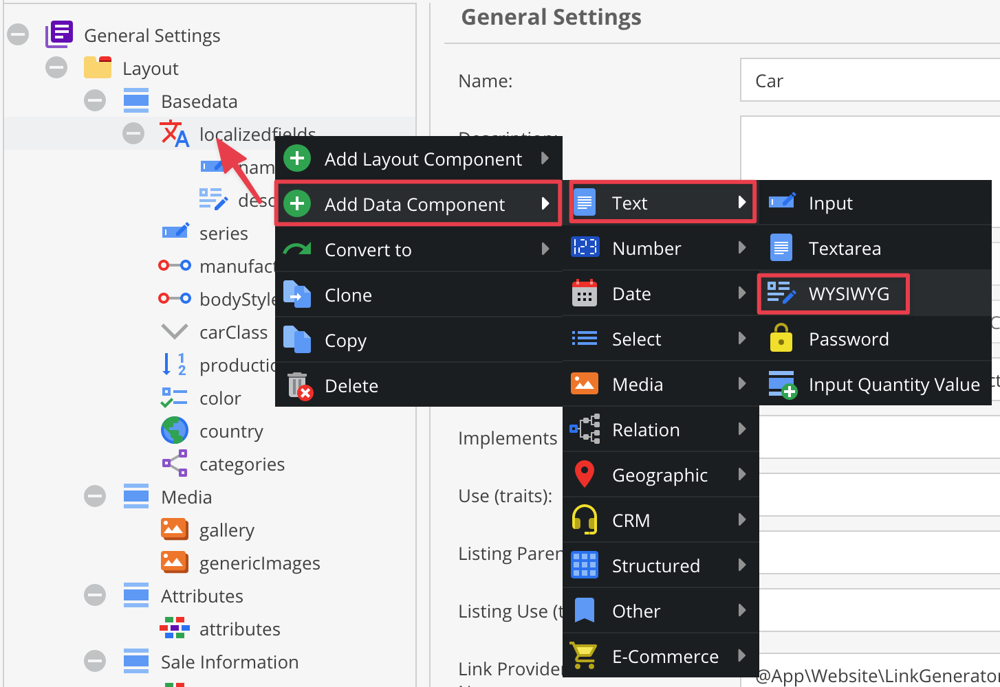
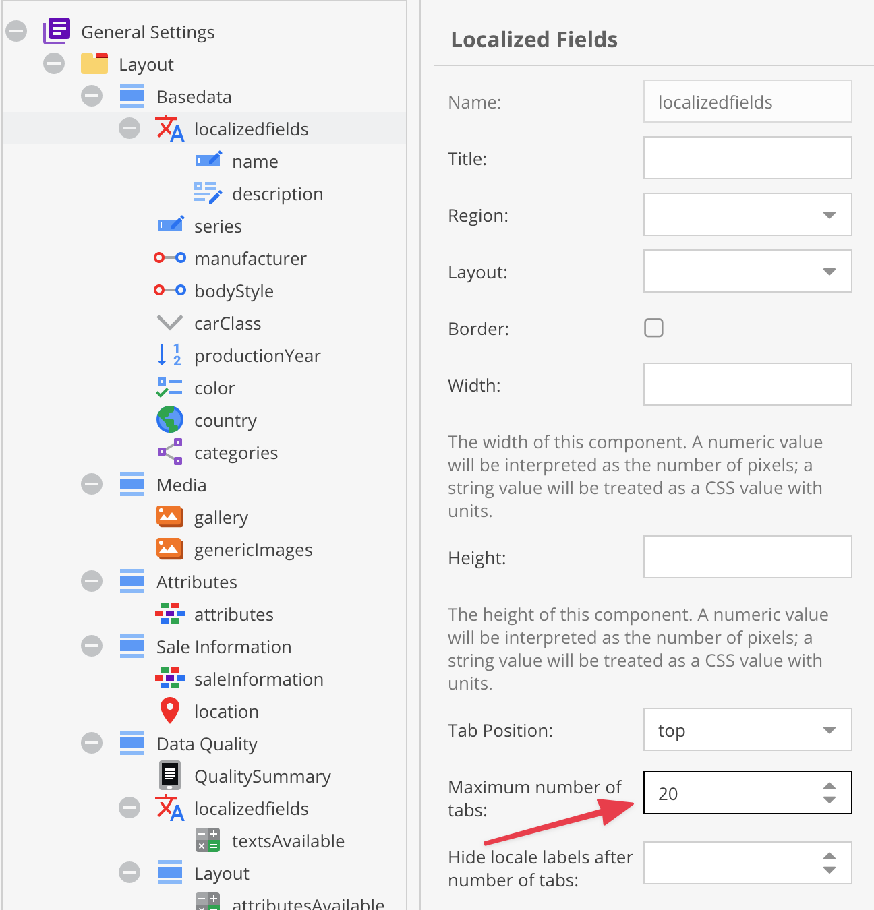
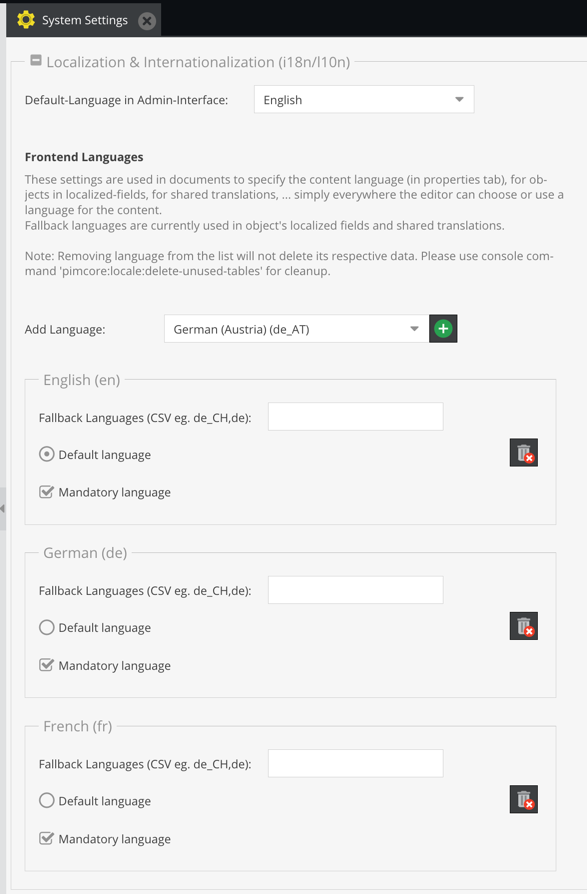
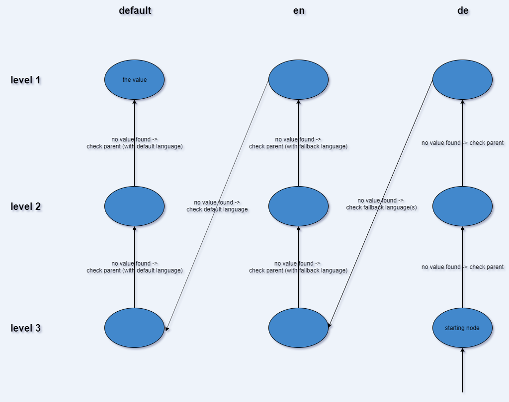

# Localized Fields

Localized fields allow the definition of attributes, that should be translated into multiple languages within an object. 
They can be filled with selected data types and layouts - due to technical and data storage reasons not all data types are
available. 

The advantage of this, is to make it very easy to translate fields to the configured languages.

## Definition of localized fields

First of all, you have to configure your localized fields and layouts within your class. This can be easily done in 
the class editor.



Then add attributes, that need to be translated, into this container. 



Pimcore generated the input widgets for every configured language. 
The result in your object editor will look like below:


By default, tabs are used if the number of languages does not exceed 15. 
This limit can be changed via the field settings in the class configurator.



## Definition of available Languages
If it's not already configured, please specify the valid languages for your website. 
You can do this in `Settings` -> `System Settings` -> `Localization & Internationalization`



## Definition of required Languages
If you want to have mandatory fields in the localized fields but they are not mandatory for all languages, you can define
which languages are required in `Settings` -> `System Settings` -> `Localization & Internationalization` with the `Mandatory language` checkbox on each language.


## Inheritance

Fallback and inherited values are evaluated in a vertical way first. This is contrary to the [Classification Store](15_Classification_Store.md) where the evaluation is done in a horizontal way. If no value for the current language is found, the parent level is checked. 

If walking up the inheritance levels yields no result, the fallback language of the lowermost level will be checked in the same way. (Also walking up the inheritance levels for this language). 

Consider the following example and let’s assume that English is the fallback language for German. We request the German value for the object at level 3. 
Since the only value can be found on level 1 for the default language the tree is traversed as depicted.





## Working with PHP API

### Getting available languages ###

The following code will create an array containing the available languages for the front end (the user facing website). 

```php
$languages = \Pimcore\Tool::getValidLanguages();
```

### Disable Fallback languages ###

You can disable the Fallback languages

```php
\Pimcore\Model\DataObject\Localizedfield::setGetFallbackValues(false);
```

### Accessing the data

Accessing the data is simple as below:

```php
// with global registered locale
$object = DataObject::getById(234);
$object->getInput1(); // will return the en_US data for the field "input1"
 
 
// get specific localized data, regardless which locale is globally registered
$object->getInput1("de"); // will return the German value for the field "input1"
```

### Setting data

It works in the similar way as getting the data.

```php
$object = DataObject::getById(234);
$object->setInput1("My Name", "fr"); // set the French value for the field "input1"
```

**Warning:** Please note that moving a field from outside (normal object field) into the localizedfield container means 
the loss of data from the field in all objects using this class.
