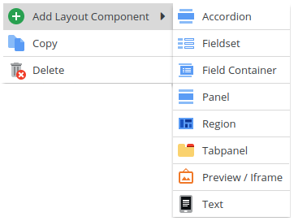

# Layout Elements

To structure object data layout-wise, there are 3 panel types and 4 other layout elements available. Data fields are 
always contained in a panel. Panels can be nested and thereby a data input interface tailored to the users's needs 
can be designed.

The three available panel types are:
* Panel - a plain panel holding fields
* Region - a region panel able to hold nested panel's in its regions north, east, west and south
* Tabpanel - a panel holding further nested panels as tabs

Moreover, within a panel fields can be put into the following layout Components
* Accordion
* Fieldset
* Field Container

And last but not least there are two extra layout elements:
* Text - to add minimally formatted text to an object layout. This can hold descriptions and hints which don't fit into 
a field's tooltip. Please note that since release 4.4.2 it is possible to generate this text dynamically.
Please read this [page](./01_Dynamic_Text_Labels.md) for further details.
* IFrame - provide a URL and make use of the context parameter to render the response of your choice.
Please read this [page](./02_Preview_Iframe.md) for further details.

Pimcore uses Ext JS layout components for all object layout elements. For a deeper understanding of the layout elements, 
please have a look at the [Ext JS documentation pages](https://docs.sencha.com/extjs/7.0.0/classic/Ext.html) and 
[examples](http://www.sencha.com/products/js/).
